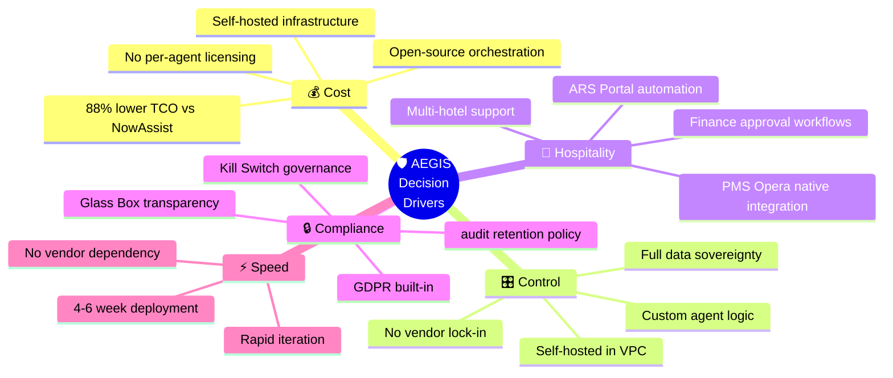

# 🛡️ AEGIS - Autonomous IT Operations & Swarming Platform

[](CHANGELOG.md)
[]()
[]()
[]()

**Client:** Accor Hotels  
**Project:** Intelligent Triage System v2.1  
**Tagline:** *"Your AI Shield Against Incident Chaos"*

---

## 📋 Table of Contents

- [Overview](#overview)
- [Technology Stack](#technology-stack)
- [Quick Start](#quick-start)
- [Architecture](#architecture)
- [API Reference](#api-reference)
- [Documentation](#documentation)
- [Changelog](#changelog)

---

## Overview

AEGIS transforms Accor's IT Service Management from reactive ticket queues into an intelligent, self-defending ecosystem. Supporting **5,500+ hotels across 110 countries**, AEGIS protects Accor's global service desk from alert storms, routes critical issues with contextual intelligence, and assembles expert swarms in seconds.

### Key Benefits

| Benefit | Metric | Description |
|---------|--------|-------------|
| 🚀 **Faster Triage** | <5 sec | vs 45 min manual |
| 🛡️ **Alert Suppression** | 90%+ | Vector similarity dedup via Storm Shield |
| 🔒 **Glass Box AI** | 100% | Every decision auditable |
| 💰 **Cost Efficient** | ~$700/mo | 1 LLM call per ticket |
| 🔐 **PII Protection** | Microsoft Presidio | Data scrubbed before LLM |

---
## 📊 Solution Comparison: Why AEGIS?

### Feature Comparison Matrix

|  ServiceNow | ITCI |

| Capability | ServiceNow OOB | NowAssist (GenAI) | Virtual Agent | 🛡️ AEGIS |
|------------|----------------|-------------------|---------------|----------|
| **AI-Powered Triage** | ❌ Rule-based | ✅ GenAI summary | ⚠️ Scripted | ✅ Multi-agent swarm |
| **Root Cause Analysis** | ❌ Manual | ✅ AI-assisted | ❌ N/A | ✅ KB-linked reasoning |
| **Auto-Remediation** | ❌ N/A | ⚠️ Recommend only | ⚠️ Guided | ✅ Full execution |
| **Storm Shield (Dedup)** | ⚠️ Basic | ❌ N/A | ❌ N/A | ✅ Redis fingerprint |
| **Kill Switch** | ❌ N/A | ❌ N/A | ❌ N/A | ✅ Multi-level verified |
| **Glass Box Audit** | N/A | ⚠️ Partial | ❌ Black box | ✅ Full trail |
| **PMS Opera Integration** | ❌ N/A | ❌ N/A | ❌ N/A | ✅ OHIP + Selenium |
| **GDPR Built-in** | ⚠️ Manual | ⚠️ Masking | ⚠️ Basic | ✅ PII scrubber |

### Cost-Benefit Analysis (50 Agents)

| Metric | NowAssist | Virtual Agent | 🛡️ AEGIS |
|--------|-----------|---------------|----------|
| **Annual License** | ~$96,000 | ~$25,000 | **$0** |
| **5-Year TCO** | $655,000 | $190,000 | **$80,000** |
| **Savings vs NowAssist** | — | 71% | **88%** |
| **Time to Value** | 3-6 months | 1-3 months | **2-4 weeks** |

### 5-Year TCO Breakdown

| Component | NowAssist | Virtual Agent | 🛡️ AEGIS |
|-----------|-----------|---------------|----------|
| Licensing | $480,000 | $125,000 | $0 |
| Infrastructure | Included | Included | $40,000 |
| Implementation | $150,000 | $50,000 | $30,000 |
| Training | $25,000 | $15,000 | $10,000 |
| **TOTAL** | **$655,000** | **$190,000** | **$80,000** |

*Above Figures are shown as Indicative and approximate number
### Key Data Drivers for AEGIS


---

## 🔍 Glass Box Principles

> [!CAUTION]
> **AEGIS operates as a Glass Box, NOT a Black Box.** Every AI decision is transparent, auditable, and reversible.

### Core Principles

| # | Principle | Description | Implementation |
|---|-----------|-------------|----------------|
| 1 | **Transparency** | All AI reasoning is visible to operators | SHERLOCK outputs structured JSON with reasoning |
| 2 | **Human-in-the-Loop** | Critical actions require human approval | ARBITER gates all writes; JANITOR requires approval |
| 3 | **Auditability** | Complete decision trail for compliance | SCRIBE logs every decision to `u_ai_audit_log` |
| 4 | **Reversibility** | All actions can be rolled back | Work notes capture pre/post state |
| 5 | **Explainability** | AI explains WHY it made each decision | KB references, confidence scores, similar cases |

## Technology Stack

### Core Components

| Component | Technology | Purpose |
|-----------|------------|---------|
| **AI Pipeline** | LangGraph | 4-node triage state machine |
| **API Server** | FastAPI | Webhooks, governance, admin |
| **Task Queue** | Redis | Reliable, persistent processing |
| **Vector Database** | ChromaDB | RAG knowledge store |
| **PII Scrubber** | Microsoft Presidio | GDPR/CCPA compliance |
| **LLM** | Claude/GPT-4o | AI reasoning (1 call/ticket) |
| **Embeddings** | AWS Titan V2 | Vector embeddings |
| **Admin Portal** | React + Vite | Agent management UI |

### v2.1 Pipeline (LangGraph)

```
API → PII Scrub → Redis Queue → Worker → [Guardrails → Enrichment → LLM → Executor]
```

| Node | Function |
|------|----------|
| **Guardrails** | PII scrub + Vector dedup (Storm Shield) |
| **Enrichment** | KB search + User/CI context |
| **LLM Triage** | Single call: classify + route + action |
| **Executor** | Update ServiceNow + Teams + Auto-heal |

---

## Quick Start

### Prerequisites

- Docker & Docker Compose
- Python 3.11+
- AWS Account (for Bedrock)
- ServiceNow instance
- MS Teams Webhook

### Installation

```bash
# Clone repository
git clone https://github.com/maniltns/AEGIS.git
cd aegis-ops

# Configure environment
cp .env.example .env
nano .env  # Add your API keys

# Install spaCy model (for PII scrubbing)
pip install -r requirements.txt
python -m spacy download en_core_web_lg

# Start the stack
cd docker
docker-compose up -d

# Verify
curl http://localhost:8000/health
```

### Service URLs

| Service | Port | URL |
|---------|------|-----|
| AEGIS API | 8000 | http://localhost:8000 |
| Admin Portal | 3000 | http://localhost:3000 |
| RAG Service | 8100 | http://localhost:8100 |
| RedisInsight | 8001 | http://localhost:8001 |

### Admin Portal Login

- **URL:** http://localhost:3000
- **Username:** admin
- **Password:** aegis2026

---

## Architecture

```
┌─────────────────────────────────────────────────────────────────┐
│                    AEGIS v2.1 Architecture                      │
├─────────────────────────────────────────────────────────────────┤
│                                                                 │
│  Layer 5: LLM Inference                                         │
│  ┌─────────────┐  ┌─────────────┐  ┌─────────────┐             │
│  │   Claude    │  │   GPT-4o    │  │ AWS Titan   │             │
│  └─────────────┘  └─────────────┘  └─────────────┘             │
│                                                                 │
│  Layer 4: AI Pipeline                                           │
│  ┌───────────────────────────────────────────────────────┐     │
│  │  LangGraph (4 Nodes)         │  RAG Service (FastAPI)  │     │
│  │  - Guardrails (PII/Dedup)    │  - KB Search            │     │
│  │  - Enrichment (KB/User)      │  - Incident Similarity  │     │
│  │  - Triage LLM (1 call)       │  - Vector Store         │     │
│  │  - Executor (SNOW/Teams)     │                         │     │
│  └───────────────────────────────────────────────────────┘     │
│                                                                 │
│  Layer 3: Queue & Governance                                    │
│  ┌────────────┐  ┌────────────┐  ┌────────────┐               │
│  │ Redis Queue│  │ Kill Switch│  │ PII Scrub  │               │
│  └────────────┘  └────────────┘  └────────────┘               │
│                                                                 │
│  Layer 2: API & Admin                                           │
│  ┌────────────┐  ┌────────────┐                                │
│  │  FastAPI   │  │Admin Portal│                                │
│  └────────────┘  └────────────┘                                │
│                                                                 │
│  Layer 1: Integration                                           │
│  ┌────────────┐  ┌────────────┐  ┌────────────┐               │
│  │ ServiceNow │  │  MS Teams  │  │  AWS SSM   │               │
│  └────────────┘  └────────────┘  └────────────┘               │
│                                                                 │
└─────────────────────────────────────────────────────────────────┘
```

---

## API Reference

### Incident Processing

```bash
# Submit incident (queued for triage)
POST /webhook/incident
{
  "number": "INC0012345",
  "short_description": "Cannot access Opera PMS",
  "category": "Software"
}
# Response: {"status": "queued", "queue_position": 1}
```

### Governance

```bash
# Kill switch (STOP all AI)
POST /governance/killswitch
{"action": "disable", "reason": "...", "operator": "admin@accor.com"}

# Resume AI
POST /governance/killswitch
{"action": "enable", "reason": "...", "operator": "admin@accor.com"}
```

### Queue Status

```bash
GET /status
# Returns queue depth, processing count, dead letter count
```

---

## Documentation

### Executive Pack
- [Executive Brief](docs/executive-pack/executive-brief.md)
- [Operating Model](docs/executive-pack/operating-model.md)
- [ROI Dashboard](docs/executive-pack/roi-dashboard.md)
- [Path to Production](docs/executive-pack/path-to-production.md)

### EA Pack
- [EA Alignment](docs/ea-pack/ea-alignment.md)
- [Risk Register](docs/ea-pack/risk-register.md)

### Technical Pack
- [Setup Guide](docs/setup-guide.md)
- [Architecture Diagrams](docs/architecture-diagrams.md)
- [RAG Service](docs/rag-service.md)

---

## Project Structure

```
aegis-ops/
├── agents/                 # LangGraph pipeline
│   ├── triage_graph.py    # 4-node state machine
│   └── tools/             # Async tool functions
│       ├── servicenow_tools.py
│       ├── redis_tools.py
│       ├── rag_tools.py
│       └── teams_tools.py
├── workers/               # Queue workers
│   └── triage_worker.py   # Redis queue consumer
├── utils/                 # Utilities
│   └── pii_scrubber.py    # Microsoft Presidio
├── admin-portal/          # React admin UI
├── rag-service/           # RAG API service
├── docker/                # Docker configuration
│   ├── docker-compose.yml
│   └── Dockerfile.api
├── docs/                  # Documentation
├── api.py                 # FastAPI server
└── requirements.txt       # Python dependencies
```

---

## Changelog

See [CHANGELOG.md](CHANGELOG.md) for version history.

### v2.1.0 (February 2026)
- **LangGraph Pipeline** - Replaced 7-agent CrewAI swarm with 4-node state machine
- **PII Scrubber** - Microsoft Presidio integration (GDPR compliant)
- **Vector Dedup** - Semantic similarity replaces hash-based dedup
- **Redis Queue** - Reliable task processing with dead letter queue
- **Admin Portal** - React UI for agent management

### v2.0.0 (January 2026)
- Initial CrewAI + LangFlow implementation

---

## License

MIT License - See [LICENSE](LICENSE) for details.

---

*Built with 🛡️ by the AEGIS Team*
