# 🛡️ AEGIS - Autonomous Expert for Governance, Intelligence & Swarming

[](CHANGELOG.md)
[]()
[]()

**Client:** Accor Hotels  
**Project:** Intelligent Triage System v1.1 (Enterprise Swarm Edition)  
**Tagline:** *"Your AI Shield Against Incident Chaos"*

---

## 📋 Table of Contents

- [Overview](#overview)
- [Key Benefits](#key-benefits)
- [Quick Start](#quick-start)
- [Architecture](#architecture)
- [Workflows](#workflows)
- [Documentation](#documentation)
- [Contributing](#contributing)
- [Changelog](#changelog)

---

## Overview

AEGIS transforms Accor's IT Service Management from reactive ticket queues into an intelligent, self-defending ecosystem. Supporting **5,500+ hotels across 110 countries**, AEGIS protects Accor's global service desk from alert storms, routes critical issues with contextual intelligence, and assembles expert swarms in seconds.

### Why AEGIS?

| vs Solution | 5-Year TCO | Savings | Key Advantage |
|-------------|-----------|---------|---------------|
| NowAssist | $655K | **88%** | No per-agent license |
| Virtual Agent | $190K | **58%** | Full auto-remediation |
| OOB ServiceNow | — | — | AI-powered triage |

---

## Key Benefits

| Benefit | Metric | Description |
|---------|--------|-------------|
| 🚀 **Faster Triage** | <60 sec | vs 45 min manual |
| 🛡️ **Alert Suppression** | 95% | Duplicate detection via Storm Shield |
| 🔒 **Glass Box AI** | 100% | Every decision auditable |
| 💰 **Cost Savings** | 88% | vs ServiceNow NowAssist |

---

## Quick Start

```bash
# 1. Clone and navigate
cd d:\AI-Ops\AISwarnOps

# 2. Setup environment
cp .env.example .env
cp docker/security-config.env.example docker/security-config.env
# Edit files with your credentials

# 3. Start Docker stack
cd docker
docker-compose up -d

# 4. Initialize Redis governance
./init-redis.sh
# Or manually:
docker exec aegis-redis redis-cli -a $REDIS_PASSWORD SET gov:killswitch true
docker exec aegis-redis redis-cli -a $REDIS_PASSWORD SET gov:mode assist

# 5. Access n8n
# URL: http://localhost:5678
# Login: admin / aegis2026

# 6. Import workflows
# Import all JSON files from /workflows folder (10 workflows)
```

---

## Architecture

### Multi-Agent Swarm (Mermaid)

```mermaid
graph TB
    subgraph "🛡️ AEGIS Agent Swarm"
        GUARDIAN["🛡️ GUARDIAN<br/>Storm Shield"]
        SCOUT["🔍 SCOUT<br/>Enrichment"]
        SHERLOCK["🕵️ SHERLOCK<br/>AI Triage"]
        ROUTER["🚦 ROUTER<br/>Assignment"]
        ARBITER["⚖️ ARBITER<br/>Governance"]
        HERALD["📢 HERALD<br/>Notification"]
        SCRIBE["📝 SCRIBE<br/>Audit"]
        BRIDGE["🌉 BRIDGE<br/>Case→Incident"]
        JANITOR["🧹 JANITOR<br/>Remediation"]
    end
    
    GUARDIAN --> SCOUT
    SCOUT --> SHERLOCK
    SHERLOCK --> ROUTER
    SHERLOCK -->|Auto-Fix| JANITOR
    ROUTER --> ARBITER
    JANITOR --> ARBITER
    ARBITER -->|Approved| HERALD
    ARBITER -->|Blocked| SCRIBE
    HERALD --> SCRIBE
```



### Technology Stack (Mermaid)

```mermaid
graph LR
    subgraph "🖥️ User Interfaces"
        TEAMS["MS Teams"]
        SNOW_UI["ServiceNow"]
    end

    subgraph "🔄 Orchestration"
        N8N["n8n Workflows"]
    end

    subgraph "🧠 Intelligence"
        LLM["GPT-4o"]
        PII["PII Scrubber"]
    end

    subgraph "💾 Data"
        REDIS["Redis Stack"]
        SNOW_DB["ServiceNow"]
    end

    subgraph "🏗️ Infrastructure"
        EC2["AWS EC2"]
        DOCKER["Docker"]
    end

    TEAMS --> N8N
    SNOW_UI --> N8N
    N8N --> LLM
    N8N --> PII
    N8N --> REDIS
    N8N --> SNOW_DB
    EC2 --> DOCKER
```



### Technology Summary

| Layer | Technology | Purpose |
|-------|------------|---------|
| **Orchestration** | n8n | Workflow automation |
| **State** | Redis Stack | Deduplication, governance |
| **AI** | GPT-4o | Triage, classification |
| **ITSM** | ServiceNow | Tickets, KB, audit |
| **Collab** | MS Teams | Notifications, approvals |
| **Infra** | AWS EC2/Docker | Container hosting |

---


## Workflows

| Workflow | Agent | Description |
|----------|-------|-------------|
| `storm-shield.json` | 🛡️ GUARDIAN | Redis-based deduplication |
| `kill-switch.json` | ⚖️ ARBITER | Basic governance toggle |
| `kill-switch-verified.json` | ⚖️ ARBITER | **NEW** - Azure AD + PIN verification |
| `kb-search.json` | 🔍 SCOUT | Knowledge base lookup |
| `master-triage.json` | 🕵️ SHERLOCK | Full AI triage pipeline |
| `case-to-incident.json` | 🌉 BRIDGE | Case → Incident conversion |
| `ritm-finance.json` | 💰 | Hotel finance approval |
| `janitor-auto-remediation.json` | 🧹 JANITOR | Script/portal automation |
| `janitor-approval-handler.json` | 🧹 JANITOR | Human approval webhook |
| `pii-scrubber.json` | 🔒 | **NEW** - GDPR PII anonymization |

---

## Documentation

### 📊 Executive Pack (CXO/Stakeholders)

| Document | Description |
|----------|-------------|
| [Executive Brief](docs/executive-pack/executive-brief.md) | **START HERE** - Vision, Before/After, 90-day roadmap |
| [Operating Model](docs/executive-pack/operating-model.md) | Ownership, RACI, governance processes |
| [ROI Dashboard](docs/executive-pack/roi-dashboard.md) | Metrics, TCO, business value |
| [Path to Production](docs/executive-pack/path-to-production.md) | Gate criteria, KPIs, approvals |

### 🏛️ EA Pack (Architecture Review Board)

| Document | Description |
|----------|-------------|
| [EA Alignment](docs/ea-pack/ea-alignment.md) | ITIL mapping, capability map, ADRs |
| [Risk Register](docs/ea-pack/risk-register.md) | 18 risks with mitigations |
| [TAD](docs/TAD.md) | Technical Architecture Document |
| [Architecture Diagrams](docs/architecture-diagrams.md) | 5-layer Mermaid diagrams |

### 🔧 Technical Pack (Engineers)

| Document | Description |
|----------|-------------|
| [Implementation Plan](docs/implementation_plan.md) | Full technical specification |
| [RAG Service](docs/rag-service.md) | Custom RAG with Titan + Claude |
| [Product Documentation](docs/product-documentation.md) | Features, workflows, user guides |
| [Demo Script](docs/demo-script.md) | Workshop demonstration guide |
| [User Stories](docs/user-stories.md) | Agile backlog |
| [Sprint Board](docs/sprint-backlog.md) | Current sprint items |
| [Contributing](CONTRIBUTING.md) | How to contribute |
| [Changelog](CHANGELOG.md) | Version history |

---


## Project Structure

```
aegis/
├── README.md                      # This file
├── CONTRIBUTING.md                # Contribution guidelines
├── CHANGELOG.md                   # Version history
├── .env.example                   # Environment template
│
├── docker/
│   ├── docker-compose.yml         # Redis + n8n stack
│   ├── init-redis.sh              # Governance init script
│   └── security-config.env.example # Security settings template
│
├── workflows/                     # n8n workflow definitions
│   ├── storm-shield.json          # Deduplication
│   ├── kill-switch.json           # Basic governance
│   ├── kill-switch-verified.json  # Enhanced with 2FA
│   ├── kb-search.json             # KB lookup
│   ├── master-triage.json         # Main triage pipeline
│   ├── case-to-incident.json      # Case conversion
│   ├── ritm-finance.json          # Finance approval
│   ├── janitor-auto-remediation.json
│   ├── janitor-approval-handler.json
│   └── pii-scrubber.json          # GDPR compliance
│
├── docs/
│   ├── implementation_plan.md     # Technical specification
│   ├── architecture-diagrams.md   # Mermaid/Draw.io diagrams
│   ├── demo-script.md             # Demo guide
│   ├── user-stories.md            # Product backlog
│   ├── sprint-backlog.md          # Current sprint
│   └── architecture.md            # Architecture details
│
└── campaign/                      # Marketing assets
```


---

## Security & Compliance

| Domain | Control |
|--------|---------|
| **Authentication** | Azure AD SSO + MFA |
| **Authorization** | RBAC via AD Groups |
| **Encryption** | TLS 1.3 in transit, AES at rest |
| **PII Protection** | Automatic redaction before AI |
| **Audit** | Full trail in ServiceNow |
| **GDPR** | Article 5/17/30 compliant |

---

## Endpoints

| Service | URL | Purpose |
|---------|-----|---------|
| n8n | http://localhost:5678 | Workflow UI |
| RedisInsight | http://localhost:8001 | Redis monitoring |

---

## Support

| Contact | Role |
|---------|------|
| Anilkumar MN | Project Owner |
| AEGIS Team | Implementation |

---

© 2026 AEGIS × Accor | Powered by n8n + Redis Stack + GPT-4o
