# 🛡️ AEGIS Technical Architecture Document (TAD)

**Document ID:** AEGIS-TAD-001  
**Version:** 1.0  
**Date:** January 28, 2026  
**Author:** Anilkumar MN  
**Client:** Accor Hotels  

---

## 1. Document Control

| Version | Date | Author | Changes |
|---------|------|--------|---------|
| 1.0 | 2026-01-28 | Anilkumar MN | Initial TAD |

---

## 2. Executive Summary

AEGIS (Autonomous Expert for Governance, Intelligence & Swarming) is an AI-powered IT Service Management automation platform designed for Accor Hotels. It transforms reactive ticket handling into intelligent, self-defending incident management supporting 5,500+ hotels across 110 countries.

### 2.1 Key Capabilities

| Capability | Description |
|------------|-------------|
| **Multi-Agent AI** | 9 specialized agents (GUARDIAN, SCOUT, SHERLOCK, ROUTER, ARBITER, HERALD, SCRIBE, BRIDGE, JANITOR) |
| **Storm Shield** | Redis-based alert deduplication preventing agent fatigue |
| **Glass Box AI** | Transparent, auditable, reversible AI decisions |
| **Kill Switch** | Multi-level verified emergency stop for all AI operations |
| **Auto-Remediation** | Human-in-the-loop automated fixes for known issues |

---

## 3. System Context

```mermaid
graph TB
    subgraph "🌐 External Systems"
        SNOW["📋 ServiceNow<br/>ITSM Platform"]
        TEAMS["💬 MS Teams<br/>Collaboration"]
        OPENAI["🧠 OpenAI<br/>GPT-4o / GPT-4o-mini"]
        ARS["🔐 ARS Portal<br/>Identity Management"]
        OPERA["🏨 PMS Opera<br/>Hotel Management"]
        AAD["🔑 Azure AD<br/>Authentication"]
    end

    subgraph "🛡️ AEGIS Platform"
        N8N["🔄 n8n<br/>Workflow Orchestration"]
        REDIS["📦 Redis Stack<br/>State & Governance"]
        AGENTS["🤖 AI Agents<br/>Multi-Agent Swarm"]
    end

    subgraph "☁️ AWS Cloud"
        EC2["💻 EC2<br/>Docker Host"]
        SSM["🔧 SSM<br/>Remote Execution"]
        SECRETS["🔐 Secrets Manager"]
        LAMBDA["⚡ Lambda<br/>Functions"]
    end

    SNOW <--> N8N
    TEAMS <--> N8N
    N8N --> OPENAI
    N8N --> ARS
    N8N --> OPERA
    N8N <--> AAD
    N8N <--> REDIS
    N8N --> AGENTS
    EC2 --> N8N
    SSM --> EC2
    SECRETS --> N8N
    LAMBDA --> SSM
```



---

## 4. Layered Architecture

```mermaid
graph TB
    subgraph "Layer 6: Presentation"
        UI_TEAMS["💬 MS Teams Adaptive Cards"]
        UI_SNOW["📋 ServiceNow Agent Workspace"]
        UI_INSIGHT["📊 RedisInsight Dashboard"]
        UI_N8N["🔧 n8n Admin Console"]
    end

    subgraph "Layer 5: API Gateway"
        API_WEBHOOK["🔗 Webhook Endpoints"]
        API_GRAPH["🔐 MS Graph API"]
        API_SNOW["📡 ServiceNow REST API"]
        API_OPENAI["🧠 OpenAI Chat API"]
    end

    subgraph "Layer 4: Application Services"
        SVC_N8N["🔄 n8n Workflow Engine"]
        SVC_AGENT["🤖 Agent Controller"]
        SVC_NOTIFY["📢 Notification Service"]
        SVC_APPROVE["✅ Approval Handler"]
    end

    subgraph "Layer 3: Business Logic"
        BIZ_TRIAGE["🕵️ SHERLOCK - AI Triage"]
        BIZ_ROUTE["🚦 ROUTER - Assignment"]
        BIZ_REMED["🧹 JANITOR - Remediation"]
        BIZ_GOV["⚖️ ARBITER - Governance"]
        BIZ_STORM["🛡️ GUARDIAN - Storm Shield"]
    end

    subgraph "Layer 2: Data Access"
        DAL_SNOW["📋 ServiceNow Client"]
        DAL_REDIS["📦 Redis Client"]
        DAL_LLM["🧠 OpenAI Client"]
        DAL_TEAMS["💬 Teams Client"]
    end

    subgraph "Layer 1: Infrastructure"
        INFRA_AWS["☁️ AWS EC2 (t3.large)"]
        INFRA_REDIS["📦 Redis Stack 7.x"]
        INFRA_DOCKER["🐳 Docker 24.x"]
        INFRA_TLS["🔐 TLS 1.3"]
    end

    UI_TEAMS --> API_WEBHOOK
    UI_SNOW --> API_SNOW
    API_WEBHOOK --> SVC_N8N
    SVC_N8N --> BIZ_TRIAGE
    BIZ_TRIAGE --> DAL_LLM
    BIZ_STORM --> DAL_REDIS
    DAL_REDIS --> INFRA_REDIS
```



---

## 5. Component Specifications

### 5.1 n8n Workflow Engine

| Attribute | Value |
|-----------|-------|
| **Version** | 1.x (Latest) |
| **Deployment** | Docker container |
| **Port** | 5678 |
| **Workflows** | 10 active |
| **Trigger Types** | Webhook, Schedule (5-min poll) |

### 5.2 Redis Stack

| Attribute | Value |
|-----------|-------|
| **Version** | Redis Stack 7.x |
| **Port** | 6379 (localhost only) |
| **Memory** | 256MB allocated |
| **Persistence** | AOF (appendonly) |
| **UI** | RedisInsight :8001 |

### 5.3 AI Models

| Model | Use Case | Context Window |
|-------|----------|----------------|
| **GPT-4o** | Complex triage, RCA | 128K tokens |
| **GPT-4o-mini** | Classification, routing | 128K tokens |

---

## 6. Agent Architecture

### 6.1 Agent Roster

```mermaid
graph TB
    subgraph "🛡️ AEGIS Agent Swarm"
        GUARDIAN["🛡️ GUARDIAN<br/>Storm Shield"]
        SCOUT["🔍 SCOUT<br/>Context Enrichment"]
        SHERLOCK["🕵️ SHERLOCK<br/>AI Triage & RCA"]
        ROUTER["🚦 ROUTER<br/>Assignment Logic"]
        ARBITER["⚖️ ARBITER<br/>Governance Gate"]
        HERALD["📢 HERALD<br/>Notifications"]
        SCRIBE["📝 SCRIBE<br/>Audit Logging"]
        BRIDGE["🌉 BRIDGE<br/>Case→Incident"]
        JANITOR["🧹 JANITOR<br/>Auto-Remediation"]
    end
    
    GUARDIAN --> SCOUT
    SCOUT --> SHERLOCK
    SHERLOCK --> ROUTER
    SHERLOCK -->|Auto-Fix| JANITOR
    ROUTER --> ARBITER
    JANITOR --> ARBITER
    ARBITER -->|Approved| HERALD
    ARBITER -->|Blocked| SCRIBE
    HERALD --> SCRIBE
```



### 6.2 Agent Specifications

| Agent | Input | Output | Dependencies |
|-------|-------|--------|--------------|
| **GUARDIAN** | Raw ticket | PASS/BLOCK | Redis |
| **SCOUT** | Ticket ID | Enriched context | ServiceNow |
| **SHERLOCK** | Enriched ticket | Triage assessment | OpenAI, KB |
| **ROUTER** | Assessment | Assignment group | Routing rules |
| **ARBITER** | Action request | Allow/Deny | Redis gov keys |
| **HERALD** | Approved action | Notification | Teams Webhook |
| **SCRIBE** | Any action | Audit record | ServiceNow |
| **BRIDGE** | Case record | Incident + Link | ServiceNow |
| **JANITOR** | Known issue | Remediation | SSM, Selenium |

---

## 7. Security Architecture

### 7.1 Security Zones

```mermaid
graph TB
    subgraph "🌐 External Zone"
        INTERNET["Internet"]
        TEAMS_EXT["MS Teams"]
        SNOW_EXT["ServiceNow"]
    end

    subgraph DMZ["⚠️ DMZ"]
        ALB["AWS ALB<br/>+ WAF"]
    end

    subgraph TRUSTED["🔒 Trusted Zone"]
        DOCKER["Docker Host"]
        N8N["n8n :5678"]
        REDIS["Redis :6379"]
    end

    subgraph BACKEND["🔐 Backend Zone"]
        SSM["AWS SSM"]
        SECRETS["Secrets Manager"]
        KMS["KMS"]
    end

    INTERNET --> ALB
    TEAMS_EXT --> ALB
    SNOW_EXT --> ALB
    ALB --> DOCKER
    DOCKER --> N8N
    N8N --> REDIS
    SECRETS --> N8N
    KMS --> SECRETS
```



### 7.2 Security Controls

| Domain | Control | Implementation |
|--------|---------|----------------|
| **Identity** | SSO | Azure AD OIDC |
| **Identity** | MFA | Conditional Access |
| **Network** | Encryption | TLS 1.3 |
| **Network** | WAF | AWS WAF + Rate Limiting |
| **Data** | Encryption at Rest | AWS EBS, Redis AOF |
| **Data** | PII Protection | pii-scrubber workflow |
| **Access** | RBAC | Azure AD Groups |
| **Audit** | Logging | u_ai_audit_log (7 years) |
| **Governance** | Kill Switch | Multi-level verified |

### 7.3 Kill Switch Protocol

```mermaid
sequenceDiagram
    participant User as 👤 Authorized User
    participant N8N as 🔄 n8n
    participant AAD as 🔑 Azure AD
    participant Redis as 📦 Redis
    participant SNOW as 📋 ServiceNow

    User->>N8N: Kill Switch Request
    N8N->>AAD: Verify Role (Team Lead/Manager)
    AAD-->>N8N: Role Confirmed
    N8N->>User: PIN Challenge (6-digit)
    User->>N8N: PIN Response
    N8N->>Redis: SET gov:killswitch false
    N8N->>SNOW: Log Activation
    N8N->>User: ✅ Kill Switch Activated
```



---

## 8. Data Architecture

### 8.1 Data Flow

```mermaid
flowchart LR
    subgraph INPUT["📥 Sources"]
        INC["Incidents"]
        CASE["Cases"]
        RITM["RITMs"]
    end

    subgraph PROCESS["⚙️ Pipeline"]
        STORM["🛡️ Storm Shield"]
        ENRICH["🔍 Enrichment"]
        PII["🔒 PII Scrubber"]
        AI["🧠 AI Triage"]
        GOV["⚖️ Governance"]
    end

    subgraph OUTPUT["📤 Actions"]
        UPDATE["📝 Ticket Update"]
        NOTIFY["📢 Teams Notify"]
        AUDIT["📊 Audit Log"]
        EXEC["🔧 Remediation"]
    end

    INC --> STORM
    CASE --> STORM
    RITM --> STORM
    STORM -->|Pass| ENRICH
    STORM -->|Block| AUDIT
    ENRICH --> PII
    PII --> AI
    AI --> GOV
    GOV -->|Approved| UPDATE
    GOV -->|Approved| NOTIFY
    GOV -->|Observe| AUDIT
    GOV -->|Auto-Fix| EXEC
```



### 8.2 Redis Schema

| Key Pattern | Type | TTL | Purpose |
|-------------|------|-----|---------|
| `storm:{hash}` | Counter | 900s | Deduplication fingerprint |
| `gov:killswitch` | Boolean | — | Emergency stop state |
| `gov:mode` | String | — | assist/observe/execute |
| `gov:killswitch:*` | Hash | — | Activation metadata |
| `killswitch:pending:*` | JSON | 300s | PIN verification |
| `audit:{inc}` | List | 604800s | Decision log (7 days) |

### 8.3 Data Retention

| Data Type | Retention | Location |
|-----------|-----------|----------|
| Storm Shield Cache | 15 minutes | Redis |
| Audit Decisions | 7 days | Redis |
| AI Triage Logs | 90 days | ServiceNow |
| GDPR Audit Trail | 7 years | ServiceNow |
| Kill Switch Events | 7 years | ServiceNow |

---

## 9. Integration Specifications

### 9.1 API Endpoints

| System | Endpoint Type | Authentication | Rate Limit |
|--------|---------------|----------------|------------|
| ServiceNow | REST API | OAuth 2.0 | 500/min |
| MS Teams | Webhooks | Shared Secret | 50/min |
| OpenAI | REST API | API Key | 10K TPM |
| Azure AD | MS Graph | OAuth 2.0 | 100/min |
| ARS Portal | Selenium | Session Cookie | N/A |
| Opera PMS | OHIP API | OAuth 2.0 | 100/min |

### 9.2 Network Requirements

| Source | Destination | Port | Protocol |
|--------|-------------|------|----------|
| n8n | ServiceNow | 443 | HTTPS |
| n8n | Redis | 6379 | TCP |
| n8n | OpenAI | 443 | HTTPS |
| n8n | Teams | 443 | HTTPS |
| n8n | ARS Portal | 443 | HTTPS |
| n8n | AWS SSM | 443 | HTTPS |

---

## 10. Deployment Architecture

### 10.1 Infrastructure

| Component | Specification | Quantity |
|-----------|---------------|----------|
| **EC2 Instance** | t3.large (2 vCPU, 8GB) | 1 |
| **EBS Volume** | gp3, 50GB | 1 |
| **Docker** | 24.x | — |
| **Redis** | Stack 7.x, 256MB | 1 |
| **n8n** | 1.x (Latest) | 1 |

### 10.2 Container Configuration

```yaml
services:
  aegis-n8n:
    image: n8nio/n8n:latest
    ports:
      - "5678:5678"
    environment:
      - N8N_BASIC_AUTH_ACTIVE=true
      - REDIS_HOST=aegis-redis
    restart: unless-stopped

  aegis-redis:
    image: redis/redis-stack:latest
    ports:
      - "127.0.0.1:6379:6379"
      - "127.0.0.1:8001:8001"
    command: redis-server --requirepass ${REDIS_PASSWORD}
    restart: unless-stopped
```

---

## 11. Monitoring & Observability

| Metric | Tool | Threshold |
|--------|------|-----------|
| Workflow Execution | n8n UI | < 60s latency |
| Redis Memory | RedisInsight | < 80% |
| API Response Time | CloudWatch | < 2s |
| Error Rate | ServiceNow Audit | < 1% |
| Kill Switch State | Redis | Monitored |

---

## 12. Disaster Recovery

| Scenario | RTO | RPO | Recovery Action |
|----------|-----|-----|-----------------|
| EC2 Failure | 15 min | 5 min | Launch from AMI |
| Redis Data Loss | 5 min | 0 | Restore from AOF |
| n8n Corruption | 10 min | 0 | Redeploy container |
| Network Outage | N/A | N/A | System gracefully pauses |

---

## 13. Appendix

### 13.1 Glossary

| Term | Definition |
|------|------------|
| **AEGIS** | Autonomous Expert for Governance, Intelligence & Swarming |
| **Glass Box** | AI transparency principle - all decisions auditable |
| **Kill Switch** | Emergency stop for all AI write operations |
| **Storm Shield** | Alert deduplication system |
| **MTTT** | Mean Time To Triage |

### 13.2 References

- [implementation_plan.md](./implementation_plan.md) - Full implementation details
- [architecture-diagrams.md](./architecture-diagrams.md) - All Mermaid diagrams
- [user-stories.md](./user-stories.md) - Product backlog

---

**Document Status:** ✅ Approved for POC  
**Next Review:** After Pilot Phase (March 2026)
