# 🛡️ AEGIS Technical Architecture Document (TAD)

**Document ID:** AEGIS-TAD-003  
**Version:** 2.1  
**Date:** February 3, 2026  
**Author:** Anilkumar MN  
**Client:** Accor Hotels  

---

## 1. Document Control

| Version | Date | Author | Changes |
|---------|------|--------|---------|
| 2.1 | 2026-02-03 | Anilkumar MN | Updated to LangGraph pipeline |
| 2.0 | 2026-02-02 | Anilkumar MN | CrewAI + LangFlow stack |
| 1.0 | 2026-01-28 | Anilkumar MN | Initial TAD |

---

## 2. Executive Summary

AEGIS (Autonomous Expert for Governance, Intelligence & Swarming) is an AI-powered IT Service Management automation platform designed for Accor Hotels. It transforms reactive ticket handling into intelligent, self-defending incident management supporting 5,500+ hotels across 110 countries.

### 2.1 Key Capabilities

| Capability | Description |
|------------|-------------|
| **LangGraph Pipeline** | 4-node state machine: Guardrails, Enrichment, LLM, Executor |
| **PII Protection** | Microsoft Presidio scrubs sensitive data before LLM calls |
| **Storm Shield** | Vector similarity dedup (90% threshold, 15-min window) |
| **Glass Box AI** | Transparent, auditable, reversible AI decisions |
| **Kill Switch** | Emergency stop for all AI operations |
| **Auto-Remediation** | Human-in-the-loop automated fixes via AWS SSM |

---

## 3. System Context

```mermaid
graph TB
    subgraph "🌐 External Systems"
        SNOW["📋 ServiceNow<br/>ITSM Platform"]
        TEAMS["💬 MS Teams<br/>Collaboration"]
        LLM["🧠 Claude/GPT-4o<br/>AI Inference"]
        ARS["🔐 ARS Portal<br/>Identity"]
    end

    subgraph "🛡️ AEGIS Platform"
        API["⚡ FastAPI<br/>API Server"]
        QUEUE["📦 Redis<br/>Task Queue"]
        WORKER["👷 Worker<br/>LangGraph"]
        RAG["🔍 RAG<br/>Service"]
        ADMIN["🖥️ Admin<br/>Portal"]
    end

    subgraph "☁️ AWS Cloud"
        EC2["💻 EC2<br/>Docker Host"]
        SSM["🔧 SSM<br/>Remote Execution"]
        SECRETS["🔐 Secrets Manager"]
        BEDROCK["🧠 Bedrock<br/>Titan Embeddings"]
    end

    SNOW <--> API
    TEAMS <--> API
    API --> QUEUE
    QUEUE --> WORKER
    WORKER --> LLM
    WORKER --> RAG
    WORKER --> ARS
    ADMIN --> API
    EC2 --> WORKER
    SSM --> EC2
    SECRETS --> WORKER
    BEDROCK --> RAG
```

---

## 4. Layered Architecture

```mermaid
graph TB
    subgraph L1["Layer 1: Presentation"]
        L1_SNOW["📋 ServiceNow Portal"]
        L1_TEAMS["💬 MS Teams"]
        L1_ADMIN["🖥️ Admin Portal"]
    end

    subgraph L2["Layer 2: API & Queue"]
        L2_API["⚡ FastAPI Server"]
        L2_QUEUE["📦 Redis Queue"]
        L2_WORKER["👷 Triage Worker"]
    end

    subgraph L3["Layer 3: AI Pipeline"]
        L3_PII["🔒 PII Scrubber<br/>Presidio"]
        L3_GRAPH["🔄 LangGraph<br/>4 Nodes"]
        L3_RAG["🔍 RAG Service<br/>ChromaDB"]
    end

    subgraph L4["Layer 4: Governance"]
        L4_KILL["⚖️ Kill Switch"]
        L4_MODE["🎚️ Mode Control"]
        L4_THRESH["📊 Thresholds"]
    end

    subgraph L5["Layer 5: LLM Inference"]
        L5_CLAUDE["🧠 Claude 3.5"]
        L5_GPT["🧠 GPT-4o"]
        L5_TITAN["📊 AWS Titan"]
    end

    L1 --> L2
    L2 --> L3
    L3 --> L4
    L4 --> L5
```

### Layer Descriptions

| Layer | Components | Purpose |
|-------|------------|---------|
| **L1: Presentation** | ServiceNow, Teams, Admin Portal | User interactions |
| **L2: API & Queue** | FastAPI, Redis Queue, Workers | Request handling, async processing |
| **L3: AI Pipeline** | LangGraph, PII Scrubber, RAG | Core AI processing |
| **L4: Governance** | Kill Switch, Mode, Thresholds | Safety controls |
| **L5: LLM** | Claude, GPT-4o, Titan | AI inference |

---

## 5. LangGraph Pipeline Architecture

### 5.1 Pipeline Overview

```mermaid
flowchart LR
    subgraph "📥 Ingest"
        API["API Server"]
        SCRUB["PII Scrub"]
        QUEUE["Redis Queue"]
    end

    subgraph "⚙️ LangGraph Pipeline"
        N1["🛡️ Guardrails"]
        N2["🔍 Enrichment"]
        N3["🧠 Triage LLM"]
        N4["⚡ Executor"]
    end

    subgraph "📤 Output"
        SNOW["ServiceNow"]
        TEAMS["Teams"]
        SSM["Auto-Heal"]
    end

    API --> SCRUB --> QUEUE --> N1
    N1 -->|Pass| N2 --> N3 --> N4
    N4 --> SNOW
    N4 --> TEAMS
    N4 -->|High Conf| SSM
```

### 5.2 Node Specifications

| Node | Function | Duration | Dependencies |
|------|----------|----------|--------------|
| **Guardrails** | PII scrub + Vector dedup | ~200ms | Presidio, RAG |
| **Enrichment** | KB search + User/CI lookup | ~500ms | RAG, ServiceNow |
| **Triage LLM** | Single LLM call | ~2-3s | Claude/GPT-4o |
| **Executor** | SNOW update + Teams + SSM | ~500ms | ServiceNow, Teams, SSM |

---

## 6. Component Specifications

### 6.1 API Server

| Attribute | Value |
|-----------|-------|
| **Framework** | FastAPI 0.100+ |
| **Port** | 8000 |
| **Endpoints** | /webhook/incident, /governance/*, /status |
| **Queue** | Redis LPUSH on ingest |

### 6.2 Triage Worker

| Attribute | Value |
|-----------|-------|
| **Pattern** | BRPOPLPUSH for reliability |
| **Concurrency** | 2 replicas recommended |
| **Retry** | 3 attempts before dead letter |

### 6.3 PII Scrubber

| Attribute | Value |
|-----------|-------|
| **Engine** | Microsoft Presidio |
| **Model** | spaCy en_core_web_lg |
| **Entities** | PERSON, EMAIL, PHONE, SSN, CREDIT_CARD |
| **Fallback** | Regex patterns |

### 6.4 RAG Service

| Attribute | Value |
|-----------|-------|
| **Vector DB** | ChromaDB |
| **Embeddings** | AWS Titan V2 |
| **Collections** | kb_articles, incidents |
| **Port** | 8100 |

---

## 7. Security Architecture

### 7.1 Data Protection

| Control | Implementation |
|---------|----------------|
| **PII Scrubbing** | Presidio before LLM |
| **Encryption in Transit** | TLS 1.3 |
| **Encryption at Rest** | AWS EBS encryption |
| **Secrets** | AWS Secrets Manager |

### 7.2 Access Control

| Control | Implementation |
|---------|----------------|
| **Admin Portal** | Username/Password |
| **API** | API Key or mTLS |
| **ServiceNow** | Integration User |

### 7.3 Governance

| Control | Redis Key |
|---------|-----------|
| **Kill Switch** | `gov:killswitch` |
| **Mode** | `gov:mode` |
| **Thresholds** | `gov:threshold:*` |

---

## 8. Deployment Architecture

### 8.1 Docker Services

| Service | Image | Port | Replicas |
|---------|-------|------|----------|
| aegis-api | Dockerfile.api | 8000 | 1 |
| aegis-worker | Dockerfile.api | — | 2 |
| admin-portal | Dockerfile | 3000 | 1 |
| redis | redis:7 | 6379 | 1 |
| rag-service | Dockerfile | 8100 | 1 |

### 8.2 AWS Production

| Resource | Type | Purpose |
|----------|------|---------|
| EC2 | t3.xlarge | Docker host |
| ALB | Application | Load balancing |
| WAF | Rules | Security |
| SSM | Document | Auto-remediation |

---

## 9. Performance Specifications

### 9.1 Latency

| Stage | Target | Actual |
|-------|--------|--------|
| API Ingest | <100ms | ~50ms |
| Queue Wait | <1s | ~100ms |
| LangGraph | <5s | ~3s |
| **Total** | <10s | ~4s |

### 9.2 Throughput

| Metric | Value |
|--------|-------|
| **Tickets/Day** | 500 |
| **Tickets/Month** | 15,000 |
| **Peak/Hour** | 100 |

### 9.3 Cost

| Component | Monthly |
|-----------|---------|
| LLM (15k tickets) | ~$700 |
| AWS EC2 | ~$200 |
| **Total** | ~$900 |

---

## 10. Reliability

### 10.1 Queue Reliability

| Feature | Implementation |
|---------|----------------|
| **Persistence** | Redis AOF |
| **Atomic Processing** | BRPOPLPUSH |
| **Retries** | 3 attempts |
| **Dead Letter** | `aegis:queue:dead_letter` |

### 10.2 Monitoring

| Metric | Source |
|--------|--------|
| Queue Depth | Redis LLEN |
| Processing Rate | Worker logs |
| Error Rate | Dead letter count |
| LLM Latency | Application logs |

---

*Document maintained by AEGIS Team*
