# AEGIS Architecture Diagrams

**Document:** Technical Architecture Diagrams  
**Version:** 2.0.0 | CrewAI + LangFlow Stack

---

## Quick Reference

| Diagram | Purpose |
|---------|---------|
| [Technology Stack](#technology-stack) | All technologies and brand logos |
| [Layered Architecture](#layered-architecture) | 5-layer system design |
| [Agent Swarm](#crewai-agent-swarm) | 9 CrewAI agents |
| [Data Flow](#incident-processing-flow) | Ticket processing |
| [Governance](#governance-architecture) | Kill switch, approvals |

---

## Technology Stack

### Professional Architecture Images

---

---

### Technology Components (Mermaid)

```mermaid
graph TB
    subgraph TECH["🏢 AEGIS v2.0 Technology Stack"]
        direction LR
        
        subgraph AI["🧠 AI/ML"]
            CLAUDE["🤖 Claude Sonnet"]
            GPT["🧠 GPT-4o"]
            TITAN["📐 AWS Titan"]
        end
        
        subgraph ORCH["🔄 Orchestration"]
            CREW["👥 CrewAI"]
            LFLOW["🎨 LangFlow"]
            FAPI["⚡ FastAPI"]
        end
        
        subgraph DATA["📦 Data"]
            REDIS["📦 Redis"]
            CHROMA["🔍 ChromaDB"]
        end
        
        subgraph INTEG["🔗 Integration"]
            SNOW["📋 ServiceNow"]
            TEAMS["💬 MS Teams"]
            AWS["☁️ AWS"]
        end
    end
    
    style TECH fill:#1a1a2e,stroke:#16213e,color:#fff
    style AI fill:#412991,stroke:#31206d,color:#fff
    style ORCH fill:#EA4B71,stroke:#c23a5a,color:#fff
    style DATA fill:#DC382D,stroke:#b32d24,color:#fff
    style INTEG fill:#FF9900,stroke:#cc7a00,color:#fff
```

---

## Layered Architecture

### Complete 5-Layer Design

```mermaid
graph TB
    subgraph L5["Layer 5: LLM Inference"]
        CLAUDE["🤖 Claude Sonnet 4"]
        GPT4["🧠 GPT-4o"]
        TITAN["📐 Titan Embeddings"]
        SPLUNK["📊 Splunk"]
    end
    
    subgraph L4["Layer 4: AI Engine"]
        subgraph CREW["👥 CrewAI Agent Swarm"]
            G["🛡️ GUARDIAN"]
            SC["🔍 SCOUT"]
            SH["🕵️ SHERLOCK"]
            R["🎯 ROUTER"]
            A["⚖️ ARBITER"]
            H["📢 HERALD"]
            SCR["📝 SCRIBE"]
            B["🌉 BRIDGE"]
            J["🧹 JANITOR"]
        end
        
        subgraph RAG["🧠 RAG Engine"]
            FAPI["⚡ FastAPI"]
            CHROMA["🔍 ChromaDB"]
        end
    end
    
    subgraph L3["Layer 3: Middleware"]
        REDIS["📦 Redis<br/>Governance + Cache"]
        AAD["🔐 Azure AD"]
        SSM["🔧 AWS SSM"]
    end
    
    subgraph L2["Layer 2: Orchestration"]
        LFLOW["🎨 LangFlow<br/>Visual Pipelines"]
        API["⚡ AEGIS API<br/>FastAPI"]
    end
    
    subgraph L1["Layer 1: Presentation"]
        SNOW["📋 ServiceNow"]
        TEAMS["💬 MS Teams"]
        WEB["🌐 Browser"]
    end
    
    L1 --> L2 --> L3 --> L4 --> L5
    
    style L5 fill:#9c27b0,stroke:#7b1fa2,color:#fff
    style L4 fill:#4caf50,stroke:#388e3c,color:#fff
    style L3 fill:#ff9800,stroke:#f57c00,color:#fff
    style L2 fill:#e91e63,stroke:#c2185b,color:#fff
    style L1 fill:#2196f3,stroke:#1976d2,color:#fff
```

---

## CrewAI Agent Swarm

### 9-Agent Architecture

```mermaid
graph TB
    subgraph SWARM["👥 AEGIS CrewAI Agent Swarm"]
        direction TB
        
        subgraph INTAKE["📥 Intake"]
            GUARDIAN["🛡️ GUARDIAN<br/>Storm Shield<br/><i>Duplicate detection</i>"]
            SCOUT["🔍 SCOUT<br/>Enrichment<br/><i>Context gathering</i>"]
        end
        
        subgraph TRIAGE["🧠 Triage"]
            SHERLOCK["🕵️ SHERLOCK<br/>AI Triage<br/><i>Classification + RCA</i>"]
            ROUTER["🎯 ROUTER<br/>Assignment<br/><i>Skills matching</i>"]
        end
        
        subgraph GOVERNANCE["⚖️ Governance"]
            ARBITER["⚖️ ARBITER<br/>Governance<br/><i>Approval gate</i>"]
            SCRIBE["📝 SCRIBE<br/>Audit<br/><i>Compliance logging</i>"]
        end
        
        subgraph OUTPUT["📤 Output"]
            HERALD["📢 HERALD<br/>Notifications<br/><i>Teams messaging</i>"]
            JANITOR["🧹 JANITOR<br/>Remediation<br/><i>Auto-fix</i>"]
        end
        
        subgraph SPECIAL["🔄 Special"]
            BRIDGE["🌉 BRIDGE<br/>Case→Incident<br/><i>Conversion</i>"]
        end
    end
    
    GUARDIAN --> SCOUT --> SHERLOCK --> ROUTER --> ARBITER
    ARBITER --> HERALD
    ARBITER --> JANITOR
    ARBITER --> SCRIBE
    
    style SWARM fill:#1a1a2e,stroke:#16213e,color:#fff
    style INTAKE fill:#2196f3,stroke:#1976d2,color:#fff
    style TRIAGE fill:#4caf50,stroke:#388e3c,color:#fff
    style GOVERNANCE fill:#ff9800,stroke:#f57c00,color:#fff
    style OUTPUT fill:#9c27b0,stroke:#7b1fa2,color:#fff
```

### Agent Responsibilities

| Agent | Tools | Key Outputs |
|-------|-------|-------------|
| **GUARDIAN** | redis.check_duplicate, redis.get_storm_status | is_duplicate, storm_active |
| **SCOUT** | snow.get_user, snow.get_ci, rag.search | enriched_context |
| **SHERLOCK** | rag.analyze, rag.recommend | classification, confidence |
| **ROUTER** | snow.get_groups, snow.get_workload | assignment_group |
| **ARBITER** | redis.check_killswitch, teams.request_approval | approved/rejected |
| **HERALD** | teams.send_card, teams.create_swarm | notification_sent |
| **SCRIBE** | redis.log_decision, snow.add_worknote | audit_id |
| **JANITOR** | snow.get_changes, redis.log_remediation | execution_result |
| **BRIDGE** | snow.get_case, snow.create_incident | incident_number |

---

## Incident Processing Flow

```mermaid
flowchart TB
    subgraph INPUT["📥 Input"]
        SNOW["📋 ServiceNow<br/>Webhook"]
    end
    
    subgraph API["⚡ AEGIS API"]
        WH["Webhook<br/>Handler"]
        KS{{"🛑 Kill<br/>Switch?"}}
    end
    
    subgraph CREW["👥 CrewAI Crew"]
        G["🛡️ GUARDIAN"]
        S["🔍 SCOUT"]
        SH["🕵️ SHERLOCK"]
        R["🎯 ROUTER"]
        A["⚖️ ARBITER"]
    end
    
    subgraph DECISION["📊 Decision"]
        CONF{{"Confidence<br/>≥85%?"}}
    end
    
    subgraph OUTPUT["📤 Output"]
        AUTO["✅ Auto<br/>Assign"]
        HUMAN["👤 Human<br/>Review"]
        TEAMS["💬 Teams<br/>Card"]
    end
    
    SNOW --> WH --> KS
    KS -->|Enabled| G
    KS -->|Disabled| HALT["⛔ HALTED"]
    G --> S --> SH --> R --> A --> CONF
    CONF -->|High| AUTO
    CONF -->|Low| HUMAN
    AUTO --> TEAMS
    HUMAN --> TEAMS
    
    style INPUT fill:#2196f3,stroke:#1976d2,color:#fff
    style CREW fill:#4caf50,stroke:#388e3c,color:#fff
    style OUTPUT fill:#9c27b0,stroke:#7b1fa2,color:#fff
    style HALT fill:#f44336,stroke:#d32f2f,color:#fff
```

---

## Governance Architecture

### Kill Switch & Approvals

### Governance Settings

| Setting | Redis Key | Default | Description |
|---------|-----------|---------|-------------|
| Kill Switch | `gov:killswitch` | `true` | `true`=enabled, `false`=all AI stopped |
| Mode | `gov:mode` | `assist` | `auto`, `assist`, `monitor` |
| Auto-assign | `gov:threshold:auto_assign` | `85` | Min confidence % |
| Auto-categorize | `gov:threshold:auto_categorize` | `80` | Min confidence % |
| Auto-remediate | `gov:threshold:auto_remediate` | `95` | Min confidence % |

---

## Infrastructure

### Docker Deployment

### AWS Deployment

---

*Document Version: 2.0.0 | Last Updated: January 30, 2026*
