```mermaid
flowchart LR
    subgraph INPUT["📥 Data Sources"]
        INC["Incidents"]
        CASE["Cases"]
        RITM["RITMs"]
    end

    subgraph PROCESS["⚙️ Processing Pipeline"]
        STORM["🛡️ Storm Shield<br/>Deduplication"]
        ENRICH["🔍 Enrichment<br/>Context Addition"]
        PII["🔒 PII Scrubber<br/>Anonymization"]
        AI["🧠 AI Triage<br/>Classification"]
        GOV["⚖️ Governance<br/>Kill Switch Check"]
    end

    subgraph OUTPUT["📤 Actions"]
        UPDATE["📝 Ticket Update"]
        NOTIFY["📢 Teams Notification"]
        AUDIT["📊 Audit Log"]
        EXEC["🔧 Auto-Remediation"]
    end

    INC --> STORM
    CASE --> STORM
    RITM --> STORM
    STORM -->|Pass| ENRICH
    STORM -->|Block| AUDIT
    ENRICH --> PII
    PII --> AI
    AI --> GOV
    GOV -->|Approved| UPDATE
    GOV -->|Approved| NOTIFY
    GOV -->|Observe| AUDIT
    GOV -->|Auto-Fix| EXEC
    EXEC --> AUDIT
```

```mermaid
graph TB
    subgraph "🛡️ AEGIS Agent Swarm"
        GUARDIAN["🛡️ GUARDIAN<br/>Storm Shield"]
        SCOUT["🔍 SCOUT<br/>Enrichment"]
        SHERLOCK["🕵️ SHERLOCK<br/>AI Triage"]
        ROUTER["🚦 ROUTER<br/>Assignment"]
        ARBITER["⚖️ ARBITER<br/>Governance"]
        HERALD["📢 HERALD<br/>Notification"]
        SCRIBE["📝 SCRIBE<br/>Audit"]
        BRIDGE["🌉 BRIDGE<br/>Case→Incident"]
        JANITOR["🧹 JANITOR<br/>Remediation"]
    end
    
    GUARDIAN --> SCOUT
    SCOUT --> SHERLOCK
    SHERLOCK --> ROUTER
    SHERLOCK -->|Auto-Fix| JANITOR
    ROUTER --> ARBITER
    JANITOR --> ARBITER
    ARBITER -->|Approved| HERALD
    ARBITER -->|Blocked| SCRIBE
    HERALD --> SCRIBE
```

# 🛡️ AEGIS Architecture Diagrams

**Project:** AEGIS - Autonomous Expert for Governance, Intelligence & Swarming  
**Client:** Accor Hotels

This document contains Draw.io compatible XML and Mermaid diagrams for the AEGIS architecture.


---

## Quick Links

- [Layered Architecture](#layered-architecture)
- [Technology Stack](#technology-stack)
- [Security Zones](#security-zones-deployment)
- [Data Flow](#data-flow)
- [Agent Interaction](#agent-interaction)

---

## Layered Architecture

### Mermaid Diagram



```mermaid
graph TB
    subgraph "Layer 6: Presentation"
        UI_TEAMS["💬 MS Teams<br/>Adaptive Cards"]
        UI_SNOW["📋 ServiceNow Portal<br/>Agent Workspace"]
        UI_INSIGHT["📊 RedisInsight<br/>Monitoring Dashboard"]
        UI_N8N["🔧 n8n Admin<br/>Workflow Editor"]
    end

    subgraph "Layer 5: API Gateway"
        API_WEBHOOK["🔗 Webhook Endpoints<br/>Inbound Triggers"]
        API_GRAPH["🔐 MS Graph API<br/>Azure AD Auth"]
        API_SNOW["📡 ServiceNow REST<br/>Table/Attachment API"]
        API_OPENAI["🧠 OpenAI API<br/>Chat Completions"]
    end

    subgraph "Layer 4: Application Services"
        SVC_N8N["🔄 n8n Engine<br/>Workflow Orchestration"]
        SVC_AGENT["🤖 Agent Controller<br/>Swarm Coordination"]
        SVC_NOTIFY["📢 Notification Service<br/>HERALD"]
        SVC_APPROVE["✅ Approval Service<br/>Human-in-Loop"]
    end

    subgraph "Layer 3: Business Logic"
        BIZ_TRIAGE["🕵️ Triage Engine<br/>SHERLOCK"]
        BIZ_ROUTE["🚦 Routing Engine<br/>ROUTER"]
        BIZ_REMED["🧹 Remediation Engine<br/>JANITOR"]
        BIZ_GOV["⚖️ Governance Engine<br/>ARBITER"]
        BIZ_STORM["🛡️ Storm Shield<br/>GUARDIAN"]
    end

    subgraph "Layer 2: Data Access"
        DAL_SNOW["📋 ServiceNow Client<br/>REST Operations"]
        DAL_REDIS["📦 Redis Client<br/>State Management"]
        DAL_LLM["🧠 LLM Client<br/>AI Inference"]
        DAL_TEAMS["💬 Teams Client<br/>Webhook Calls"]
    end

    subgraph "Layer 1: Infrastructure"
        INFRA_AWS["☁️ AWS EC2<br/>Docker Host"]
        INFRA_REDIS["📦 Redis Stack<br/>In-Memory Store"]
        INFRA_NET["🔒 VPC Network<br/>Security Groups"]
        INFRA_SSL["🔐 TLS 1.3<br/>Encryption"]
    end

    UI_TEAMS --> API_WEBHOOK
    UI_SNOW --> API_SNOW
    API_WEBHOOK --> SVC_N8N
    API_SNOW --> SVC_N8N
    SVC_N8N --> BIZ_TRIAGE
    SVC_N8N --> BIZ_GOV
    BIZ_TRIAGE --> DAL_LLM
    BIZ_STORM --> DAL_REDIS
    DAL_REDIS --> INFRA_REDIS
    DAL_SNOW --> INFRA_NET
```

### Layer Descriptions

| Layer | Components | Purpose |
|-------|-----------|---------|
| **6. Presentation** | MS Teams, ServiceNow, RedisInsight, n8n UI | User interaction |
| **5. API Gateway** | Webhooks, Graph API, SNOW REST, OpenAI API | External interfaces |
| **4. Application** | n8n Engine, Agent Controller, Notification, Approval | Core services |
| **3. Business Logic** | SHERLOCK, ROUTER, JANITOR, ARBITER, GUARDIAN | Domain logic |
| **2. Data Access** | ServiceNow, Redis, LLM, Teams clients | Data layer |
| **1. Infrastructure** | AWS EC2, Redis, VPC, TLS | Foundation |

---

## Technology Stack

### Mermaid Diagram


---

## Security Zones Deployment

### Mermaid Diagram



```mermaid
graph TB
    subgraph "🌐 Internet / External"
        USER["👤 End Users"]
        TEAMS_EXT["💬 MS Teams"]
        SNOW_EXT["📋 ServiceNow Cloud"]
        OPENAI_EXT["🧠 OpenAI API"]
    end

    subgraph DMZ["⚠️ DMZ Zone"]
        ALB["AWS Application<br/>Load Balancer<br/>+ WAF"]
        WEBHOOK["Webhook<br/>Endpoint"]
    end

    subgraph TRUSTED["🔒 Trusted Zone (Private Subnet)"]
        subgraph DOCKER["🐳 Docker Host"]
            N8N["n8n<br/>:5678"]
            REDIS["Redis<br/>:6379 localhost"]
            INSIGHT["RedisInsight<br/>:8001 localhost"]
        end
        LAMBDA["⚡ Lambda<br/>Functions"]
    end

    subgraph BACKEND["🔐 Backend Zone"]
        SSM["AWS SSM<br/>Run Command"]
        SECRETS["Secrets<br/>Manager"]
        KMS["AWS KMS<br/>Encryption Keys"]
    end

    subgraph TARGETS["🖥️ Target Systems"]
        WIN["Windows<br/>Servers"]
        LINUX["Linux<br/>Servers"]
        ARS["ARS Portal"]
        OPERA["PMS Opera"]
    end

    USER --> TEAMS_EXT
    TEAMS_EXT --> ALB
    SNOW_EXT --> ALB
    ALB --> WEBHOOK
    WEBHOOK --> N8N
    N8N --> REDIS
    N8N --> LAMBDA
    LAMBDA --> SSM
    SSM --> WIN
    SSM --> LINUX
    N8N --> OPENAI_EXT
    N8N --> ARS
    N8N --> OPERA
    SECRETS --> N8N
    KMS --> SECRETS
```

### Security Zone Summary

| Zone | Components | Security Level |
|------|-----------|----------------|
| **External** | MS Teams, ServiceNow, OpenAI | Public Internet |
| **DMZ** | ALB + WAF, Webhook | Network perimeter |
| **Trusted** | Docker Host (n8n, Redis) | Private subnet |
| **Backend** | SSM, Secrets Manager, KMS | IAM-protected |
| **Targets** | Windows/Linux, ARS, Opera | Execution layer |

---

## Data Flow

### Mermaid Diagram



---

## Agent Interaction

### Mermaid Diagram



---

## Draw.io / diagrams.net Import

To import these diagrams into Draw.io:

1. Open [draw.io](https://app.diagrams.net/)
2. Select **Arrange → Insert → Advanced → Mermaid...**
3. Paste the Mermaid code from any section above
4. Click **Insert**

Alternatively, you can use the [Mermaid Live Editor](https://mermaid.live/) to visualize and export as SVG/PNG.

---

## Exporting Diagrams

| Format | Tool | Use Case |
|--------|------|----------|
| **PNG** | Mermaid CLI / Live Editor | Presentations |
| **SVG** | Mermaid CLI / Live Editor | Documentation |
| **Draw.io XML** | diagrams.net | Editable diagrams |
| **PDF** | Export from Draw.io | Print-ready |

### Mermaid CLI Export Command

```bash
# Install mermaid-cli
npm install -g @mermaid-js/mermaid-cli

# Export to PNG
mmdc -i diagram.mmd -o diagram.png

# Export to SVG
mmdc -i diagram.mmd -o diagram.svg
```
