# AEGIS Architecture Diagrams

**Document:** Technical Architecture Diagrams  
**Version:** 2.1.0 | LangGraph Pipeline

---

## Quick Reference

| Diagram | Purpose |
|---------|---------|
| [Technology Stack](#technology-stack) | All technologies |
| [Layered Architecture](#layered-architecture) | 5-layer system design |
| [LangGraph Pipeline](#langgraph-pipeline) | 4-node triage flow |
| [Data Flow](#incident-processing-flow) | Ticket processing |
| [Governance](#governance-architecture) | Kill switch, approvals |

---

## Technology Stack

### Technology Components (v2.1)

```mermaid
graph TB
    subgraph TECH["🏢 AEGIS v2.1 Technology Stack"]
        direction LR
        
        subgraph AI["🧠 AI/ML"]
            CLAUDE["🤖 Claude 3.5"]
            GPT["🧠 GPT-4o"]
            TITAN["📐 AWS Titan"]
        end
        
        subgraph PIPELINE["🔄 Pipeline"]
            LGRAPH["🔄 LangGraph"]
            PRESIDIO["🔒 Presidio"]
            FAPI["⚡ FastAPI"]
        end
        
        subgraph DATA["📦 Data"]
            REDIS["📦 Redis"]
            CHROMA["🔍 ChromaDB"]
        end
        
        subgraph INTEG["🔗 Integration"]
            SNOW["📋 ServiceNow"]
            TEAMS["💬 MS Teams"]
            AWS["☁️ AWS"]
        end
    end
    
    style TECH fill:#1a1a2e,stroke:#16213e,color:#fff
    style AI fill:#412991,stroke:#31206d,color:#fff
    style PIPELINE fill:#EA4B71,stroke:#c23a5a,color:#fff
    style DATA fill:#DC382D,stroke:#b32d24,color:#fff
    style INTEG fill:#FF9900,stroke:#cc7a00,color:#fff
```

---

## Layered Architecture

### Complete 5-Layer Design

```mermaid
graph TB
    subgraph L5["Layer 5: LLM Inference"]
        CLAUDE["🤖 Claude 3.5"]
        GPT4["🧠 GPT-4o"]
        TITAN["📐 Titan Embeddings"]
    end
    
    subgraph L4["Layer 4: AI Pipeline"]
        subgraph GRAPH["🔄 LangGraph Pipeline"]
            N1["🛡️ Guardrails"]
            N2["🔍 Enrichment"]
            N3["🧠 Triage LLM"]
            N4["⚡ Executor"]
        end
        
        subgraph RAG["🧠 RAG Engine"]
            FAPI["⚡ FastAPI"]
            CHROMA["🔍 ChromaDB"]
        end
        
        PII["🔒 Presidio<br/>PII Scrubber"]
    end
    
    subgraph L3["Layer 3: Queue & Governance"]
        REDIS["📦 Redis<br/>Queue + State"]
        WORKER["👷 Workers<br/>x2 Replicas"]
    end
    
    subgraph L2["Layer 2: API & Admin"]
        API["⚡ AEGIS API<br/>FastAPI"]
        ADMIN["🖥️ Admin Portal<br/>React"]
    end
    
    subgraph L1["Layer 1: Presentation"]
        SNOW["📋 ServiceNow"]
        TEAMS["💬 MS Teams"]
    end
    
    L1 --> L2 --> L3 --> L4 --> L5
    
    style L5 fill:#9c27b0,stroke:#7b1fa2,color:#fff
    style L4 fill:#4caf50,stroke:#388e3c,color:#fff
    style L3 fill:#ff9800,stroke:#f57c00,color:#fff
    style L2 fill:#e91e63,stroke:#c2185b,color:#fff
    style L1 fill:#2196f3,stroke:#1976d2,color:#fff
```

---

## LangGraph Pipeline

### 4-Node Triage Architecture

```mermaid
graph TB
    subgraph PIPELINE["🔄 AEGIS LangGraph Pipeline"]
        direction TB
        
        subgraph INTAKE["📥 Intake"]
            N1["🛡️ GUARDRAILS<br/>PII Scrub + Vector Dedup<br/><i>~200ms</i>"]
        end
        
        subgraph CONTEXT["🔍 Context"]
            N2["🔍 ENRICHMENT<br/>KB + User + CI<br/><i>~500ms</i>"]
        end
        
        subgraph TRIAGE["🧠 Triage"]
            N3["🧠 TRIAGE LLM<br/>1 Call Only<br/><i>~2-3s</i>"]
        end
        
        subgraph OUTPUT["📤 Output"]
            N4["⚡ EXECUTOR<br/>SNOW + Teams + SSM<br/><i>~500ms</i>"]
        end
    end
    
    N1 -->|Pass| N2 --> N3 --> N4
    N1 -->|Duplicate| AUDIT["📊 Audit Log"]
    
    style PIPELINE fill:#1a1a2e,stroke:#16213e,color:#fff
    style INTAKE fill:#2196f3,stroke:#1976d2,color:#fff
    style CONTEXT fill:#4caf50,stroke:#388e3c,color:#fff
    style TRIAGE fill:#ff9800,stroke:#f57c00,color:#fff
    style OUTPUT fill:#9c27b0,stroke:#7b1fa2,color:#fff
```

### Pipeline Node Details

| Node | Function | Duration | Key Tools |
|------|----------|----------|-----------|
| **Guardrails** | PII scrub (Presidio) + Vector dedup (90% similarity) | ~200ms | `scrub_text`, `check_duplicate_vector` |
| **Enrichment** | KB search + User info + CI details | ~500ms | `search_kb_articles`, `get_user_info`, `get_ci_info` |
| **Triage LLM** | Single LLM call: classify + route + action | ~2-3s | Claude/GPT-4o API |
| **Executor** | Update SNOW + Send Teams + Optional auto-heal | ~500ms | `update_incident`, `send_triage_card`, `run_ssm_command` |

---

## Incident Processing Flow

```mermaid
flowchart TB
    subgraph INPUT["📥 Input"]
        SNOW["📋 ServiceNow<br/>Webhook"]
    end
    
    subgraph API["⚡ AEGIS API"]
        WH["Webhook<br/>Handler"]
        PII["🔒 PII<br/>Scrub"]
        QUEUE["📦 Redis<br/>Queue"]
    end
    
    subgraph WORKER["👷 Triage Worker"]
        KS{{"🛑 Kill<br/>Switch?"}}
        GRAPH["🔄 LangGraph<br/>Pipeline"]
    end
    
    subgraph DECISION["📊 Decision"]
        CONF{{"Confidence<br/>≥85%?"}}
    end
    
    subgraph OUTPUT["📤 Output"]
        AUTO["✅ Auto<br/>Assign"]
        HUMAN["👤 Human<br/>Review"]
        TEAMS["💬 Teams<br/>Card"]
    end
    
    SNOW --> WH --> PII --> QUEUE --> KS
    KS -->|Enabled| GRAPH
    KS -->|Disabled| HALT["⛔ HALTED"]
    GRAPH --> CONF
    CONF -->|High| AUTO
    CONF -->|Low| HUMAN
    AUTO --> TEAMS
    HUMAN --> TEAMS
    
    style INPUT fill:#2196f3,stroke:#1976d2,color:#fff
    style WORKER fill:#4caf50,stroke:#388e3c,color:#fff
    style OUTPUT fill:#9c27b0,stroke:#7b1fa2,color:#fff
    style HALT fill:#f44336,stroke:#d32f2f,color:#fff
```

---

## Governance Architecture

### Kill Switch & Approvals

```mermaid
flowchart TB
    subgraph CONTROLS["🔒 Governance Controls"]
        KS["🛑 Kill Switch<br/>(Redis)"]
        MODE["🎚️ Operating Mode<br/>auto | assist | observe"]
        THRESH["📊 Confidence<br/>Thresholds"]
    end
    
    subgraph CHECK["⚖️ Governance Checks"]
        C1["Kill switch active?"]
        C2["Confidence ≥ threshold?"]
        C3["Risk level acceptable?"]
    end
    
    subgraph OUTCOMES["📋 Outcomes"]
        APPROVE["✅ Approved"]
        REJECT["❌ Rejected"]
        REVIEW["👤 Human Review"]
    end
    
    CONTROLS --> CHECK
    C1 -->|Yes| REJECT
    C1 -->|No| C2
    C2 -->|Yes| C3
    C2 -->|No| REVIEW
    C3 -->|Low Risk| APPROVE
    C3 -->|High Risk| REVIEW
    
    style CONTROLS fill:#ff9800,stroke:#f57c00,color:#fff
    style CHECK fill:#2196f3,stroke:#1976d2,color:#fff
    style APPROVE fill:#4caf50,stroke:#388e3c,color:#fff
    style REJECT fill:#f44336,stroke:#d32f2f,color:#fff
    style REVIEW fill:#9c27b0,stroke:#7b1fa2,color:#fff
```

### Governance Settings

| Setting | Redis Key | Default | Description |
|---------|-----------|---------|-------------|
| Kill Switch | `gov:killswitch` | `false` | `false`=enabled, `true`=all AI stopped |
| Mode | `gov:mode` | `assist` | `auto`, `assist`, `observe` |
| Auto-assign | `gov:threshold:auto_assign` | `85` | Min confidence % |
| Auto-categorize | `gov:threshold:auto_categorize` | `80` | Min confidence % |
| Auto-remediate | `gov:threshold:auto_remediate` | `95` | Min confidence % |

---

## Infrastructure

### Docker Deployment

### AWS Deployment

---

*Document Version: 2.1.0 | Last Updated: February 3, 2026*
