```mermaid
flowchart LR
    subgraph INPUT["📥 Data Sources"]
        INC["Incidents"]
        CASE["Cases"]
        RITM["RITMs"]
    end

    subgraph PROCESS["⚙️ Processing Pipeline"]
        STORM["🛡️ Storm Shield<br/>Deduplication"]
        ENRICH["🔍 Enrichment<br/>Context Addition"]
        PII["🔒 PII Scrubber<br/>Anonymization"]
        AI["🧠 AI Triage<br/>Classification"]
        GOV["⚖️ Governance<br/>Kill Switch Check"]
    end

    subgraph OUTPUT["📤 Actions"]
        UPDATE["📝 Ticket Update"]
        NOTIFY["📢 Teams Notification"]
        AUDIT["📊 Audit Log"]
        EXEC["🔧 Auto-Remediation"]
    end

    INC --> STORM
    CASE --> STORM
    RITM --> STORM
    STORM -->|Pass| ENRICH
    STORM -->|Block| AUDIT
    ENRICH --> PII
    PII --> AI
    AI --> GOV
    GOV -->|Approved| UPDATE
    GOV -->|Approved| NOTIFY
    GOV -->|Observe| AUDIT
    GOV -->|Auto-Fix| EXEC
    EXEC --> AUDIT
```

```mermaid
graph TB
    subgraph "🛡️ AEGIS Agent Swarm"
        GUARDIAN["🛡️ GUARDIAN<br/>Storm Shield"]
        SCOUT["🔍 SCOUT<br/>Enrichment"]
        SHERLOCK["🕵️ SHERLOCK<br/>AI Triage"]
        ROUTER["🚦 ROUTER<br/>Assignment"]
        ARBITER["⚖️ ARBITER<br/>Governance"]
        HERALD["📢 HERALD<br/>Notification"]
        SCRIBE["📝 SCRIBE<br/>Audit"]
        BRIDGE["🌉 BRIDGE<br/>Case→Incident"]
        JANITOR["🧹 JANITOR<br/>Remediation"]
    end
    
    GUARDIAN --> SCOUT
    SCOUT --> SHERLOCK
    SHERLOCK --> ROUTER
    SHERLOCK -->|Auto-Fix| JANITOR
    ROUTER --> ARBITER
    JANITOR --> ARBITER
    ARBITER -->|Approved| HERALD
    ARBITER -->|Blocked| SCRIBE
    HERALD --> SCRIBE
```

# 🛡️ AEGIS Architecture Diagrams

**Project:** AEGIS - Autonomous Expert for Governance, Intelligence & Swarming  
**Client:** Accor Hotels

This document contains Draw.io compatible XML and Mermaid diagrams for the AEGIS architecture.


---

## Quick Links

- [Layered Architecture](#layered-architecture)
- [Technology Stack](#technology-stack)
- [Security Zones](#security-zones-deployment)
- [Data Flow](#data-flow)
- [Agent Interaction](#agent-interaction)

---

## Layered Architecture

> **Enterprise AI Platform Architecture** | AEGIS v1.2

---

### Professional Architecture Diagrams

#### 5-Layer Enterprise Architecture (with Technology Logos)


---

#### Technology Stack (with Brand Logos)


---

### Technology Stack Overview (Mermaid)

```mermaid
graph TB
    subgraph TECH["🏢 AEGIS Technology Stack"]
        direction LR
        T1["☁️ AWS Cloud"]
        T2["🔄 n8n"]
        T3["🧠 OpenAI"]
        T4["🤖 Anthropic"]
        T5["📦 Redis"]
        T6["🔍 ChromaDB"]
        T7["📋 ServiceNow"]
        T8["💬 MS Teams"]
    end
    
    style TECH fill:#1a1a2e,stroke:#16213e,color:#fff
    style T1 fill:#FF9900,stroke:#cc7a00,color:#fff
    style T2 fill:#EA4B71,stroke:#c23a5a,color:#fff
    style T3 fill:#412991,stroke:#31206d,color:#fff
    style T4 fill:#D97757,stroke:#b85f42,color:#fff
    style T5 fill:#DC382D,stroke:#b32d24,color:#fff
    style T6 fill:#00A86B,stroke:#008555,color:#fff
    style T7 fill:#78BE20,stroke:#5a9216,color:#fff
    style T8 fill:#5558AF,stroke:#40428a,color:#fff
```




---

### Legend

| Color | Status | Description |
|-------|--------|-------------|
| 🟢 Green | Configuration Only | No code changes required |
| 🟠 Orange | In Scope | Active development |
| ⚪ Gray | Not Considered | Out of current scope |
| 🔵 Blue | Future Enhancement | Planned for later phases |

---

### Complete Layered Architecture

```mermaid
graph TB
    %% ═══════════════════════════════════════════════════════════════
    %% LAYER 1: PRESENTATION & COLLABORATION
    %% ═══════════════════════════════════════════════════════════════
    subgraph L1["🖥️ LAYER 1: Presentation & Collaboration"]
        direction LR
        
        subgraph SNOW_UI["📋 ServiceNow"]
            S_USERS["👤 Users & Groups"]
            S_SESSION["🔐 Sessions"]
            S_INCIDENT["🎫 Incident Portal"]
            S_AGENT["👨‍💻 Agent Workspace"]
        end
        
        subgraph TEAMS_UI["💬 Microsoft Teams"]
            T_CHAT["💬 Chat Interface"]
            T_CARDS["🃏 Adaptive Cards"]
            T_APPROVE["✅ Approval Actions"]
            T_NOTIFY["🔔 Notifications"]
        end
        
        subgraph ADMIN_UI["🔧 Admin Console"]
            A_N8N["🔄 n8n Dashboard"]
            A_REDIS["📊 RedisInsight"]
            A_CONFIG["⚙️ Configuration"]
        end
    end

    %% ═══════════════════════════════════════════════════════════════
    %% LAYER 2: ORCHESTRATION (n8n)
    %% ═══════════════════════════════════════════════════════════════
    subgraph L2["🔄 LAYER 2: n8n Orchestration Engine"]
        direction LR
        
        subgraph N8N_CONN["🔗 Connectors"]
            NC_SNOW["📋 ServiceNow<br/>REST Connector"]
            NC_TEAMS["💬 Teams<br/>Webhook"]
            NC_HTTP["🌐 HTTP/REST<br/>Nodes"]
            NC_CODE["💻 Code<br/>Nodes"]
        end
        
        subgraph N8N_PIPE["⚙️ Core Workflows"]
            NP_STORM["🛡️ Storm Shield<br/><i>Deduplication</i>"]
            NP_TRIAGE["🕵️ Master Triage<br/><i>AI Classification</i>"]
            NP_CASE["🌉 Case→Incident<br/><i>Conversion</i>"]
            NP_KILL["🛑 Kill Switch<br/><i>Governance</i>"]
        end
        
        subgraph N8N_TOOLS["🧰 Tools & Functions"]
            NT_PII["🔒 PII Scrubber"]
            NT_KB["📚 KB Search"]
            NT_RAG["🧠 RAG Query"]
            NT_SSM["🔧 AWS SSM"]
        end
    end

    %% ═══════════════════════════════════════════════════════════════
    %% LAYER 3: MIDDLEWARE & ACCESS CONTROL
    %% ═══════════════════════════════════════════════════════════════
    subgraph L3["🔐 LAYER 3: Middleware & Access Control"]
        direction LR
        
        subgraph L3_AUTH["🔑 Identity & Access"]
            AUTH_AAD["🔑 Azure AD<br/>SSO / MFA"]
            AUTH_RBAC["👥 RBAC<br/>Role-Based Access"]
            AUTH_KILL["🛑 Kill Switch<br/>Gate"]
        end
        
        subgraph L3_INTEGRATIONS["🔌 External Integrations"]
            INT_SNOW["📋 ServiceNow<br/>Table API"]
            INT_REDIS["📦 Redis Stack<br/>State Store"]
            INT_SSM["☁️ AWS SSM<br/>Remote Exec"]
            INT_ARS["🔐 ARS Portal<br/>Identity Mgmt"]
            INT_OPERA["🏨 Oracle Opera<br/>PMS API"]
        end
    end

    %% ═══════════════════════════════════════════════════════════════
    %% LAYER 4: AI ENGINE (RAG + AGENTS)
    %% ═══════════════════════════════════════════════════════════════
    subgraph L4["🧠 LAYER 4: AI Engine"]
        direction TB
        
        subgraph L4_RAG["🧠 RAG Engine (FastAPI)"]
            direction LR
            subgraph RAG_INGEST["📥 Ingestion"]
                RI_PARSE["📄 Document Parser"]
                RI_CHUNK["✂️ Chunking"]
                RI_EMBED["🔢 Titan V2<br/>Embeddings"]
                RI_INDEX["📇 Vector Indexing"]
            end
            
            subgraph RAG_RETRIEVE["🔍 Retrieval"]
                RR_ROUTE["🔀 Query Router"]
                RR_SEARCH["🔎 Semantic Search"]
                RR_RERANK["📊 Reranking"]
                RR_FUSE["🔗 Knowledge Fusion"]
            end
            
            subgraph RAG_GEN["💬 Generation"]
                RG_PROMPT["💭 Prompt Builder"]
                RG_CONTEXT["📋 Context Assembly"]
                RG_LLM["🧠 LLM Call"]
                RG_OUTPUT["📝 Response"]
            end
        end
        
        subgraph L4_STORE["💾 Knowledge Store"]
            KS_CHROMA["🔍 ChromaDB<br/>Vector Database"]
            KS_KB["📚 KB Articles"]
            KS_TICKETS["🎫 Historical Tickets"]
            KS_SOP["📋 SOPs"]
        end
        
        subgraph L4_AGENT["🤖 Agent Engine (n8n)"]
            direction LR
            subgraph AGENT_CORE["⚙️ Core Agents"]
                AG_GUARDIAN["🛡️ GUARDIAN<br/>Storm Shield"]
                AG_SCOUT["🔍 SCOUT<br/>Enrichment"]
                AG_SHERLOCK["🕵️ SHERLOCK<br/>AI Triage"]
            end
            
            subgraph AGENT_EXEC["⚡ Execution Agents"]
                AG_ROUTER["🚦 ROUTER<br/>Assignment"]
                AG_JANITOR["🧹 JANITOR<br/>Remediation"]
                AG_ARBITER["⚖️ ARBITER<br/>Governance"]
            end
            
            subgraph AGENT_NOTIFY["📢 Communication"]
                AG_HERALD["📢 HERALD<br/>Notifications"]
                AG_SCRIBE["📝 SCRIBE<br/>Audit Log"]
                AG_BRIDGE["🌉 BRIDGE<br/>Case→Incident"]
            end
        end
    end

    %% ═══════════════════════════════════════════════════════════════
    %% LAYER 5: LLM INFERENCING & OBSERVABILITY
    %% ═══════════════════════════════════════════════════════════════
    subgraph L5["☁️ LAYER 5: LLM Inferencing & Observability"]
        direction LR
        
        subgraph L5_LLM["🧠 LLM Endpoints"]
            LLM_OPENAI["🧠 OpenAI<br/>GPT-4o / 4o-mini"]
            LLM_CLAUDE["🤖 Anthropic<br/>Claude Sonnet 4.5"]
            LLM_BEDROCK["☁️ AWS Bedrock<br/>Titan / Claude"]
            LLM_TITAN["📐 Amazon Titan<br/>Text Embeddings V2"]
        end
        
        subgraph L5_OBS["📊 Observability"]
            OBS_METRICS["📈 Metrics<br/>Latency, Tokens"]
            OBS_LOGS["📋 Audit Logs<br/>7-Year Retention"]
            OBS_ALERTS["🚨 Alerts<br/>Accuracy, Drift"]
        end
    end

    %% ═══════════════════════════════════════════════════════════════
    %% AWS CLOUD INFRASTRUCTURE
    %% ═══════════════════════════════════════════════════════════════
    subgraph AWS["☁️ AWS Cloud Infrastructure"]
        direction LR
        
        subgraph AWS_COMPUTE["💻 Compute"]
            EC2["🖥️ EC2<br/>t3.large"]
            DOCKER["🐳 Docker<br/>Containers"]
        end
        
        subgraph AWS_SERVICES["🔧 Services"]
            AWS_SSM2["📡 Systems Manager<br/>Run Command"]
            AWS_SECRETS["🔐 Secrets Manager"]
            AWS_KMS["🔑 KMS<br/>Encryption"]
        end
        
        subgraph AWS_NETWORK["🌐 Network"]
            VPC["🔒 VPC<br/>Private Subnet"]
            ALB["⚖️ ALB<br/>Load Balancer"]
            WAF["🛡️ WAF<br/>Firewall"]
        end
    end

    %% ═══════════════════════════════════════════════════════════════
    %% EXTERNAL SYSTEMS
    %% ═══════════════════════════════════════════════════════════════
    subgraph EXTERNAL["🌐 External Systems"]
        EXT_SNOW["📋 ServiceNow<br/>Cloud Instance"]
        EXT_TEAMS["💬 MS Teams<br/>Tenant"]
        EXT_AAD["🔑 Azure AD<br/>Identity"]
        EXT_SPLUNK["📊 Splunk<br/>Monitoring"]
    end

    %% ═══════════════════════════════════════════════════════════════
    %% CONNECTIONS
    %% ═══════════════════════════════════════════════════════════════
    L1 ==> L2
    L2 ==> L3
    L3 ==> L4
    L4 ==> L5
    
    L2 --> AWS
    L4_STORE --> L4_RAG
    L4_RAG --> L5_LLM
    L4_AGENT --> L4_STORE
    
    AWS --> EXTERNAL
    L5_OBS --> EXT_SPLUNK
    
    %% ═══════════════════════════════════════════════════════════════
    %% STYLING
    %% ═══════════════════════════════════════════════════════════════
    classDef layer1 fill:#E3F2FD,stroke:#1976D2,color:#0D47A1
    classDef layer2 fill:#FCE4EC,stroke:#C2185B,color:#880E4F
    classDef layer3 fill:#FFF3E0,stroke:#E65100,color:#BF360C
    classDef layer4 fill:#E8F5E9,stroke:#388E3C,color:#1B5E20
    classDef layer5 fill:#F3E5F5,stroke:#7B1FA2,color:#4A148C
    classDef aws fill:#FF9900,stroke:#cc7a00,color:#fff
    classDef external fill:#ECEFF1,stroke:#607D8B,color:#263238
    
    class L1 layer1
    class L2 layer2
    class L3 layer3
    class L4 layer4
    class L5 layer5
    class AWS aws
    class EXTERNAL external
```



---

### Layer Summary

| Layer | Technology | Components | Scaling |
|-------|------------|------------|---------|
| **L1: Presentation** | ServiceNow, Teams, n8n UI | User interfaces, notifications | Horizontal |
| **L2: Orchestration** | **n8n** (self-hosted) | Workflows, connectors, tools | Horizontal |
| **L3: Middleware** | Azure AD, Redis, APIs | Auth, state, integrations | Horizontal |
| **L4: AI Engine** | **FastAPI**, ChromaDB | RAG, 9 agents, vector store | Hybrid |
| **L5: LLM** | **OpenAI**, **Claude**, **Titan** | Inference, embeddings | Load Balanced |
| **Infrastructure** | **AWS** (EC2, SSM, Secrets) | Compute, networking | Auto-scaling |

---

### Technology Brand Colors

```mermaid
graph LR
    subgraph BRANDS["Technology Stack"]
        AWS_B["☁️ AWS<br/>#FF9900"]
        N8N_B["🔄 n8n<br/>#EA4B71"]
        OPENAI_B["🧠 OpenAI<br/>#412991"]
        ANTHROPIC_B["🤖 Anthropic<br/>#D97757"]
        REDIS_B["📦 Redis<br/>#DC382D"]
        CHROMA_B["🔍 ChromaDB<br/>#00A86B"]
        SNOW_B["📋 ServiceNow<br/>#78BE20"]
        TEAMS_B["💬 Teams<br/>#5558AF"]
    end
    
    style AWS_B fill:#FF9900,stroke:#cc7a00,color:#fff
    style N8N_B fill:#EA4B71,stroke:#c23a5a,color:#fff
    style OPENAI_B fill:#412991,stroke:#31206d,color:#fff
    style ANTHROPIC_B fill:#D97757,stroke:#b85f42,color:#fff
    style REDIS_B fill:#DC382D,stroke:#b32d24,color:#fff
    style CHROMA_B fill:#00A86B,stroke:#008555,color:#fff
    style SNOW_B fill:#78BE20,stroke:#5a9216,color:#fff
    style TEAMS_B fill:#5558AF,stroke:#40428a,color:#fff
```



---

### Layer 4 Deep Dive: AI Engine

#### 🧠 RAG Engine Components

| Component | Status | Technology | Description |
|-----------|--------|------------|-------------|
| Document Parser | 🟠 Active | Python | Parse KB articles, tickets, SOPs |
| Embedding | 🟠 Active | **Amazon Titan V2** | 1536-dim embeddings |
| Chunking | 🟠 Active | LangChain | 1000 tokens, 200 overlap |
| Indexing | 🟠 Active | **ChromaDB** | Vector storage |
| Query Routing | 🟠 Active | Custom | Route to collections |
| Semantic Search | 🟠 Active | **ChromaDB** | Similarity search |
| Reranking | 🟠 Active | Python | Score and filter |
| Prompt Builder | 🟠 Active | Jinja2 | Context assembly |
| LLM Call | 🟠 Active | **Claude Sonnet 4.5** | Reasoning |
| Pipeline Server | 🟠 Active | **FastAPI** | `/api/v1/analyze` |

#### 🤖 Agent Engine Components

| Agent | Status | Workflow | Description |
|-------|--------|----------|-------------|
| GUARDIAN | 🟠 Active | storm-shield.json | Deduplication |
| SCOUT | 🟠 Active | master-triage.json | Enrichment |
| SHERLOCK | 🟠 Active | master-triage.json | AI Triage |
| ROUTER | 🟠 Active | master-triage.json | Assignment |
| ARBITER | 🟠 Active | kill-switch.json | Governance |
| HERALD | 🟠 Active | master-triage.json | Notifications |
| SCRIBE | 🟠 Active | All workflows | Audit logging |
| BRIDGE | 🟠 Active | case-to-incident.json | Case conversion |
| JANITOR | 🟠 Active | janitor-*.json | Auto-remediation |

---


## Technology Stack

### Mermaid Diagram


---

## Security Zones Deployment

### Mermaid Diagram



```mermaid
graph TB
    subgraph "🌐 Internet / External"
        USER["👤 End Users"]
        TEAMS_EXT["💬 MS Teams"]
        SNOW_EXT["📋 ServiceNow Cloud"]
        OPENAI_EXT["🧠 OpenAI API"]
    end

    subgraph DMZ["⚠️ DMZ Zone"]
        ALB["AWS Application<br/>Load Balancer<br/>+ WAF"]
        WEBHOOK["Webhook<br/>Endpoint"]
    end

    subgraph TRUSTED["🔒 Trusted Zone (Private Subnet)"]
        subgraph DOCKER["🐳 Docker Host"]
            N8N["n8n<br/>:5678"]
            REDIS["Redis<br/>:6379 localhost"]
            INSIGHT["RedisInsight<br/>:8001 localhost"]
        end
        LAMBDA["⚡ Lambda<br/>Functions"]
    end

    subgraph BACKEND["🔐 Backend Zone"]
        SSM["AWS SSM<br/>Run Command"]
        SECRETS["Secrets<br/>Manager"]
        KMS["AWS KMS<br/>Encryption Keys"]
    end

    subgraph TARGETS["🖥️ Target Systems"]
        WIN["Windows<br/>Servers"]
        LINUX["Linux<br/>Servers"]
        ARS["ARS Portal"]
        OPERA["PMS Opera"]
    end

    USER --> TEAMS_EXT
    TEAMS_EXT --> ALB
    SNOW_EXT --> ALB
    ALB --> WEBHOOK
    WEBHOOK --> N8N
    N8N --> REDIS
    N8N --> LAMBDA
    LAMBDA --> SSM
    SSM --> WIN
    SSM --> LINUX
    N8N --> OPENAI_EXT
    N8N --> ARS
    N8N --> OPERA
    SECRETS --> N8N
    KMS --> SECRETS
```

### Security Zone Summary

| Zone | Components | Security Level |
|------|-----------|----------------|
| **External** | MS Teams, ServiceNow, OpenAI | Public Internet |
| **DMZ** | ALB + WAF, Webhook | Network perimeter |
| **Trusted** | Docker Host (n8n, Redis) | Private subnet |
| **Backend** | SSM, Secrets Manager, KMS | IAM-protected |
| **Targets** | Windows/Linux, ARS, Opera | Execution layer |

---

## Data Flow

### Mermaid Diagram



---

## Agent Interaction

### Mermaid Diagram



---

## Draw.io / diagrams.net Import

To import these diagrams into Draw.io:

1. Open [draw.io](https://app.diagrams.net/)
2. Select **Arrange → Insert → Advanced → Mermaid...**
3. Paste the Mermaid code from any section above
4. Click **Insert**

Alternatively, you can use the [Mermaid Live Editor](https://mermaid.live/) to visualize and export as SVG/PNG.

---

## Exporting Diagrams

| Format | Tool | Use Case |
|--------|------|----------|
| **PNG** | Mermaid CLI / Live Editor | Presentations |
| **SVG** | Mermaid CLI / Live Editor | Documentation |
| **Draw.io XML** | diagrams.net | Editable diagrams |
| **PDF** | Export from Draw.io | Print-ready |

### Mermaid CLI Export Command

```bash
# Install mermaid-cli
npm install -g @mermaid-js/mermaid-cli

# Export to PNG
mmdc -i diagram.mmd -o diagram.png

# Export to SVG
mmdc -i diagram.mmd -o diagram.svg
```
