```mermaid
graph TB
    subgraph L1["Layer 1: ServiceNow & Collaboration"]
        direction LR
        subgraph L1_SNOW["📋 ServiceNow Portal"]
            USERS["👤 Users & Groups"]
            SESSION["📱 Session Mgmt"]
            INCIDENT["🎫 Incident View"]
        end
        subgraph L1_COLLAB["💬 MS Teams Interface"]
            CHAT["💬 Chat Interface"]
            CARDS["🃏 Adaptive Cards"]
            APPROVAL["✅ Approval Buttons"]
        end
        subgraph L1_ADMIN["🔧 Admin Panel"]
            N8N_UI["n8n Console"]
            REDIS_UI["RedisInsight"]
            CONFIG["⚙️ Configuration"]
        end
    end

    subgraph L2["Layer 2: n8n Pipelines"]
        direction LR
        subgraph L2_CONNECTORS["🔗 Pipeline Connectors"]
            SNOW_CONN["📋 ServiceNow<br/>Connector"]
            TEAMS_CONN["💬 Teams<br/>Webhook"]
            HTTP_CONN["🌐 HTTP<br/>Nodes"]
        end
        subgraph L2_PIPELINES["⚙️ Core Pipelines"]
            STORM_PIPE["🛡️ Storm Shield<br/>Pipeline"]
            TRIAGE_PIPE["🕵️ Master Triage<br/>Pipeline"]
            CASE_PIPE["🌉 Case→Incident<br/>Pipeline"]
        end
        subgraph L2_TOOLS["🔧 Tool Calling"]
            PII_TOOL["🔒 PII Scrubber"]
            KB_TOOL["📚 KB Search"]
            FUNC_CALL["⚡ Function<br/>Calling"]
        end
    end

    subgraph L3["Layer 3: Middleware"]
        direction LR
        subgraph L3_ACCESS["🔐 Access Control"]
            AAD["🔑 Azure AD<br/>SSO"]
            RBAC["👥 Role-Based<br/>Access"]
            KILLSWITCH["🛑 Kill Switch<br/>Gate"]
        end
        subgraph L3_DATA["📊 Data Sources & External Connectors"]
            SNOW_API["📋 ServiceNow<br/>REST API"]
            REDIS_CONN["📦 Redis<br/>Connection"]
            SSM_CONN["🔧 AWS SSM"]
            ARS_CONN["🔐 ARS Portal"]
            OPERA_CONN["🏨 Opera PMS"]
        end
    end

    subgraph L4["Layer 4: AI Engine Layer"]
        direction LR
        subgraph L4_RAG["🧠 RAG Engine"]
            DOC_PARSE["📄 Document<br/>Parser"]
            EMBEDDING["🔢 Embedding<br/>(Titan V2)"]
            CHUNKING["✂️ Chunking"]
            INDEXING["📇 Indexing"]
            AUDIT_TRAIL["📝 Audit Trail"]
            
            QUERY_ROUTE["🔀 Query<br/>Routing"]
            RAG_PROMPT["💭 RAG Prompt<br/>Builder"]
            RERANK["📊 Retrieval<br/>Reranking"]
            KB_FUSION["🔗 Knowledge<br/>Fusion"]
            CONTENT_GEN["📝 Content<br/>Generation"]
            
            RAG_MEM["🧠 RAG Memory"]
            MULTIMODAL["🖼️ Multi-Modal<br/>Support"]
            RAG_CHAIN["⛓️ RAG Chain"]
            FASTAPI["🚀 Pipeline Server<br/>(FastAPI)"]
        end

        KNOWLEDGE["💾 Knowledge<br/>Store<br/>(ChromaDB)"]
        AUDIT_LOG["📊 Audit<br/>Logging"]

        subgraph L4_AGENT["🤖 Agent Engine"]
            TASK_PLAN["📋 Task<br/>Planning"]
            TASK_EXEC["⚡ Task<br/>Execution"]
            DECISION["🎯 Decision<br/>Engine"]
            AGENT_MEM["🧠 Agent<br/>Memory"]
            
            STATE_MGMT["📊 State<br/>Management"]
            MULTI_AGENT["🤝 Multi-Agent<br/>Orchestration"]
            WORKFLOWS["🔄 Multi-step<br/>Workflows"]
            TOOL_CALL["🔧 Tool<br/>Calling"]
            
            AGENT_CHAIN["⛓️ Agent Chain"]
        end
    end

    subgraph L5["Layer 5: LLM Inferencing & Observability"]
        direction LR
        subgraph L5_OBS["📊 Observability"]
            LLM_OBS["👁️ LLM<br/>Observability"]
            LLMOPS["⚙️ LLMOps<br/>- Model Registry<br/>- Config Store"]
        end
        subgraph L5_ENDPOINTS["🔌 LLM Endpoints"]
            BEDROCK["☁️ AWS<br/>Bedrock"]
            ANTHROPIC["🤖 Anthropic<br/>Claude"]
            OPENAI["🧠 OpenAI<br/>GPT-4o"]
            TITAN["📐 Titan<br/>Embeddings"]
        end
    end

    %% External Integrations
    subgraph EXTERNAL["📡 External Integrations"]
        SERVICENOW["📋 ServiceNow<br/>ITSM"]
        SPLUNK["📊 Splunk<br/>Monitoring"]
    end

    %% Layer Connections
    L1 --> L2
    L2 --> L3
    L3 --> L4
    L4 --> L5
    
    %% External connections
    L4_RAG --> KNOWLEDGE
    L4_AGENT --> AUDIT_LOG
    AUDIT_LOG --> SERVICENOW
    L5_OBS --> SPLUNK

    %% Styling
    classDef configOnly fill:#4CAF50,stroke:#2E7D32,color:#fff
    classDef inScope fill:#FF9800,stroke:#E65100,color:#fff
    classDef notConsidered fill:#9E9E9E,stroke:#616161,color:#fff
    classDef newChange fill:#2196F3,stroke:#1565C0,color:#fff
    classDef future fill:#fff,stroke:#2196F3,stroke-width:2px,color:#2196F3
    
    class STORM_PIPE,TRIAGE_PIPE,CASE_PIPE,PII_TOOL configOnly
    class DOC_PARSE,EMBEDDING,CHUNKING,INDEXING,QUERY_ROUTE,RAG_PROMPT,RERANK,FASTAPI inScope
    class MULTIMODAL,KB_FUSION,CONTENT_GEN future
    class TASK_PLAN,TASK_EXEC,DECISION,STATE_MGMT,MULTI_AGENT,WORKFLOWS,TOOL_CALL inScope
```

```mermaid
flowchart LR
    subgraph INPUT["📥 Data Sources"]
        INC["Incidents"]
        CASE["Cases"]
        RITM["RITMs"]
    end

    subgraph PROCESS["⚙️ Processing Pipeline"]
        STORM["🛡️ Storm Shield<br/>Deduplication"]
        ENRICH["🔍 Enrichment<br/>Context Addition"]
        PII["🔒 PII Scrubber<br/>Anonymization"]
        AI["🧠 AI Triage<br/>Classification"]
        GOV["⚖️ Governance<br/>Kill Switch Check"]
    end

    subgraph OUTPUT["📤 Actions"]
        UPDATE["📝 Ticket Update"]
        NOTIFY["📢 Teams Notification"]
        AUDIT["📊 Audit Log"]
        EXEC["🔧 Auto-Remediation"]
    end

    INC --> STORM
    CASE --> STORM
    RITM --> STORM
    STORM -->|Pass| ENRICH
    STORM -->|Block| AUDIT
    ENRICH --> PII
    PII --> AI
    AI --> GOV
    GOV -->|Approved| UPDATE
    GOV -->|Approved| NOTIFY
    GOV -->|Observe| AUDIT
    GOV -->|Auto-Fix| EXEC
    EXEC --> AUDIT
```

```mermaid
graph TB
    subgraph "🛡️ AEGIS Agent Swarm"
        GUARDIAN["🛡️ GUARDIAN<br/>Storm Shield"]
        SCOUT["🔍 SCOUT<br/>Enrichment"]
        SHERLOCK["🕵️ SHERLOCK<br/>AI Triage"]
        ROUTER["🚦 ROUTER<br/>Assignment"]
        ARBITER["⚖️ ARBITER<br/>Governance"]
        HERALD["📢 HERALD<br/>Notification"]
        SCRIBE["📝 SCRIBE<br/>Audit"]
        BRIDGE["🌉 BRIDGE<br/>Case→Incident"]
        JANITOR["🧹 JANITOR<br/>Remediation"]
    end
    
    GUARDIAN --> SCOUT
    SCOUT --> SHERLOCK
    SHERLOCK --> ROUTER
    SHERLOCK -->|Auto-Fix| JANITOR
    ROUTER --> ARBITER
    JANITOR --> ARBITER
    ARBITER -->|Approved| HERALD
    ARBITER -->|Blocked| SCRIBE
    HERALD --> SCRIBE
```

# 🛡️ AEGIS Architecture Diagrams

**Project:** AEGIS - Autonomous Expert for Governance, Intelligence & Swarming  
**Client:** Accor Hotels

This document contains Draw.io compatible XML and Mermaid diagrams for the AEGIS architecture.


---

## Quick Links

- [Layered Architecture](#layered-architecture)
- [Technology Stack](#technology-stack)
- [Security Zones](#security-zones-deployment)
- [Data Flow](#data-flow)
- [Agent Interaction](#agent-interaction)

---

## Layered Architecture

> **Inspired by:** Enterprise AI Platform Reference Architecture

### Legend

| Color | Status |
|-------|--------|
| 🟢 **Green** | Configuration Only - No Code Changes |
| 🟠 **Orange** | In Scope - Code Changes Required |
| ⚪ **Gray** | Currently Not Considered |
| 🔵 **Blue** | New Changes / Future Enhancement |

---

### Mermaid Diagram



---

### Layer Descriptions

| Layer | Components | Scaling | Purpose |
|-------|-----------|---------|---------|
| **Layer 1: UI** | ServiceNow Portal, MS Teams, Admin Panel | Horizontal | User interactions, session management |
| **Layer 2: Pipelines** | n8n Workflows, Connectors, Tool Calling | Horizontal | Pipeline orchestration, RAG pipelines |
| **Layer 3: Middleware** | Azure AD, Data Connectors, Kill Switch | Horizontal | Access control, external data sources |
| **Layer 4: AI Engine** | RAG Engine + Agent Engine | Hybrid | Core AI processing, embeddings, reasoning |
| **Layer 5: LLM** | Bedrock, Anthropic, OpenAI, Titan | Model-specific + Load Balancing | LLM inference, observability |

---

### Layer 4 Deep Dive: AI Engine

#### 🧠 RAG Engine Components

| Component | Status | Description |
|-----------|--------|-------------|
| Document Parser | 🟠 In Scope | Parse KB articles, tickets, SOPs |
| Embedding (Titan V2) | 🟠 In Scope | Amazon Titan Text Embeddings V2 |
| Chunking | 🟠 In Scope | Split documents for vector storage |
| Indexing | 🟠 In Scope | ChromaDB vector indexing |
| Query Routing | 🟠 In Scope | Route to appropriate KB/ticket collection |
| RAG Prompt Builder | 🟠 In Scope | Construct context-rich prompts |
| Retrieval Reranking | 🟠 In Scope | Score and rerank retrieved docs |
| Knowledge Fusion | 🔵 Future | Combine multiple knowledge sources |
| Content Generation | 🔵 Future | Generate resolutions from KB |
| RAG Memory | 🟠 In Scope | Conversation/session context |
| Multi-Modal Support | 🔵 Future | Image/attachment processing |
| RAG Chain | 🟠 In Scope | Sequential RAG steps |
| Pipeline Server | 🟠 In Scope | FastAPI `/api/v1/analyze` |

#### 🤖 Agent Engine Components

| Component | Status | Description |
|-----------|--------|-------------|
| Task Planning | 🟠 In Scope | SHERLOCK → ROUTER → JANITOR sequencing |
| Task Execution | 🟠 In Scope | n8n workflow execution |
| Decision Engine | 🟠 In Scope | ARBITER governance decisions |
| Agent Memory | 🟠 In Scope | Redis state for agents |
| State Management | 🟠 In Scope | Redis `gov:*` keys |
| Multi-Agent Orchestration | 🟠 In Scope | 9-agent swarm coordination |
| Multi-step Workflows | 🟠 In Scope | Complex workflow chains |
| Tool Calling | 🟠 In Scope | SSM, Selenium, API calls |
| Agent Chain | 🟠 In Scope | GUARDIAN→SCOUT→SHERLOCK→... |

---


## Technology Stack

### Mermaid Diagram


---

## Security Zones Deployment

### Mermaid Diagram



```mermaid
graph TB
    subgraph "🌐 Internet / External"
        USER["👤 End Users"]
        TEAMS_EXT["💬 MS Teams"]
        SNOW_EXT["📋 ServiceNow Cloud"]
        OPENAI_EXT["🧠 OpenAI API"]
    end

    subgraph DMZ["⚠️ DMZ Zone"]
        ALB["AWS Application<br/>Load Balancer<br/>+ WAF"]
        WEBHOOK["Webhook<br/>Endpoint"]
    end

    subgraph TRUSTED["🔒 Trusted Zone (Private Subnet)"]
        subgraph DOCKER["🐳 Docker Host"]
            N8N["n8n<br/>:5678"]
            REDIS["Redis<br/>:6379 localhost"]
            INSIGHT["RedisInsight<br/>:8001 localhost"]
        end
        LAMBDA["⚡ Lambda<br/>Functions"]
    end

    subgraph BACKEND["🔐 Backend Zone"]
        SSM["AWS SSM<br/>Run Command"]
        SECRETS["Secrets<br/>Manager"]
        KMS["AWS KMS<br/>Encryption Keys"]
    end

    subgraph TARGETS["🖥️ Target Systems"]
        WIN["Windows<br/>Servers"]
        LINUX["Linux<br/>Servers"]
        ARS["ARS Portal"]
        OPERA["PMS Opera"]
    end

    USER --> TEAMS_EXT
    TEAMS_EXT --> ALB
    SNOW_EXT --> ALB
    ALB --> WEBHOOK
    WEBHOOK --> N8N
    N8N --> REDIS
    N8N --> LAMBDA
    LAMBDA --> SSM
    SSM --> WIN
    SSM --> LINUX
    N8N --> OPENAI_EXT
    N8N --> ARS
    N8N --> OPERA
    SECRETS --> N8N
    KMS --> SECRETS
```

### Security Zone Summary

| Zone | Components | Security Level |
|------|-----------|----------------|
| **External** | MS Teams, ServiceNow, OpenAI | Public Internet |
| **DMZ** | ALB + WAF, Webhook | Network perimeter |
| **Trusted** | Docker Host (n8n, Redis) | Private subnet |
| **Backend** | SSM, Secrets Manager, KMS | IAM-protected |
| **Targets** | Windows/Linux, ARS, Opera | Execution layer |

---

## Data Flow

### Mermaid Diagram



---

## Agent Interaction

### Mermaid Diagram



---

## Draw.io / diagrams.net Import

To import these diagrams into Draw.io:

1. Open [draw.io](https://app.diagrams.net/)
2. Select **Arrange → Insert → Advanced → Mermaid...**
3. Paste the Mermaid code from any section above
4. Click **Insert**

Alternatively, you can use the [Mermaid Live Editor](https://mermaid.live/) to visualize and export as SVG/PNG.

---

## Exporting Diagrams

| Format | Tool | Use Case |
|--------|------|----------|
| **PNG** | Mermaid CLI / Live Editor | Presentations |
| **SVG** | Mermaid CLI / Live Editor | Documentation |
| **Draw.io XML** | diagrams.net | Editable diagrams |
| **PDF** | Export from Draw.io | Print-ready |

### Mermaid CLI Export Command

```bash
# Install mermaid-cli
npm install -g @mermaid-js/mermaid-cli

# Export to PNG
mmdc -i diagram.mmd -o diagram.png

# Export to SVG
mmdc -i diagram.mmd -o diagram.svg
```
