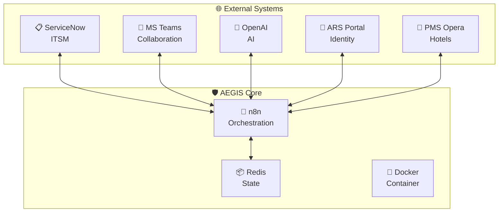
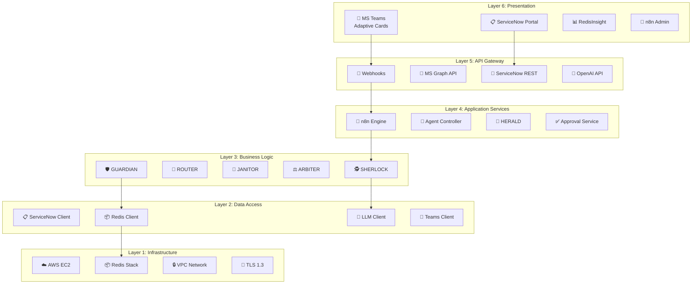
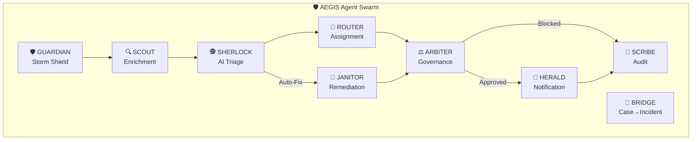
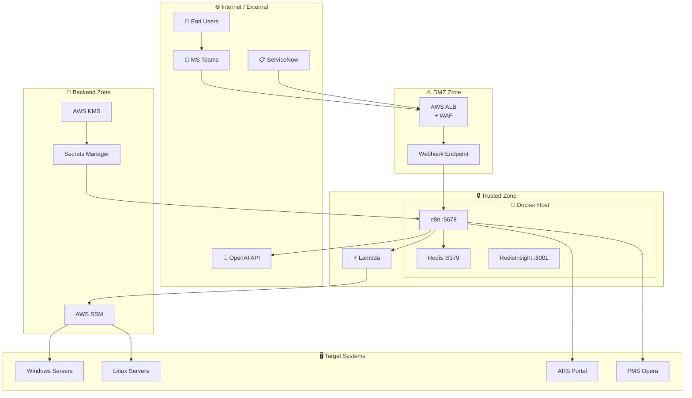
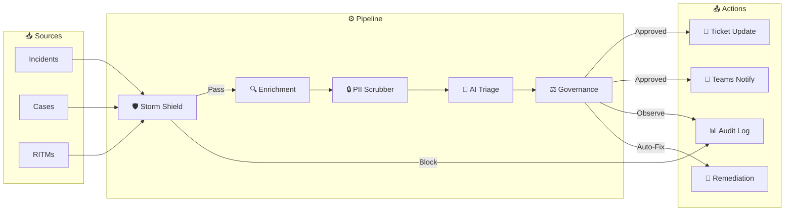

# 🛡️ AEGIS Architecture Overview

**Project:** AEGIS - Autonomous Expert for Governance, Intelligence & Swarming  
**Client:** Accor Hotels

## System Context Diagram (Mermaid)

---

## Layered Architecture (Mermaid)

---

## Agent Architecture

### Multi-Agent Swarm (Mermaid)

### Agent Roles

| Agent | Icon | Responsibility | Trigger |
|-------|------|----------------|---------|
| **GUARDIAN** | 🛡️ | Storm Shield - Blocks duplicates | Every new ticket |
| **SCOUT** | 🔍 | Context enrichment (caller, history) | After GUARDIAN pass |
| **SHERLOCK** | 🕵️ | AI reasoning, RCA, KB search | After SCOUT |
| **ROUTER** | 🚦 | Assignment group selection | After SHERLOCK |
| **ARBITER** | ⚖️ | Governance check (kill switch, mode) | Before any write |
| **HERALD** | 📢 | Teams notifications | After ARBITER approval |
| **SCRIBE** | 📝 | Audit logging | All decisions |
| **BRIDGE** | 🌉 | Case → Incident conversion | L1 case flagged |
| **JANITOR** | 🧹 | Auto-remediation | High confidence + approval |

---

## Deployment Architecture (Mermaid)

### Security Zones

---

## Data Flow (Mermaid)

### Incident Triage Flow

---

## Redis Schema

| Key Pattern | Type | TTL | Purpose |
|-------------|------|-----|---------|
| `storm:{hash}` | Counter | 900s | Deduplication |
| `gov:killswitch` | Boolean | — | Emergency stop |
| `gov:mode` | String | — | assist/observe/execute |
| `gov:killswitch:*` | Hash | — | Activation metadata |
| `killswitch:pending:*` | JSON | 300s | PIN verification |
| `audit:{inc}` | List | 604800s | Decision log |

---

## Security Controls

| Layer | Control | Technology |
|-------|---------|------------|
| Network | Encryption | TLS 1.3 |
| Network | WAF | AWS WAF |
| Identity | SSO | Azure AD |
| Identity | MFA | Conditional Access |
| Data | Encryption at Rest | AWS EBS, Redis AOF |
| Data | PII Protection | pii-scrubber workflow |
| Access | RBAC | Azure AD Groups |
| Audit | Logging | ServiceNow u_ai_audit_log |
