# 🛡️ AEGIS Architecture Overview

**Project:** AEGIS - Autonomous IT Operations & Swarming Platform  
**Client:** Accor Hotels  
**Stack:** LangGraph + FastAPI v2.1

## System Context Diagram

```mermaid
graph TB
    subgraph "🌐 External Systems"
        SNOW["📋 ServiceNow<br/>ITSM"]
        TEAMS["💬 MS Teams<br/>Collaboration"]
        LLM["🧠 Claude/GPT-4o<br/>AI"]
        ARS["🔐 ARS Portal<br/>Identity"]
    end

    subgraph "🛡️ AEGIS Core"
        API["⚡ FastAPI<br/>API Server"]
        QUEUE["📦 Redis<br/>Queue"]
        WORKER["👷 Worker<br/>LangGraph"]
        RAG["🔍 RAG<br/>Service"]
        ADMIN["🖥️ Admin<br/>Portal"]
    end

    SNOW <--> API
    TEAMS <--> API
    API --> QUEUE
    QUEUE --> WORKER
    WORKER --> LLM
    WORKER --> RAG
    WORKER --> ARS
    ADMIN --> API
```

---

## Layered Architecture

---

## LangGraph Pipeline Architecture

### 4-Node Triage Pipeline

```mermaid
flowchart LR
    subgraph "📥 Ingest"
        API["API Server"]
        SCRUB["PII Scrub"]
        QUEUE["Redis Queue"]
    end

    subgraph "⚙️ LangGraph Pipeline"
        N1["🛡️ Guardrails<br/>Dedup + Safety"]
        N2["🔍 Enrichment<br/>KB + User + CI"]
        N3["🧠 Triage LLM<br/>1 Call Only"]
        N4["⚡ Executor<br/>SNOW + Teams"]
    end

    subgraph "📤 Output"
        SNOW["ServiceNow Update"]
        TEAMS["Teams Card"]
        SSM["Auto-Heal"]
        AUDIT["Audit Log"]
    end

    API --> SCRUB --> QUEUE
    QUEUE --> N1
    N1 -->|Pass| N2
    N1 -->|Dup| AUDIT
    N2 --> N3
    N3 --> N4
    N4 --> SNOW
    N4 --> TEAMS
    N4 -->|High Conf| SSM
    N4 --> AUDIT
```

### Pipeline Nodes

| Node | Function | Duration |
|------|----------|----------|
| **Guardrails** | PII scrub (Presidio) + Vector dedup (90% similarity) | ~200ms |
| **Enrichment** | KB search + User info + CI details | ~500ms |
| **Triage LLM** | Single LLM call: classify + route + action | ~2-3s |
| **Executor** | Update SNOW + Teams + optional auto-heal | ~500ms |

**Total:** 2-5 seconds per ticket (vs 15-35s with 7-agent swarm)

---

## Deployment Architecture

### Security Zones

```mermaid
graph TB
    subgraph "🌐 Internet"
        USER["👤 End Users"]
        TEAMS_EXT["💬 MS Teams"]
        SNOW_EXT["📋 ServiceNow"]
        LLM_EXT["🧠 LLM API"]
    end

    subgraph DMZ["⚠️ DMZ Zone"]
        ALB["AWS ALB<br/>+ WAF"]
    end

    subgraph TRUSTED["🔒 Trusted Zone"]
        subgraph DOCKER["🐳 Docker Compose"]
            API["FastAPI :8000"]
            ADMIN["Admin Portal :3000"]
            WORKER["Triage Worker x2"]
            REDIS["Redis :6379"]
            RAG["RAG Service :8100"]
        end
    end

    subgraph BACKEND["🔐 Backend Zone"]
        SSM["AWS SSM"]
        SECRETS["Secrets Manager"]
    end

    USER --> TEAMS_EXT
    TEAMS_EXT --> ALB
    SNOW_EXT --> ALB
    ALB --> API
    ALB --> ADMIN
    API --> REDIS
    REDIS --> WORKER
    WORKER --> LLM_EXT
    WORKER --> RAG
    WORKER --> SSM
    SECRETS --> API
```

---

## Data Flow

### Incident Triage Flow

```mermaid
flowchart LR
    subgraph INPUT["📥 Sources"]
        INC["Incidents"]
        CASE["Cases"]
    end

    subgraph PIPELINE["⚙️ LangGraph"]
        PII["🔒 PII Scrub"]
        DEDUP["🛡️ Vector Dedup"]
        ENRICH["🔍 Enrichment"]
        LLM["🧠 Triage LLM"]
        GOV["⚖️ Governance"]
    end

    subgraph OUTPUT["📤 Actions"]
        UPDATE["📝 Ticket Update"]
        NOTIFY["📢 Teams Notify"]
        AUDIT["📊 Audit Log"]
        EXEC["🔧 Auto-Heal"]
    end

    INC --> PII
    CASE --> PII
    PII --> DEDUP
    DEDUP -->|Pass| ENRICH
    DEDUP -->|Dup| AUDIT
    ENRICH --> LLM
    LLM --> GOV
    GOV -->|Approved| UPDATE
    GOV -->|Approved| NOTIFY
    GOV -->|High Conf| EXEC
    GOV --> AUDIT
```

---

## Redis Schema

| Key Pattern | Type | TTL | Purpose |
|-------------|------|-----|---------|
| `aegis:queue:triage` | List | — | Incident queue |
| `aegis:queue:processing` | List | — | Currently processing |
| `aegis:queue:dead_letter` | List | — | Failed items |
| `gov:killswitch` | String | — | Emergency stop |
| `gov:mode` | String | — | assist/observe/auto |
| `gov:threshold:*` | String | — | Confidence thresholds |
| `triage:result:{id}` | JSON | 24h | Triage results |
| `logs:activity` | List | — | Activity log (last 1000) |
| `stats:daily` | Hash | — | Daily processing stats |

---

## Security Controls

| Layer | Control | Technology |
|-------|---------|------------|
| Network | Encryption | TLS 1.3 |
| Network | WAF | AWS WAF |
| Data | PII Protection | Microsoft Presidio |
| Data | Encryption at Rest | AWS EBS, Redis AOF |
| Identity | Admin Auth | Username/Password |
| Queue | Reliability | Redis BRPOPLPUSH |
| AI | Cost Control | 1 LLM call per ticket |
| Audit | Logging | Redis + ServiceNow |

---

## Performance Comparison

| Metric | v2.0 (CrewAI) | v2.1 (LangGraph) |
|--------|---------------|------------------|
| LLM Calls/Ticket | 7 | 1 |
| Latency | 15-35s | 2-5s |
| Monthly Cost (15k) | ~$5,000 | ~$700 |
| Queue Reliability | Low | High |
| PII Protection | None | Presidio |
