# 🛡️ AEGIS Architecture Overview

**Project:** AEGIS - Autonomous IT Operations & Swarming Platform  
**Client:** Accor Hotels  
**Stack:** CrewAI + LangFlow

## System Context Diagram (Mermaid)

```mermaid
graph TB
    subgraph "🌐 External Systems"
        SNOW["📋 ServiceNow<br/>ITSM"]
        TEAMS["💬 MS Teams<br/>Collaboration"]
        OPENAI["🧠 OpenAI/Claude<br/>AI"]
        ARS["🔐 ARS Portal<br/>Identity"]
        OPERA["🏨 PMS Opera<br/>Hotels"]
    end

    subgraph "🛡️ AEGIS Core"
        CREW["👥 CrewAI<br/>9 Agents"]
        API["⚡ FastAPI<br/>Webhooks"]
        LF["🎨 LangFlow<br/>Pipelines"]
        REDIS["📦 Redis<br/>State"]
    end

    SNOW <--> API
    TEAMS <--> API
    API --> CREW
    CREW --> OPENAI
    CREW --> ARS
    CREW --> OPERA
    CREW <--> REDIS
    LF --> CREW
```

---

## Layered Architecture (Mermaid)

```mermaid
graph TB
    subgraph "Layer 6: Presentation"
        UI_TEAMS["💬 MS Teams<br/>Adaptive Cards"]
        UI_SNOW["📋 ServiceNow Portal"]
        UI_INSIGHT["📊 RedisInsight"]
        UI_LF["🎨 LangFlow UI"]
    end

    subgraph "Layer 5: API Gateway"
        API_WEBHOOK["🔗 Webhooks"]
        API_GRAPH["🔐 MS Graph API"]
        API_SNOW["📡 ServiceNow REST"]
        API_OPENAI["🧠 OpenAI API"]
    end

    subgraph "Layer 4: Application Services"
        SVC_API["⚡ FastAPI Server"]
        SVC_AGENT["👥 CrewAI Agents"]
        SVC_NOTIFY["📢 HERALD"]
        SVC_APPROVE["✅ Approval Service"]
    end

    subgraph "Layer 3: Business Logic"
        BIZ_TRIAGE["🕵️ SHERLOCK"]
        BIZ_ROUTE["🚦 ROUTER"]
        BIZ_REMED["🧹 JANITOR"]
        BIZ_GOV["⚖️ ARBITER"]
        BIZ_STORM["🛡️ GUARDIAN"]
    end

    subgraph "Layer 2: Data Access"
        DAL_SNOW["📋 ServiceNow Client"]
        DAL_REDIS["📦 Redis Client"]
        DAL_LLM["🧠 LLM Client"]
        DAL_TEAMS["💬 Teams Client"]
    end

    subgraph "Layer 1: Infrastructure"
        INFRA_AWS["☁️ AWS EC2"]
        INFRA_REDIS["📦 Redis Stack"]
        INFRA_NET["🔒 VPC Network"]
        INFRA_SSL["🔐 TLS 1.3"]
    end

    UI_TEAMS --> API_WEBHOOK
    UI_SNOW --> API_SNOW
    API_WEBHOOK --> SVC_API
    SVC_API --> SVC_AGENT
    SVC_AGENT --> BIZ_TRIAGE
    BIZ_TRIAGE --> DAL_LLM
    BIZ_STORM --> DAL_REDIS
    DAL_REDIS --> INFRA_REDIS
```

---

## Agent Architecture

### Multi-Agent Swarm (Mermaid)

```mermaid
graph TB
    subgraph "🛡️ AEGIS Agent Swarm"
        GUARDIAN["🛡️ GUARDIAN<br/>Storm Shield"]
        SCOUT["🔍 SCOUT<br/>Enrichment"]
        SHERLOCK["🕵️ SHERLOCK<br/>AI Triage"]
        ROUTER["🚦 ROUTER<br/>Assignment"]
        ARBITER["⚖️ ARBITER<br/>Governance"]
        HERALD["📢 HERALD<br/>Notification"]
        SCRIBE["📝 SCRIBE<br/>Audit"]
        BRIDGE["🌉 BRIDGE<br/>Case→Incident"]
        JANITOR["🧹 JANITOR<br/>Remediation"]
    end
    
    GUARDIAN --> SCOUT
    SCOUT --> SHERLOCK
    SHERLOCK --> ROUTER
    SHERLOCK -->|Auto-Fix| JANITOR
    ROUTER --> ARBITER
    JANITOR --> ARBITER
    ARBITER -->|Approved| HERALD
    ARBITER -->|Blocked| SCRIBE
    HERALD --> SCRIBE
```

### Agent Roles

| Agent | Icon | Responsibility | Trigger |
|-------|------|----------------|---------|
| **GUARDIAN** | 🛡️ | Storm Shield - Blocks duplicates | Every new ticket |
| **SCOUT** | 🔍 | Context enrichment (caller, history) | After GUARDIAN pass |
| **SHERLOCK** | 🕵️ | AI reasoning, RCA, KB search | After SCOUT |
| **ROUTER** | 🚦 | Assignment group selection | After SHERLOCK |
| **ARBITER** | ⚖️ | Governance check (kill switch, mode) | Before any write |
| **HERALD** | 📢 | Teams notifications | After ARBITER approval |
| **SCRIBE** | 📝 | Audit logging | All decisions |
| **BRIDGE** | 🌉 | Case → Incident conversion | L1 case flagged |
| **JANITOR** | 🧹 | Auto-remediation | High confidence + approval |

---

## Deployment Architecture (Mermaid)

### Security Zones

```mermaid
graph TB
    subgraph "🌐 Internet / External"
        USER["👤 End Users"]
        TEAMS_EXT["💬 MS Teams"]
        SNOW_EXT["📋 ServiceNow"]
        OPENAI_EXT["🧠 OpenAI API"]
    end

    subgraph DMZ["⚠️ DMZ Zone"]
        ALB["AWS ALB<br/>+ WAF"]
        WEBHOOK["Webhook Endpoint"]
    end

    subgraph TRUSTED["🔒 Trusted Zone"]
        subgraph DOCKER["🐳 Docker Host"]
            API["FastAPI :8000"]
            LF["LangFlow :7860"]
            REDIS["Redis :6379"]
            INSIGHT["RedisInsight :8001"]
        end
        LAMBDA["⚡ Lambda"]
    end

    subgraph BACKEND["🔐 Backend Zone"]
        SSM["AWS SSM"]
        SECRETS["Secrets Manager"]
        KMS["AWS KMS"]
    end

    subgraph TARGETS["🖥️ Target Systems"]
        WIN["Windows Servers"]
        LINUX["Linux Servers"]
        ARS["ARS Portal"]
        OPERA["PMS Opera"]
    end

    USER --> TEAMS_EXT
    TEAMS_EXT --> ALB
    SNOW_EXT --> ALB
    ALB --> WEBHOOK
    WEBHOOK --> API
    API --> REDIS
    API --> LAMBDA
    LAMBDA --> SSM
    SSM --> WIN
    SSM --> LINUX
    API --> OPENAI_EXT
    API --> ARS
    API --> OPERA
    SECRETS --> API
    KMS --> SECRETS
```

---

## Data Flow (Mermaid)

### Incident Triage Flow

```mermaid
flowchart LR
    subgraph INPUT["📥 Sources"]
        INC["Incidents"]
        CASE["Cases"]
        RITM["RITMs"]
    end

    subgraph PROCESS["⚙️ Pipeline"]
        STORM["🛡️ Storm Shield"]
        ENRICH["🔍 Enrichment"]
        PII["🔒 PII Scrubber"]
        AI["🧠 AI Triage"]
        GOV["⚖️ Governance"]
    end

    subgraph OUTPUT["📤 Actions"]
        UPDATE["📝 Ticket Update"]
        NOTIFY["📢 Teams Notify"]
        AUDIT["📊 Audit Log"]
        EXEC["🔧 Remediation"]
    end

    INC --> STORM
    CASE --> STORM
    RITM --> STORM
    STORM -->|Pass| ENRICH
    STORM -->|Block| AUDIT
    ENRICH --> PII
    PII --> AI
    AI --> GOV
    GOV -->|Approved| UPDATE
    GOV -->|Approved| NOTIFY
    GOV -->|Observe| AUDIT
    GOV -->|Auto-Fix| EXEC
```

---

## Redis Schema

| Key Pattern | Type | TTL | Purpose |
|-------------|------|-----|---------|
| `storm:{hash}` | Counter | 900s | Deduplication |
| `gov:killswitch` | Boolean | — | Emergency stop |
| `gov:mode` | String | — | assist/observe/execute |
| `gov:killswitch:*` | Hash | — | Activation metadata |
| `killswitch:pending:*` | JSON | 300s | PIN verification |
| `audit:{inc}` | List | 604800s | Decision log |

---

## Security Controls

| Layer | Control | Technology |
|-------|---------|------------|
| Network | Encryption | TLS 1.3 |
| Network | WAF | AWS WAF |
| Identity | SSO | Azure AD |
| Identity | MFA | Conditional Access |
| Data | Encryption at Rest | AWS EBS, Redis AOF |
| Data | PII Protection | PII scrubber agent |
| Access | RBAC | Azure AD Groups |
| Audit | Logging | ServiceNow u_ai_audit_log |
