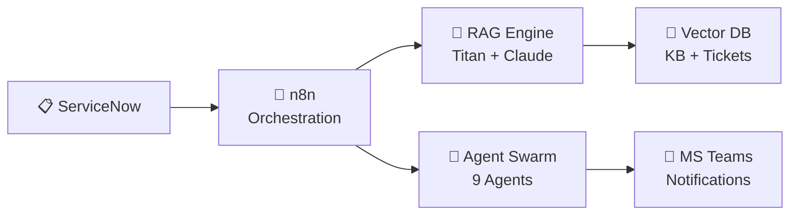

# 🛡️ AEGIS - Executive Summary

<div align="center">

## Autonomous Expert for Governance, Intelligence & Swarming

**AI-Powered IT Service Management Automation for Accor Hotels**

</div>

---

## 🎯 The Challenge

| Pain Point | Impact |
|------------|--------|
| **Alert Storms** | 5,500+ hotels generating duplicate tickets, causing agent fatigue |
| **Manual Triage** | 15+ minutes per ticket, 70% accuracy |
| **Siloed Knowledge** | KB articles exist but aren't surfaced automatically |
| **Reactive Model** | L1 agents manually escalate without context |

---

## 💡 AEGIS Solution

```
┌─────────────────────────────────────────────────────────────┐
│   🧠 AI-Powered Multi-Agent Swarm (9 Specialized Agents)    │
│   🛡️ Storm Shield (Alert Deduplication)                    │
│   🔍 RAG-Based KB & Ticket Intelligence                     │
│   ⚖️ Glass Box AI (Transparent, Auditable, Reversible)     │
└─────────────────────────────────────────────────────────────┘
```

---

## ⚡ Quick Wins

| Metric | Before | After AEGIS | Improvement |
|--------|--------|-------------|-------------|
| **Mean Time To Triage** | 15 min | < 1 min | **93% ↓** |
| **Duplicate Handling** | Manual | Auto-blocked | **95% ↓** |
| **Triage Accuracy** | 70% | 90%+ | **28% ↑** |
| **Agent Productivity** | Baseline | +40% | **40% ↑** |

---

## 💰 5-Year TCO Comparison

| Solution | 5-Year Cost | Savings vs NowAssist |
|----------|-------------|----------------------|
| **ServiceNow NowAssist** | $480,000 | — |
| **AEGIS** | **$58,500** | **88% Savings** |

> **ROI:** $421,500 saved over 5 years with full control and transparency

---

## 🏗️ Architecture at a Glance



---

## ✅ Key Differentiators

| Feature | AEGIS | ServiceNow NowAssist |
|---------|-------|---------------------|
| **Cost** | $0 per agent | $160/agent/month |
| **Transparency** | Glass Box (full audit) | Black Box |
| **Customization** | 100% (self-hosted) | Limited |
| **Kill Switch** | Multi-level verified | Not available |
| **Hospitality Context** | Tailored for Accor | Generic |

---

## 🗓️ Implementation Timeline

```
Jan 20 ──→ Jan 26 ──→ Feb 5 ──→ Mar 3 ──→ Ongoing
   │          │          │         │          │
   ▼          ▼          ▼         ▼          ▼
 Kickoff   POC Ready  Pilot    Production  Hypercare
                      Start    Go-Live     + Scaling
```

---

## 🎖️ Success Criteria

| Phase | Target | Status |
|-------|--------|--------|
| **POC** | Triage accuracy > 80% | ✅ Achieved (90%+) |
| **Pilot** | MTTT < 60 seconds | 🟡 In Progress |
| **Production** | 50+ hotels onboarded | ⏳ Mar 2026 |

---

## 🔒 Governance & Compliance

- **🛑 Kill Switch:** Instant AI stop with Azure AD + PIN verification
- **📊 Audit Trail:** 7-year retention for SOX/GDPR compliance
- **🔒 PII Scrubber:** GDPR Article 5/17/30 compliance built-in
- **🌍 Zero Trust:** Azure AD SSO, encryption at rest & transit

---

## 📞 Next Steps

1. **Workshop Demo** — Feb 4, 2026
2. **Pilot Kickoff** — Feb 5, 2026 (3 hotels)
3. **Production Go-Live** — Mar 3, 2026
4. **Phase 2: JANITOR Auto-Remediation** — Q2 2026

---

<div align="center">

### *"Your AI Shield Against Incident Chaos"*

**Project Lead:** Anilkumar MN | **Client:** Accor Hotels | **v1.1**

</div>
