# AEGIS – Executive 1-Pager

**Autonomous IT Operations & Swarming Platform**  
*Feb 4 Workshop | Accor Hotels*

---

## 1. Executive Context (The Problem)

The Service Desk currently processes **20,000–30,000 incidents per month**.

This volume creates operational noise that:

```mermaid
mindmap
  root((Operational Challenges))
    🔴 Critical Incidents Buried
      Hidden in noise
      Delayed detection
    ⏱️ 2,000+ Hours/Month
      Manual triage
      L1 effort wasted
    📈 MTTR & SLA Risk
      Slower resolution
      Compliance gaps
    ⚡ Peak Period Delays
      Outage overload
      Bottlenecks
```

> **Traditional ITSM tools remain reactive, rule-driven, and human-dependent at scale.**

---

## 2. The Vision

**AEGIS transforms the Service Desk from a ticket queue into an autonomous, governed swarming engine.**

```mermaid
flowchart LR
    subgraph TODAY["❌ Today: Ticket Queue"]
        T1["📥 Tickets"] --> T2["👤 Manual<br/>Sorting"] --> T3["🔄 Slow<br/>Routing"] --> T4["⏳ Delayed<br/>Resolution"]
    end
    
    subgraph AEGIS["✅ With AEGIS: Swarming Engine"]
        A1["📥 Tickets"] --> A2["🛡️ Noise<br/>Suppressed"] --> A3["🧠 Intent<br/>Understood"] --> A4["👥 Experts<br/>Assembled"] --> A5["⚡ Auto<br/>Resolution"]
    end
    
    style TODAY fill:#ffcdd2,stroke:#c62828
    style AEGIS fill:#c8e6c9,stroke:#2e7d32
```

Instead of manually sorting tickets, AEGIS:

| Capability | Description |
|------------|-------------|
| 🛡️ **Suppresses Noise** | Blocks duplicates before they reach humans |
| 🧠 **Understands Intent** | Instantly detects impact and urgency |
| 👥 **Assembles Experts** | Right people, right time, automatically |
| 🔧 **Automates Safely** | Low-risk, high-volume resolutions |

> **This is Autonomous IT Operations with human control, not chatbots or black-box automation.**

---

## 3. What Is AEGIS

**AEGIS is a governance-first, AI-driven orchestration platform that sits between ServiceNow and support teams.**

```mermaid
graph TB
    subgraph AEGIS["🛡️ AEGIS Platform"]
        direction TB
        SS["🛡️ Storm Shield<br/><i>Blocks duplicates & alert floods</i>"]
        IT["🧠 Intelligent Triage<br/><i>AI classification, prioritization, routing</i>"]
        CI["🔍 Contextual Intelligence<br/><i>Root cause via institutional knowledge</i>"]
        CS["👥 Collaborative Swarming<br/><i>Expert assembly via MS Teams</i>"]
        SG["🔒 Safety & Governance<br/><i>Kill switch, audit logs, change enforcement</i>"]
    end
    
    SNOW["📋 ServiceNow"] --> AEGIS --> TEAMS["💬 Support Teams"]
    
    style AEGIS fill:#1a1a2e,stroke:#16213e,color:#fff
    style SNOW fill:#78BE20,stroke:#5a9216,color:#fff
    style TEAMS fill:#5558AF,stroke:#40428a,color:#fff
```

### Core Capabilities

| Capability | Function |
|------------|----------|
| **Storm Shield** | Blocks duplicate incidents and alert floods |
| **Intelligent Triage** | AI-based classification, prioritization, and routing |
| **Contextual Intelligence** | Root cause analysis using institutional knowledge |
| **Collaborative Swarming** | Automatic expert assembly via Microsoft Teams |
| **Safety & Governance** | Kill switch, audit logs, standard change enforcement |

> **AEGIS augments ServiceNow. It does not replace existing ITSM investments.**

---

## 4. Before vs After Operating Model

```mermaid
graph LR
    subgraph TODAY["❌ Today (Reactive)"]
        direction TB
        R1["📋 Manual triage & routing"]
        R2["📈 High L1 workload"]
        R3["🔍 Slow expert discovery"]
        R4["⏳ Delayed response during spikes"]
        R5["❓ Inconsistent resolution quality"]
    end
    
    subgraph FUTURE["✅ With AEGIS (Autonomous + Governed)"]
        direction TB
        A1["🛡️ Noise suppressed at ingestion"]
        A2["🧠 Instant triage with context"]
        A3["👥 Experts assembled in seconds"]
        A4["👤 Human-in-the-loop for risk"]
        A5["✅ Faster, consistent resolution"]
    end
    
    TODAY --> FUTURE
    
    style TODAY fill:#ffcdd2,stroke:#c62828
    style FUTURE fill:#c8e6c9,stroke:#2e7d32
```

| Dimension | Today (Reactive) | With AEGIS |
|-----------|------------------|------------|
| **Triage** | Manual | Noise suppressed at ingestion |
| **Routing** | Slow, manual | Instant with context |
| **Expert Discovery** | Delayed | Assembled in seconds |
| **Risk Management** | Ad-hoc | Human-in-the-loop |
| **Resolution Quality** | Inconsistent | Faster, consistent |

> **Outcome: Humans focus on solving problems, not sorting tickets.**

---

## 5. Target Business Outcomes (Pilot Scope)

```mermaid
mindmap
  root((Pilot Outcomes))
    📉 MTTR Reduction
      30–40%
      Faster resolution
    🔄 Volume Deflection
      25–35% automated
      No human touch
    ⏱️ Capacity Reclaimed
      ~2,000 hours/month
      10–12 FTE equivalent
    ✅ Service Quality
      Improved SLA
      Guest impact reduction
```

| Outcome | Target | Impact |
|---------|--------|--------|
| **MTTR Reduction** | 30–40% | Faster incident resolution |
| **Volume Deflection** | 25–35% | Tickets fully automated |
| **Capacity Reclaimed** | ~2,000 hours/month | 10–12 FTE equivalent |
| **Service Quality** | Improved | SLA compliance, guest impact reduction |

> **Value is delivered through capacity uplift and service reliability, not headcount reduction.**

---

## 6. Governance & Risk Control (Why This Is Safe)

**AEGIS is designed for enterprise production from day one.**

```mermaid
flowchart LR
    subgraph CONTROLS["🔒 Safety Controls"]
        C1["📊 Confidence<br/>Thresholds"]
        C2["👤 Human-in-Loop<br/>(Med/High Risk)"]
        C3["🛑 Global<br/>Kill Switch"]
        C4["📝 Full<br/>Audit Trail"]
        C5["✅ Standard<br/>Changes Only"]
    end
    
    C1 --> SAFE["✅ Safe<br/>Operations"]
    C2 --> SAFE
    C3 --> SAFE
    C4 --> SAFE
    C5 --> SAFE
    
    style CONTROLS fill:#e3f2fd,stroke:#1976d2
    style SAFE fill:#4caf50,stroke:#2e7d32,color:#fff
```

| Control | Description |
|---------|-------------|
| **Confidence Thresholds** | AI actions gated by accuracy scores |
| **Human-in-the-Loop** | Required for medium/high-risk incidents |
| **Global Kill Switch** | Stops all AI before any write action |
| **Full Audit Trail** | Every AI decision logged and traceable |
| **Standard Changes Only** | Auto-remediation via approved changes |

> **This ensures control, transparency, and compliance.**

---

## Workshop Agenda (Feb 4)

| Time | Topic |
|------|-------|
| 10:00 | Executive Context & Vision |
| 10:15 | Live Demo: Storm Shield + AI Triage |
| 10:30 | Before/After Operating Model |
| 10:45 | Governance & Kill Switch Demo |
| 11:00 | Pilot Scope & Next Steps |

---

**AEGIS – Autonomous IT Operations & Swarming Platform**  
*"Your AI Shield Against Incident Chaos"*

**Contact:** Anilkumar MN

