# AEGIS Orchestration: CrewAI + LangFlow vs UiPath Agentic

**Decision Document:** Technology Stack Comparison  
**Date:** January 30, 2026

---

## Executive Summary

| Dimension | CrewAI + LangFlow | UiPath Agentic |
|-----------|-------------------|----------------|
| **License** | MIT (Free) ✅ | Commercial ($40K-$100K+/yr) |
| **20-30K Tickets/Month** | ✅ Supported | ✅ Supported |
| **Vendor Lock-in** | Low | High |
| **Enterprise Governance** | Manual setup | Built-in |
| **Best For** | AI-native, API-first | Legacy UI, RPA workflows |

---

## 1. Scalability Analysis (20-30K Tickets/Month)

### CrewAI + LangFlow Capacity

| Metric | Value | Notes |
|--------|-------|-------|
| **Tickets/Day** | ~1,000 | 30K ÷ 30 days |
| **Tickets/Hour** | ~42 | 24/7 operation |
| **Tickets/Minute** | < 1 | Well within capacity |
| **Processing Time** | < 60 sec/ticket | AI triage target |
| **Concurrent Agents** | 9 agents | CrewAI supports parallel execution |

**Infrastructure for 30K Tickets/Month:**

```
┌─────────────────────────────────────────────────────────────┐
│  EC2 Instance: t3.xlarge (4 vCPU, 16 GB RAM)                │
│  ├── LangFlow: 2 workers                                    │
│  ├── CrewAI: 9 agents (containerized)                       │
│  ├── FastAPI RAG: 2 workers                                 │
│  └── Redis: Storm Shield cache                              │
│                                                             │
│  Estimated Load: ~42 requests/hour = 0.7 req/min            │
│  Status: ✅ EASILY HANDLED                                  │
└─────────────────────────────────────────────────────────────┘
```

### Scaling Path

| Volume | Infrastructure | Monthly Cost |
|--------|---------------|--------------|
| **30K tickets** | 1x t3.xlarge | ~$150 |
| **100K tickets** | 2x t3.xlarge + ALB | ~$400 |
| **500K tickets** | Kubernetes cluster | ~$1,500 |

---

## 2. Cost Comparison (5-Year TCO)

### CrewAI + LangFlow (Self-Hosted)

| Cost Category | Year 1 | Years 2-5 | 5-Year Total |
|---------------|--------|-----------|--------------|
| **Software License** | $0 | $0 | **$0** |
| **AWS Infrastructure** | $2,400 | $9,600 | $12,000 |
| **LLM API Costs** | $6,000 | $24,000 | $30,000 |
| **Development** | $25,000 | $10,000 | $35,000 |
| **Support/Maintenance** | $5,000 | $20,000 | $25,000 |
| **Training** | $3,000 | $2,000 | $5,000 |
| **TOTAL** | **$41,400** | **$65,600** | **$107,000** |

### UiPath Agentic (With Existing License)

| Cost Category | Year 1 | Years 2-5 | 5-Year Total |
|---------------|--------|-----------|--------------|
| **Platform License** | $50,000* | $200,000 | $250,000 |
| **AI Units (GenAI)** | $15,000 | $60,000 | $75,000 |
| **Robot Licenses** | $20,000 | $80,000 | $100,000 |
| **Infrastructure** | $2,400 | $9,600 | $12,000 |
| **Development** | $15,000 | $5,000 | $20,000 |
| **Support (UiPath)** | $10,000 | $40,000 | $50,000 |
| **TOTAL** | **$112,400** | **$394,600** | **$507,000** |

*Note: Even with existing RPA license, Agentic AI features require additional AI Units*

### 5-Year Savings with CrewAI + LangFlow

```
┌─────────────────────────────────────────────────────────────┐
│                                                             │
│   UiPath Agentic:      $507,000                             │
│   CrewAI + LangFlow:   $107,000                             │
│                        ─────────                            │
│   SAVINGS:             $400,000 (79% reduction)             │
│                                                             │
└─────────────────────────────────────────────────────────────┘
```

---

## 3. Operational Complexity Comparison

| Dimension | CrewAI + LangFlow | UiPath Agentic |
|-----------|-------------------|----------------|
| **Skills Required** | Python, AI/ML | UiPath Studio, RPA |
| **Learning Curve** | Moderate (2-4 weeks) | Low (1-2 weeks if RPA exp) |
| **Deployment** | Docker/K8s | UiPath Orchestrator |
| **Debugging** | LangSmith, logs | UiPath Insights |
| **Version Control** | Git (native) | UiPath packages |
| **CI/CD** | Standard pipelines | UiPath-specific |

### Complexity Score (1-5, lower is easier)

| Task | CrewAI + LangFlow | UiPath |
|------|-------------------|--------|
| Initial Setup | 3 | 2 |
| Day-to-Day Operations | 2 | 2 |
| Adding New Agents | 2 | 3 |
| LLM Model Swapping | 1 | 4 |
| Scaling | 2 | 2 |
| Troubleshooting | 3 | 2 |
| **Average** | **2.2** | **2.5** |

---

## 4. Feature Comparison

| Feature | CrewAI + LangFlow | UiPath Agentic |
|---------|-------------------|----------------|
| **Multi-Agent Orchestration** | ✅ Native (CrewAI) | ✅ Agent Builder |
| **Visual Workflow Builder** | ✅ LangFlow | ✅ Studio |
| **ServiceNow Integration** | ✅ API-based | ✅ Native connector |
| **MS Teams Integration** | ✅ Webhook/Graph | ✅ Native |
| **Kill Switch** | ✅ Custom (Redis) | ✅ Orchestrator |
| **Audit Logging** | ✅ Custom/LangSmith | ✅ Built-in |
| **Human-in-the-Loop** | ✅ Custom | ✅ Action Center |
| **RAG/Embeddings** | ✅ ChromaDB | ⚠️ Limited |
| **LLM Flexibility** | ✅ Any (OpenAI, Claude, local) | ⚠️ UiPath AI models |
| **Legacy UI Automation** | ❌ Limited | ✅ Excellent |
| **SOC2/Compliance** | ⚠️ Self-implement | ✅ Built-in |

---

## 5. Key Differentiators

### Why CrewAI + LangFlow for AEGIS

```mermaid
graph TB
    subgraph AEGIS["🛡️ AEGIS with CrewAI + LangFlow"]
        A1["✅ Zero License Cost"]
        A2["✅ LLM-Native (Claude, GPT-4)"]
        A3["✅ Full RAG Support"]
        A4["✅ No Vendor Lock-in"]
        A5["✅ Python Flexibility"]
        A6["✅ Visual + Code Hybrid"]
    end
    
    style AEGIS fill:#c8e6c9,stroke:#2e7d32
```



### When UiPath Makes Sense

- ✅ Heavy legacy desktop automation (SAP, Citrix)
- ✅ Existing UiPath developer team
- ✅ Strict SOC2/FedRAMP requirements out-of-box
- ❌ Not ideal for AI-first, reasoning-heavy workflows

---

## 6. Risk Comparison

| Risk | CrewAI + LangFlow | UiPath Agentic |
|------|-------------------|----------------|
| **Vendor Bankruptcy** | Low (MIT, fork-able) | Medium (VC-backed) |
| **Price Increases** | None (open source) | High risk |
| **Talent Availability** | Growing Python/AI pool | Limited UiPath experts |
| **Technology Obsolescence** | Low (LLM ecosystem growing) | Medium (RPA declining) |
| **Integration Flexibility** | High | Medium |

---

## 7. Recommendation

### For AEGIS: **CrewAI + LangFlow** ✅

| Reason | Impact |
|--------|--------|
| **$400K savings over 5 years** | Direct cost reduction |
| **No additional licensing** | Uses existing AWS/Azure |
| **AI-native architecture** | Better fit for intelligent triage |
| **LLM flexibility** | Can switch OpenAI ↔ Claude ↔ local |
| **Developer productivity** | Python > proprietary tools |

---

## 8. Architecture: AEGIS with CrewAI + LangFlow

```mermaid
graph TB
    subgraph PRESENTATION["Layer 1: Presentation"]
        SNOW["📋 ServiceNow"]
        TEAMS["💬 MS Teams"]
    end
    
    subgraph ORCHESTRATION["Layer 2: LangFlow Orchestration"]
        LF["🎨 LangFlow<br/>Visual Pipelines"]
        STORM["🛡️ Storm Shield"]
        TRIAGE["🧠 Triage Flow"]
    end
    
    subgraph AGENTS["Layer 3: CrewAI Agent Swarm"]
        CREW["👥 CrewAI<br/>9 Agents"]
        GUARDIAN["🛡️ GUARDIAN"]
        SHERLOCK["🕵️ SHERLOCK"]
        JANITOR["🧹 JANITOR"]
    end
    
    subgraph AI["Layer 4: AI Engine"]
        RAG["🧠 RAG Service<br/>(FastAPI)"]
        CHROMA["🔍 ChromaDB"]
        REDIS["📦 Redis"]
    end
    
    subgraph LLM["Layer 5: LLM Inference"]
        OPENAI["🧠 OpenAI"]
        CLAUDE["🤖 Claude"]
        TITAN["📐 Titan"]
    end
    
    SNOW --> LF
    TEAMS --> LF
    LF --> CREW
    CREW --> RAG
    RAG --> CHROMA
    CREW --> REDIS
    RAG --> OPENAI
    RAG --> CLAUDE
    
    style ORCHESTRATION fill:#FCE4EC,stroke:#C2185B
    style AGENTS fill:#E8F5E9,stroke:#388E3C
    style AI fill:#E3F2FD,stroke:#1976D2
```



---

*Document Owner: Anilkumar MN*  
*Decision: Pending Executive Approval*
