# AEGIS – Enterprise Architecture Alignment

**Document:** EA Pack – ITIL, Capability Map & Integration Model  
**Version:** 1.0 | January 2026

---

## 1. ITIL Alignment Statement

> **AEGIS augments ServiceNow. It does not replace it.**

### ITIL Process Mapping

| ITIL Process | ServiceNow Role | AEGIS Role | Integration |
|--------------|-----------------|------------|-------------|
| **Incident Management** | System of Record | Triage Automation | API augmentation |
| **Problem Management** | Root Cause Tracking | Pattern Detection | Read-only analytics |
| **Knowledge Management** | KB Repository | RAG Retrieval | Search augmentation |
| **Change Management** | CAB Workflow | Auto-remediation Requests | CHG integration |
| **Request Fulfillment** | RITM Processing | Approval Routing | Webhook triggers |

### Key Principle

```
┌─────────────────────────────────────────────────────────────┐
│   ServiceNow = System of Record (Source of Truth)          │
│   AEGIS = Intelligence Layer (Automation & Augmentation)   │
└─────────────────────────────────────────────────────────────┘
```

- All tickets originate in ServiceNow
- All ticket updates flow through ServiceNow API
- AEGIS writes work notes, not primary fields (initially)
- Full audit trail in ServiceNow `u_ai_audit_log`

---

## 2. Capability Map

### Level 0: Enterprise IT Operations

```
┌─────────────────────────────────────────────────────────────────────────┐
│                    ENTERPRISE IT OPERATIONS                             │
├─────────────────────────────────────────────────────────────────────────┤
│                                                                         │
│  ┌─────────────────┐  ┌─────────────────┐  ┌─────────────────┐         │
│  │  Service Desk   │  │  Infrastructure │  │   Application   │         │
│  │   Operations    │  │    Operations   │  │   Operations    │         │
│  └────────┬────────┘  └─────────────────┘  └─────────────────┘         │
│           │                                                             │
│           ▼                                                             │
│  ┌─────────────────────────────────────────────────────────────┐       │
│  │                    AEGIS PLATFORM                            │       │
│  │  ┌─────────────┐  ┌─────────────┐  ┌─────────────┐          │       │
│  │  │  Control    │  │ Intelligence│  │   Action    │          │       │
│  │  │   Plane     │  │    Plane    │  │   Plane     │          │       │
│  │  └─────────────┘  └─────────────┘  └─────────────┘          │       │
│  └─────────────────────────────────────────────────────────────┘       │
│                                                                         │
└─────────────────────────────────────────────────────────────────────────┘
```

### Level 1: AEGIS Capabilities

| Capability | Description | ITIL Alignment |
|------------|-------------|----------------|
| **Storm Shield** | Duplicate ticket detection and blocking | Incident Management |
| **AI Triage** | Automated classification and prioritization | Incident Management |
| **KB Surfacing** | Relevant article retrieval via RAG | Knowledge Management |
| **Smart Routing** | Assignment to correct resolution group | Incident Management |
| **Auto-Remediation** | Scripted fixes with approval | Change Management |
| **Kill Switch** | Emergency governance override | Governance |
| **Audit Logging** | Decision trail for compliance | Governance |

### Level 2: Technical Components

| Component | Technology | Purpose |
|-----------|-----------|---------|
| CrewAI | Agent Framework | 9-agent orchestration |
| LangFlow | Visual Builder | Pipeline design |
| Redis | In-Memory Store | State, deduplication |
| ChromaDB | Vector DB | RAG embeddings |
| FastAPI | API Server | RAG service |
| Docker | Containerization | Deployment |
| AWS EC2 | Compute | Infrastructure |

---

## 3. Integration Architecture

### Systems Integrated

```mermaid
graph LR
    subgraph "Source Systems"
        SNOW["📋 ServiceNow"]
        TEAMS["💬 MS Teams"]
        AAD["🔑 Azure AD"]
    end

    subgraph "AEGIS Platform"
        CREW["👥 CrewAI"]
        RAG["🧠 RAG Service"]
        REDIS["📦 Redis"]
    end

    subgraph "Target Systems"
        ARS["🔐 ARS Portal"]
        OPERA["🏨 Opera PMS"]
        SSM["🔧 AWS SSM"]
    end

    SNOW -->|API| CREW
    TEAMS -->|Webhook| CREW
    AAD -->|OAuth| CREW
    CREW --> RAG
    CREW --> REDIS
    CREW -->|Selenium| ARS
    CREW -->|OHIP| OPERA
    CREW -->|API| SSM
```



### Integration Patterns

| Pattern | Systems | Method | Data Flow |
|---------|---------|--------|-----------|
| **Poll** | ServiceNow | REST API | Inbound (5 min) |
| **Webhook** | ServiceNow | Business Rule | Inbound (real-time) |
| **Webhook** | MS Teams | Connector | Outbound |
| **OAuth** | Azure AD | Graph API | Bidirectional |
| **Selenium** | ARS Portal | Browser Automation | Outbound |
| **REST** | Opera PMS | OHIP API | Bidirectional |
| **REST** | AWS SSM | SDK | Outbound |

---

## 4. What AEGIS Replaces vs Augments

### Does NOT Replace

| System | Reason |
|--------|--------|
| **ServiceNow** | ITSM system of record |
| **MS Teams** | Collaboration platform |
| **Azure AD** | Identity provider |
| **Existing L1/L2/L3** | Human agents remain essential |

### Augments

| Capability | Before AEGIS | With AEGIS |
|------------|--------------|------------|
| Triage | Manual (15 min) | AI-assisted (1 min) |
| KB Search | Manual | Auto-surfaced |
| Duplicate Detection | Manual | Automated (Storm Shield) |
| Routing | Manual lookup | AI recommendation |
| Escalation | Manual | Smart escalation |

### Introduces (New)

| Capability | Description |
|------------|-------------|
| Storm Shield | Proactive duplicate blocking |
| RAG Intelligence | Vector-based KB matching |
| Glass Box AI | Transparent, auditable decisions |
| Kill Switch | Instant AI governance override |

---

## 5. Data Flow Architecture

### Ticket Lifecycle with AEGIS

```
┌─────────┐    ┌─────────┐    ┌─────────┐    ┌─────────┐    ┌─────────┐
│ Ticket  │ →  │ Storm   │ →  │  RAG    │ →  │   AI    │ →  │ Human   │
│ Created │    │ Shield  │    │ Enrich  │    │ Triage  │    │ Review  │
└─────────┘    └─────────┘    └─────────┘    └─────────┘    └─────────┘
     │              │              │              │              │
     │              │              │              │              │
     ▼              ▼              ▼              ▼              ▼
 ServiceNow     Redis          ChromaDB      OpenAI/Claude   Teams Card
 (Source)     (Dedupe)        (Vector)        (LLM)         (Approval)
```

### Data Residency

| Data Type | Storage | Retention | Compliance |
|-----------|---------|-----------|------------|
| Ticket Data | ServiceNow | Per SNOW policy | SOX |
| Storm Cache | Redis | 15 minutes | N/A |
| Embeddings | ChromaDB | Indefinite | GDPR |
| Audit Logs | ServiceNow | 7 years | SOX/GDPR |
| PII Scrubbed | Not stored | Ephemeral | GDPR Art.17 |

---

## 6. Security Architecture Alignment

### Zero Trust Principles

| Principle | AEGIS Implementation |
|-----------|---------------------|
| Never trust, always verify | Azure AD SSO for all admin access |
| Least privilege | Service accounts with minimal permissions |
| Assume breach | Kill switch + audit logging |
| Verify explicitly | Multi-level kill switch verification |
| Secure by default | Redis localhost-only, TLS 1.3 |

### Defense in Depth

```
┌─────────────────────────────────────────────────────────────┐
│ Layer 1: Network (WAF, VPC, Security Groups)                │
├─────────────────────────────────────────────────────────────┤
│ Layer 2: Identity (Azure AD SSO, MFA)                       │
├─────────────────────────────────────────────────────────────┤
│ Layer 3: Application (Kill Switch, PII Scrubber)            │
├─────────────────────────────────────────────────────────────┤
│ Layer 4: Data (Encryption at rest, TLS in transit)          │
├─────────────────────────────────────────────────────────────┤
│ Layer 5: Monitoring (Audit logs, Splunk integration)        │
└─────────────────────────────────────────────────────────────┘
```

---

## 7. Architecture Decision Records (ADRs)

### ADR-001: CrewAI + LangFlow for Orchestration

- **Decision:** Use CrewAI for agent orchestration with LangFlow visual pipelines
- **Rationale:** Open source (MIT), AI-native agents, visual design
- **Alternatives:** Python scripts, AWS Step Functions, UiPath Agentic
- **Consequences:** Python-based agent code, self-hosted stack

### ADR-002: Redis over Database

- **Decision:** Use Redis for Storm Shield
- **Rationale:** Sub-millisecond latency, TTL support
- **Alternatives:** PostgreSQL, DynamoDB
- **Consequences:** In-memory constraints (256MB)

### ADR-003: ChromaDB over Pinecone

- **Decision:** Self-hosted ChromaDB for RAG
- **Rationale:** No external API dependency, cost control
- **Alternatives:** Pinecone, Weaviate
- **Consequences:** Manage own infrastructure

### ADR-004: Claude over GPT-4 for Reasoning

- **Decision:** Claude Sonnet 4.5 for complex reasoning
- **Rationale:** Better structured output, cost efficiency
- **Alternatives:** GPT-4o only
- **Consequences:** Multi-provider dependency

---

*Document Owner: Anilkumar MN*  
*Last Updated: January 28, 2026*
