# AEGIS – Executive Brief

**Autonomous IT Operations Platform**  
*Accor Hotels | January 2026*

---

## The Problem

| Challenge | Business Impact |
|-----------|-----------------|
| **Alert Storms** | 5,500+ hotels generate duplicate tickets → agent fatigue |
| **Slow Triage** | 15+ minutes per ticket, 70% accuracy |
| **Knowledge Silos** | KB articles exist but aren't surfaced |
| **Reactive Model** | L1 escalates without context, L2/L3 overloaded |

---

## The Vision

**AEGIS transforms reactive ticket handling into intelligent, self-defending IT operations.**

```mermaid
graph TB
    subgraph AEGIS["🛡️ AEGIS Platform"]
        direction LR
        subgraph CP["Control Plane"]
            CP1["🛑 Kill Switch"]
            CP2["🛡️ Storm Shield"]
            CP3["📝 Audit Trail"]
        end
        subgraph IP["Intelligence Plane"]
            IP1["🧠 AI Triage"]
            IP2["🔍 RAG Search"]
            IP3["📚 KB Matching"]
        end
        subgraph AP["Action Plane"]
            AP1["📢 Notifications"]
            AP2["🔧 Remediation"]
            AP3["⬆️ Escalation"]
        end
    end

    INPUT["📥 Tickets"] --> CP
    CP --> IP
    IP --> AP
    AP --> OUTPUT["✅ Resolution"]

    style AEGIS fill:#1a1a2e,stroke:#16213e,color:#fff
    style CP fill:#0f4c75,stroke:#1b262c,color:#fff
    style IP fill:#3282b8,stroke:#1b262c,color:#fff
    style AP fill:#bbe1fa,stroke:#1b262c,color:#1a1a2e
```

---

## Before / After

```mermaid
graph LR
    subgraph BEFORE["❌ Before AEGIS"]
        direction TB
        B1["📥 Ticket Created"] --> B2["👤 L1 Reads (2 min)"]
        B2 --> B3["🔍 Manual KB Search (5 min)"]
        B3 --> B4["📝 Categorize (3 min)"]
        B4 --> B5["🎯 Assign (2 min)"]
        B5 --> B6["📋 Update Notes (3 min)"]
        B6 --> B7["⏱️ Total: 15 min"]
    end

    subgraph AFTER["✅ After AEGIS"]
        direction TB
        A1["📥 Ticket Created"] --> A2["🛡️ Storm Shield (1 sec)"]
        A2 --> A3["🧠 AI Triage (30 sec)"]
        A3 --> A4["👤 L1 Review (30 sec)"]
        A4 --> A5["⏱️ Total: < 1 min"]
    end

    style BEFORE fill:#ffcccb,stroke:#cc0000,color:#000
    style AFTER fill:#90EE90,stroke:#006400,color:#000
```

| Metric | Before AEGIS | After AEGIS | Impact |
|--------|--------------|-------------|--------|
| **Time to Triage** | 15 minutes | < 1 minute | **93% faster** |
| **Duplicate Tickets** | Manual handling | Auto-blocked | **95% reduction** |
| **Triage Accuracy** | 70% | 90%+ | **28% improvement** |
| **Agent Capacity** | 100% on triage | 60% freed | **40% reclaimed** |

---

## Business Outcomes

```mermaid
mindmap
  root((AEGIS Value))
    💰 Cost Savings
      $421K saved
      vs NowAssist
    ⚡ Productivity
      40% capacity
      reclaimed
    🎯 Quality
      90%+ accuracy
      25% FCR improvement
    ⏱️ Speed
      93% faster
      triage
```

---

## 90-Day Roadmap

```mermaid
timeline
    title AEGIS Implementation Journey
    section POC
        Jan 20-26 : ✅ POC Complete
                  : Storm Shield
                  : AI Triage
                  : Kill Switch
    section Pilot
        Feb 5-28 : 🟡 Pilot Phase
                 : 3 Hotels
                 : Live Tickets
                 : Agent Training
    section Production
        Mar 3-31 : ⏳ Go-Live
                 : Full Deployment
                 : CAB Approval
                 : 24/7 Operations
    section Scale
        Apr 15+ : 🔮 Regional Rollout
               : 50+ Hotels
               : Phase 2 Features
               : JANITOR Auto-Fix
```

| Gate | Entry Criteria | Exit Criteria |
|------|----------------|---------------|
| **POC → Pilot** | Accuracy >80% | Workshop approval |
| **Pilot → Prod** | MTTT <60s, 3 hotels stable | CAB approval |
| **Prod → Scale** | 30-day stability | Regional rollout plan |

---

## Governance & Control

```mermaid
flowchart LR
    subgraph Controls["🔒 Governance Controls"]
        direction TB
        KS["🛑 Kill Switch<br/>2-Factor Verified"]
        GB["🔍 Glass Box<br/>Every Decision Auditable"]
        HL["👤 Human-in-Loop<br/>Critical Actions Approved"]
        AU["📊 7-Year Audit<br/>SOX/GDPR Compliant"]
    end

    KS --> SAFE["✅ Safe Operations"]
    GB --> SAFE
    HL --> SAFE
    AU --> SAFE

    style Controls fill:#f8f9fa,stroke:#dee2e6
    style SAFE fill:#28a745,stroke:#1e7e34,color:#fff
```

---

## Key Differentiator

> **AEGIS augments ServiceNow. It does not replace it.**

```mermaid
graph LR
    SNOW["📋 ServiceNow<br/>(System of Record)"] <--> AEGIS["🛡️ AEGIS<br/>(Intelligence Layer)"]
    AEGIS --> TEAMS["💬 MS Teams"]
    AEGIS --> AUTO["🔧 Auto-Remediation"]
    
    style SNOW fill:#78BE20,stroke:#5a9216,color:#fff
    style AEGIS fill:#1a1a2e,stroke:#16213e,color:#fff
```

- Runs alongside existing ITSM
- Zero per-agent licensing cost
- 100% transparency and control
- Tailored for Accor hospitality context

---

## Ask

1. **Workshop Demo** — February 4, 2026
2. **Pilot Approval** — 3 hotels, 4 weeks
3. **Executive Sponsor** — For production gate

---

**AEGIS – Autonomous IT Operations Platform**  
*"Your AI Shield Against Incident Chaos"*

**Contact:** Anilkumar MN

