```mermaid
flowchart LR
    subgraph PROCESS["📋 Automation Approval Flow"]
        REQ["📝 Request<br/>New Rule"] --> REV["🔍 Review<br/>Model Steward<br/><i>2 days</i>"]
        REV --> TEST["🧪 Test<br/>Staging<br/><i>3 days</i>"]
        TEST --> CAB["📊 CAB<br/>Approval"]
        CAB --> DEPLOY["🚀 Deploy<br/>Production"]
    end
    
    style PROCESS fill:#fff3e0,stroke:#ff9800
    style DEPLOY fill:#4caf50,stroke:#2e7d32,color:#fff
```

# AEGIS – Operating Model

**Document:** Operating Model & Ownership  
**Version:** 1.1 | January 2026

---

## 1. Current vs Target Operating Model

### Intelligent Triage System (ITS) Transformation

### Target Operating Model (With AEGIS + SIAM)

```mermaid
graph TB
    subgraph TARGET["✅ TARGET OPERATING MODEL"]
        direction TB
        STRATEGY["🎯 Accor – ITC Strategy Office (Driven by OKRs)"]
        
        subgraph SIAM["🔗 Service Integration & Management (SIAM)"]
            direction TB
            
            subgraph INFRA["�️ IT Infra and Ops"]
                DESK["L1 Integrated Service Desk"]
                L2INT["Integrated L2<br/>(IAM, DC, NOC etc.)"]
                
                subgraph PLATFORM["Platform Support"]
                    L3DWP["L3 DWP"]
                    L3MIG["L3 Migration"]
                    DEVOPS1["DevOps"]
                    M2N["M2N Projects"]
                    GAIA["GAIA Rollout"]
                end
            end
            
            subgraph HOTEL["🏨 Hotel Systems"]
                FIELD["Field Support"]
                OPERA["Opera (incl. L2)"]
                TAGS["TAGS (incl. L2)"]
                FOLS["FOLS (incl. L2)"]
                RMS["RMS"]
            end
            
            subgraph APPS["📱 Apps"]
                DIGITAL["Digital"]
                INTEG["Integrations"]
                CLOUD["Cloud (Build, OS, SW)"]
            end
            
            subgraph ERP["💼 ERP"]
                PORTALS["Portals, Dashboards"]
                HR["HR"]
                FINANCE2["Finance"]
            end
            
            subgraph AIML["🧠 AI & ML CoE"]
                AEGIS_CORE["🛡️ AEGIS<br/>Intelligent Triage"]
            end
            
            subgraph DATA["📊 Data & Automation"]
                SMART["Smart Automation"]
                DATAHUB["Data Hub"]
                DATAMGMT["Data Mgmt"]
            end
            
            subgraph OUTSOURCE["🏭 Process Outsourcing"]
                DIST["Distribution"]
                BILLING["Billing"]
            end
        end
        
        subgraph SHARED["⚡ Optimization Shared Services (OSS)"]
            OSS["ITSM, DevOps, Automation & AI, Data & Analytics"]
        end
        
        XPMS["📋 XPMS CoE"]
        INNOVATION["🚀 Innovation & Transformation Office"]
        INTKM["📚 Integration KM"]
    end
    
    style TARGET fill:#e8f5e9,stroke:#2e7d32
    style SIAM fill:#c8e6c9,stroke:#66bb6a
    style AIML fill:#e3f2fd,stroke:#1976d2
```

---

## 2. Side-by-Side Comparison

```mermaid
graph LR
    subgraph BEFORE["❌ Current State"]
        direction TB
        B1["� Multiple Contracts"]
        B2["🔴 Un-consolidated"]
        B3["🔴 Fragmented Towers"]
        B4["🔴 Manual Triage"]
        B5["🔴 Slow Expert Discovery"]
        B6["🔴 No AI/ML Integration"]
    end
    
    AEGIS_TRANSFORM["🛡️ AEGIS<br/>Transformation"]
    
    subgraph AFTER["✅ Target State"]
        direction TB
        A1["🟢 Integrated Services"]
        A2["� SIAM Governance"]
        A3["🟢 Shared Services"]
        A4["🟢 AI-Powered Triage"]
        A5["🟢 Instant Swarming"]
        A6["🟢 AI & ML CoE"]
    end
    
    BEFORE --> AEGIS_TRANSFORM --> AFTER
    
    style BEFORE fill:#ffcdd2,stroke:#c62828
    style AFTER fill:#c8e6c9,stroke:#2e7d32
    style AEGIS_TRANSFORM fill:#1a1a2e,stroke:#16213e,color:#fff
```

| Dimension | Current State | Target State (With AEGIS) |
|-----------|---------------|---------------------------|
| **Structure** | Multiple contracts, fragmented | Integrated services, SIAM |
| **Triage** | Manual, 15+ minutes | AI-powered, < 1 minute |
| **Expert Discovery** | Slow, manual | Instant collaborative swarming |
| **Knowledge** | Siloed by tower | Unified Knowledge Management |
| **Automation** | Minimal, script-based | AI & ML CoE with AEGIS |
| **Governance** | Tower-specific | OKR-driven Strategy Office |

---

## 3. AEGIS Role in SIAM

```mermaid
flowchart TB
    subgraph AEGIS_ROLE["🛡️ AEGIS in Target Operating Model"]
        direction TB
        
        INPUT["📥 20K-30K Incidents/Month"] --> AEGIS
        
        subgraph AEGIS["AEGIS - AI & ML CoE"]
            SS["🛡️ Storm Shield<br/>Noise Suppression"]
            IT["🧠 Intelligent Triage<br/>Classification & Routing"]
            CI["� Contextual Intelligence<br/>Root Cause Analysis"]
            CS["👥 Collaborative Swarming<br/>Expert Assembly"]
        end
        
        AEGIS --> INFRA2["�️ IT Infra & Ops"]
        AEGIS --> HOTEL2["🏨 Hotel Systems"]
        AEGIS --> APPS2["📱 Apps & ERP"]
        
        subgraph OUTCOMES["📊 Business Outcomes"]
            O1["30-40% MTTR Reduction"]
            O2["25-35% Volume Deflection"]
            O3["2,000 hrs/month Reclaimed"]
        end
        
        INFRA2 --> OUTCOMES
        HOTEL2 --> OUTCOMES
        APPS2 --> OUTCOMES
    end
    
    style AEGIS fill:#e3f2fd,stroke:#1976d2
    style OUTCOMES fill:#c8e6c9,stroke:#2e7d32
```

---

## 4. Ownership Roles (RACI)

```mermaid
graph TB
    subgraph ROLES["🏢 AEGIS Ownership Structure"]
        PO["👔 Product Owner<br/>Anilkumar MN<br/><i>Roadmap, Priorities</i>"]
        TL["💻 Technical Lead<br/>Engineering Team<br/><i>Architecture, Workflows</i>"]
        MS["🧠 Model Steward<br/>AI/ML Team<br/><i>Accuracy, Prompts</i>"]
        SA["🔒 Security Approver<br/>CISO Office<br/><i>PII, Kill Switch</i>"]
        OO["📊 Operations Owner<br/>IT Ops<br/><i>Monitoring, SLAs</i>"]
        CM["📋 Change Manager<br/>Change Mgmt<br/><i>CAB, Deployments</i>"]
    end
    
    PO --> TL
    PO --> MS
    TL --> OO
    SA --> OO
    CM --> OO
    
    style ROLES fill:#e3f2fd,stroke:#1976d2
    style PO fill:#1976d2,stroke:#0d47a1,color:#fff
    style SA fill:#d32f2f,stroke:#b71c1c,color:#fff
```

### Decision Authority Matrix

| Decision Type | Authority | Approval Required |
|--------------|-----------|-------------------|
| New automation rule | Model Steward | Product Owner |
| Production deployment | Technical Lead | Change Manager + CAB |
| Kill switch activation | Security Approver | Immediate (post-audit) |
| Model/prompt changes | Model Steward | Product Owner + Testing |
| New integration | Technical Lead | Security Approver |

---

## 5. Process Ownership

### Automation Approval Process

### Model Accuracy Review Cycle

| Frequency | Activity | Owner |
|-----------|----------|-------|
| **Daily** | Error logs, false positives | Operations |
| **Weekly** | Accuracy metrics review | Model Steward |
| **Monthly** | Full audit, prompt tuning | Model Steward + PO |
| **Quarterly** | Model drift assessment | AI/ML Team |

---

## 6. Escalation Matrix

| Severity | Condition | Response Time |
|----------|-----------|---------------|
| **P1** | AEGIS down, all AI stopped | 15 min |
| **P2** | Single workflow failing | 1 hour |
| **P3** | Accuracy degradation | 4 hours |
| **P4** | Enhancement request | 5 days |

---

## 7. Support Model

```mermaid
graph TB
    subgraph SUPPORT["🛠️ Support Tiers"]
        direction LR
        L1S["🟢 L1 Support<br/>Operations Team"] --> L2S["🟡 L2 Support<br/>Technical Team"] --> L3S["🔴 L3 Support<br/>Engineering Team"]
    end
    
    style L1S fill:#4caf50,stroke:#2e7d32,color:#fff
    style L2S fill:#ff9800,stroke:#ef6c00,color:#fff
    style L3S fill:#f44336,stroke:#c62828,color:#fff
```

| Tier | Team | Responsibilities |
|------|------|------------------|
| **L1** | Operations | Monitor dashboards, restart workflows, kill switch |
| **L2** | Technical | Debug workflow errors, fix integrations, tune prompts |
| **L3** | Engineering | Architecture changes, new agents, model retraining |

---

## 8. Key Metrics Ownership

| Metric | Owner | Target | Review |
|--------|-------|--------|--------|
| MTTT | Ops Owner | <60 sec | Daily |
| Triage Accuracy | Model Steward | >90% | Weekly |
| Storm Shield Block | Tech Lead | >95% | Weekly |
| System Availability | Ops Owner | 99.5% | Daily |
| Kill Switch Response | Security | <10 sec | Monthly |

---

*Document Owner: Anilkumar MN | Last Updated: January 30, 2026*
