# AEGIS – Operating Model

**Document:** Operating Model & Ownership  
**Version:** 1.0 | January 2026

---

## 1. Before / After Operating Model

### Current State (Without AEGIS)

```mermaid
flowchart TB
    subgraph CURRENT["❌ Current State - Manual Triage"]
        direction TB
        U1["👤 User"] --> SN1["📋 ServiceNow"]
        SN1 --> L1["👨‍💻 L1 Agent"]
        
        subgraph MANUAL["Manual Process (15+ min)"]
            L1 --> M1["📖 Read Ticket<br/>2 min"]
            M1 --> M2["🔍 Search KB<br/>5 min"]
            M2 --> M3["📝 Categorize<br/>3 min"]
            M3 --> M4["🎯 Assign<br/>2 min"]
            M4 --> M5["📋 Update Notes<br/>3 min"]
        end
        
        M5 --> L2["👨‍💼 L2 Agent"]
    end
    
    style CURRENT fill:#ffebee,stroke:#c62828
    style MANUAL fill:#ffcdd2,stroke:#e57373
```

### Future State (With AEGIS)

```mermaid
flowchart TB
    subgraph FUTURE["✅ Future State - AI-Assisted Triage"]
        direction TB
        U2["👤 User"] --> SN2["📋 ServiceNow"]
        SN2 --> AEGIS["🛡️ AEGIS Platform"]
        
        subgraph AUTO["Automated Process (< 1 min)"]
            AEGIS --> A1["🛡️ Storm Shield<br/>Dedupe"]
            A1 --> A2["🔍 RAG Search<br/>KB + History"]
            A2 --> A3["🧠 AI Classify<br/>90%+ Accuracy"]
            A3 --> A4["🎯 Auto-Assign"]
            A4 --> A5["📋 Work Notes<br/>+ Reasoning"]
        end
        
        A5 --> L1R["👨‍💻 L1 Review<br/>1 min"]
        L1R --> DONE["✅ Resolved"]
    end
    
    style FUTURE fill:#e8f5e9,stroke:#2e7d32
    style AUTO fill:#c8e6c9,stroke:#66bb6a
```

---

## 2. Ownership Roles (RACI)

```mermaid
graph TB
    subgraph ROLES["🏢 AEGIS Ownership Structure"]
        PO["👔 Product Owner<br/>Anilkumar MN<br/><i>Roadmap, Priorities</i>"]
        TL["💻 Technical Lead<br/>Engineering Team<br/><i>Architecture, Workflows</i>"]
        MS["🧠 Model Steward<br/>AI/ML Team<br/><i>Accuracy, Prompts</i>"]
        SA["🔒 Security Approver<br/>CISO Office<br/><i>PII, Kill Switch</i>"]
        OO["📊 Operations Owner<br/>IT Ops<br/><i>Monitoring, SLAs</i>"]
        CM["📋 Change Manager<br/>Change Mgmt<br/><i>CAB, Deployments</i>"]
    end
    
    PO --> TL
    PO --> MS
    TL --> OO
    SA --> OO
    CM --> OO
    
    style ROLES fill:#e3f2fd,stroke:#1976d2
    style PO fill:#1976d2,stroke:#0d47a1,color:#fff
    style SA fill:#d32f2f,stroke:#b71c1c,color:#fff
```

### Decision Authority Matrix

| Decision Type | Authority | Approval Required |
|--------------|-----------|-------------------|
| New automation rule | Model Steward | Product Owner |
| Production deployment | Technical Lead | Change Manager + CAB |
| Kill switch activation | Security Approver | Immediate (post-audit) |
| Model/prompt changes | Model Steward | Product Owner + Testing |
| New integration | Technical Lead | Security Approver |

---

## 3. Process Ownership

### 3.1 Automation Approval Process

```mermaid
flowchart LR
    subgraph PROCESS["📋 Automation Approval Flow"]
        REQ["📝 Request<br/>New Rule"] --> REV["🔍 Review<br/>Model Steward<br/><i>2 days</i>"]
        REV --> TEST["🧪 Test<br/>Staging<br/><i>3 days</i>"]
        TEST --> CAB["📊 CAB<br/>Approval"]
        CAB --> DEPLOY["🚀 Deploy<br/>Production"]
    end
    
    style PROCESS fill:#fff3e0,stroke:#ff9800
    style DEPLOY fill:#4caf50,stroke:#2e7d32,color:#fff
```

### 3.2 Model Accuracy Review Cycle

| Frequency | Activity | Owner |
|-----------|----------|-------|
| **Daily** | Check error logs, false positives | Operations |
| **Weekly** | Accuracy metrics review | Model Steward |
| **Monthly** | Full accuracy audit, prompt tuning | Model Steward + PO |
| **Quarterly** | Model drift assessment, retraining decision | AI/ML Team |

### 3.3 Production Change Sign-Off

| Change Type | Approvers | SLA |
|-------------|-----------|-----|
| **Standard** (config) | Technical Lead | 24 hours |
| **Normal** (new workflow) | Technical Lead + Ops Owner | 5 days |
| **Emergency** (hotfix) | Product Owner + Security | 4 hours |
| **Major** (new agent) | Full CAB | 10 days |

---

## 4. Escalation Matrix

| Severity | Condition | Response Time |
|----------|-----------|---------------|
| **P1** | AEGIS down, all AI stopped | 15 min |
| **P2** | Single workflow failing | 1 hour |
| **P3** | Accuracy degradation | 4 hours |
| **P4** | Enhancement request | 5 days |

---

## 5. Support Model

---

## 6. Governance Cadence

---

## 7. Key Metrics Ownership

| Metric | Owner | Target | Review |
|--------|-------|--------|--------|
| MTTT | Ops Owner | <60 sec | Daily |
| Triage Accuracy | Model Steward | >90% | Weekly |
| Storm Shield Block | Tech Lead | >95% | Weekly |
| System Availability | Ops Owner | 99.5% | Daily |
| Kill Switch Response | Security | <10 sec | Monthly |

---

*Document Owner: Anilkumar MN | Last Updated: January 28, 2026*
