# AEGIS – Path to Production

**Gate-Based Roadmap with Entry/Exit Criteria**  
*Version 1.0 | January 2026*

---

## Overview

This document defines the formal gates, entry criteria, exit criteria, and KPIs required to progress AEGIS from proof-of-concept to production.

---

## Gate Model

```mermaid
flowchart LR
    subgraph GATES["🚀 AEGIS Production Journey"]
        G0["✅ GATE 0<br/>POC Ready<br/><b>Jan 26</b>"]
        G1["🟡 GATE 1<br/>Pilot Ready<br/><b>Feb 5</b>"]
        G2["⏳ GATE 2<br/>Production<br/><b>Mar 3</b>"]
        G3["🔮 GATE 3<br/>Scale<br/><b>Apr 15</b>"]
    end
    
    G0 --> G1 --> G2 --> G3
    
    style G0 fill:#4caf50,stroke:#2e7d32,color:#fff
    style G1 fill:#ff9800,stroke:#ef6c00,color:#fff
    style G2 fill:#9e9e9e,stroke:#616161,color:#fff
    style G3 fill:#9e9e9e,stroke:#616161,color:#fff
```

---

## Gate 0: POC Ready

**Status:** ✅ COMPLETE (January 26, 2026)

```mermaid
flowchart TB
    subgraph G0["✅ Gate 0: POC Complete"]
        direction LR
        subgraph ENTRY0["Entry Criteria"]
            E01["🐳 Docker Stack Deployed"]
            E02["📦 Redis Configured"]
            E03["🧠 AI Workflow Ready"]
            E04["📋 ServiceNow Tested"]
        end
        subgraph EXIT0["Exit Criteria"]
            X01["📊 Accuracy: 92%<br/>(Target: >80%)"]
            X02["🛡️ Block Rate: 97%<br/>(Target: >90%)"]
            X03["🛑 Kill Switch: 2s<br/>(Target: <10s)"]
            X04["🔒 Data Leaks: 0"]
        end
    end
    
    ENTRY0 --> EXIT0
    
    style G0 fill:#e8f5e9,stroke:#4caf50
    style ENTRY0 fill:#c8e6c9,stroke:#66bb6a
    style EXIT0 fill:#a5d6a7,stroke:#4caf50
```

| Approver | Status |
|----------|--------|
| Product Owner (Anilkumar MN) | ✅ Approved |
| Technical Lead | ✅ Approved |

---

## Gate 1: Pilot Ready

**Status:** 🟡 IN PROGRESS

```mermaid
flowchart TB
    subgraph G1["🟡 Gate 1: Pilot Phase"]
        direction LR
        subgraph ENTRY1["Entry Criteria"]
            E11["✅ POC Gate Passed"]
            E12["⏳ Workshop Feb 4"]
            E13["✅ 3 Hotels Selected"]
            E14["⏳ CHG Submitted"]
            E15["✅ Operating Model"]
            E16["⏳ Risk Register"]
        end
        subgraph EXIT1["Exit Criteria"]
            X11["⏳ MTTT <60s"]
            X12["⏳ Accuracy >85%"]
            X13["⏳ Satisfaction >70%"]
            X14["⏳ Zero P1 Caused"]
            X15["⏳ 4 Weeks Stable"]
        end
    end
    
    ENTRY1 --> EXIT1
    
    style G1 fill:#fff3e0,stroke:#ff9800
    style ENTRY1 fill:#ffe0b2,stroke:#ffb74d
    style EXIT1 fill:#ffcc80,stroke:#ff9800
```

| Approver | Status |
|----------|--------|
| Product Owner | ⏳ Pending |
| Security Approver | ⏳ Pending |
| Change Manager | ⏳ Pending |
| Business Sponsor | ⏳ TBD |

---

## Gate 2: Production Ready

**Status:** ⏳ NOT STARTED (Target: March 3, 2026)

---

## Gate 3: Scale Ready

**Status:** ⏳ NOT STARTED (Target: April 15, 2026)

```mermaid
flowchart TB
    subgraph G3["🔮 Gate 3: Scale"]
        direction LR
        subgraph ENTRY3["Entry Criteria"]
            E31["Production Gate Passed"]
            E32["30 Days Stable"]
            E33["Regional Plan"]
            E34["Training Complete"]
            E35["24x7 Support"]
        end
        subgraph EXIT3["Exit Criteria"]
            X31["50+ Hotels"]
            X32["20K Tickets/Month"]
            X33["80% Adoption"]
            X34["$200K+ ROI/Year"]
        end
    end
    
    ENTRY3 --> EXIT3
    
    style G3 fill:#e3f2fd,stroke:#2196f3
```

---

## KPI Progression by Gate

| KPI | POC | Pilot | Production | Scale |
|-----|-----|-------|------------|-------|
| Triage Accuracy | >80% | >85% | >90% | >92% |
| MTTT | <5 min | <2 min | <60 sec | <45 sec |
| System Uptime | >95% | >99% | >99.5% | >99.9% |
| Ticket Volume | 100 | 500 | 5,000 | 20,000 |

---

## Risk Gates (No-Go Conditions)

```mermaid
flowchart TB
    subgraph RISKS["🚫 No-Go Conditions"]
        R1["❌ Accuracy <70%"] --> STOP1["🛑 Stop & Retrain"]
        R2["❌ P1 Caused by AEGIS"] --> STOP2["🛑 Stop & RCA"]
        R3["❌ Security Breach"] --> STOP3["🛑 Kill Switch"]
        R4["❌ >3 False Escalations/Day"] --> STOP4["⚠️ Pause & Tune"]
        R5["❌ Model Drift >10%"] --> STOP5["⚠️ Pause & Retrain"]
    end
    
    style R1 fill:#ffcdd2,stroke:#e53935
    style R2 fill:#ffcdd2,stroke:#e53935
    style R3 fill:#ffcdd2,stroke:#e53935
    style R4 fill:#fff9c4,stroke:#fdd835
    style R5 fill:#fff9c4,stroke:#fdd835
```

---

## Governance Checkpoints

---

*Document Owner: Anilkumar MN*  
*Approved By: [Pending Workshop]*  
*Last Updated: January 28, 2026*
