# AEGIS – ROI Dashboard

**Autonomous IT Operations Platform**  
*Metrics & Business Value*

---

## Executive Summary

```mermaid
mindmap
  root((AEGIS ROI))
    💰 Cost Savings
      $485K vs NowAssist
      Zero licensing
    ⚡ Productivity
      40% capacity freed
      6.6 FTEs reclaimed
    🎯 Quality
      90%+ accuracy
      66% fewer misroutes
    ⏱️ Speed
      93% faster triage
      15 min → 1 min
```

| Metric | Current State | With AEGIS | Annual Value |
|--------|---------------|------------|--------------|
| **MTTR** | 2.5 hours | 1.5 hours | 40% improvement |
| **Ticket Deflection** | 0% | 25% | 15,000 tickets/year |
| **Agent Capacity** | 0% freed | 40% freed | $200K equivalent |
| **Duplicate Handling** | 4 hours/day | 0 hours | 1,000 hours/year |

---

## 1. Time Savings Analysis

```mermaid
graph LR
    subgraph BEFORE["❌ Before: 15 min/ticket"]
        B1["📖 Read<br/>2 min"] --> B2["🔍 Search KB<br/>5 min"]
        B2 --> B3["📝 Categorize<br/>3 min"]
        B3 --> B4["🎯 Assign<br/>2 min"]
        B4 --> B5["📋 Notes<br/>3 min"]
    end
    
    subgraph AFTER["✅ After: 1.5 min/ticket"]
        A1["🧠 AI Triage<br/>1 min"] --> A2["✅ Review<br/>0.5 min"]
    end
    
    style BEFORE fill:#ffcdd2,stroke:#e53935
    style AFTER fill:#c8e6c9,stroke:#43a047
```

### Time Saved Per Ticket: **13.5 minutes (90%)**

---

## 2. Capacity Reclaimed

| Calculation | Value |
|-------------|-------|
| Tickets per day | 200 |
| Time saved per ticket | 13.5 min |
| **Daily time saved** | **45 hours** |
| **Monthly time saved** | **990 hours** |
| **Annual time saved** | **11,880 hours** |
| FTE equivalent | **6.6 FTEs** |
| **Annual capacity value** | **$297,000** |

---

## 3. Deflection Rate

| Category | Before | After | Impact |
|----------|--------|-------|--------|
| Password resets | 0% | 80% | Auto-resolved |
| Duplicate alerts | 0% | 95% | Auto-blocked |
| KB-solvable issues | 0% | 30% | Self-service |
| **Overall** | **0%** | **25%** | **15K tickets/year** |

**Annual Savings: $225,000** (15,000 tickets × $15/ticket)

---

## 4. Accuracy Improvement

```mermaid
graph LR
    subgraph ACCURACY["📊 Triage Accuracy Improvement"]
        BEFORE_ACC["Before<br/>70%"] --> AFTER_ACC["After<br/>90%+"]
    end
    
    subgraph IMPACT["💰 Business Impact"]
        MIS1["30% Misroutes"] --> MIS2["10% Misroutes"]
        MIS2 --> SAVE["8,000 tickets saved<br/><b>$200K/year</b>"]
    end
    
    ACCURACY --> IMPACT
    
    style BEFORE_ACC fill:#ffcdd2,stroke:#e53935
    style AFTER_ACC fill:#c8e6c9,stroke:#43a047
    style SAVE fill:#a5d6a7,stroke:#2e7d32,color:#000
```

---

## 5. TCO Comparison (5-Year)

| Cost Component | AEGIS | NowAssist | Savings |
|----------------|-------|-----------|---------|
| Licensing (50 agents) | **$0** | $480,000 | $480,000 |
| Infrastructure | $30,000 | $0 | -$30,000 |
| Implementation | $25,000 | $50,000 | $25,000 |
| Support/Maintenance | $15,000 | $25,000 | $10,000 |
| **Total 5-Year** | **$70,000** | **$555,000** | **$485,000** |

---

## 6. ROI Calculation

| Metric | Value |
|--------|-------|
| 5-Year Investment | $70,000 |
| 5-Year Benefits | $2,610,000 |
| **Net ROI** | **$2,540,000** |
| **ROI Percentage** | **3,629%** |
| **Payback Period** | **3 months** |

---

## 7. Dashboard Metrics (Live Tracking)

```mermaid
graph TB
    subgraph KPIs["📊 Primary KPIs"]
        direction LR
        KPI1["⏱️ MTTT<br/><60 sec<br/>🟡 Pilot"]
        KPI2["🎯 Accuracy<br/>92% / >90%<br/>🟢 On Track"]
        KPI3["🛡️ Block Rate<br/>97% / >95%<br/>🟢 On Track"]
        KPI4["📈 Uptime<br/>99.8%<br/>🟢 On Track"]
    end
    
    style KPI1 fill:#fff9c4,stroke:#f9a825
    style KPI2 fill:#c8e6c9,stroke:#43a047
    style KPI3 fill:#c8e6c9,stroke:#43a047
    style KPI4 fill:#c8e6c9,stroke:#43a047
```

### Primary KPIs

| KPI | Target | Current | Status |
|-----|--------|---------|--------|
| MTTT | <60 sec | -- | 🟡 Pilot |
| Triage Accuracy | >90% | 92% | 🟢 On Track |
| Storm Shield Block Rate | >95% | 97% | 🟢 On Track |
| System Uptime | >99.5% | 99.8% | 🟢 On Track |

### Secondary KPIs

| KPI | Target | Current | Status |
|-----|--------|---------|--------|
| Deflection Rate | >25% | -- | 🟡 Pilot |
| False Positive Rate | <5% | 3% | 🟢 On Track |
| Agent Satisfaction | >80% | -- | 🟡 Pilot |
| Kill Switch Response | <10 sec | 2 sec | 🟢 On Track |

---

## 8. H1 2026 Value Projection

| Month | Tickets | Time Saved | Value |
|-------|---------|------------|-------|
| Feb 2026 (Pilot) | 500 | 112 hrs | $3,000 |
| Mar 2026 (Prod) | 5,000 | 1,125 hrs | $30,000 |
| Apr 2026 | 10,000 | 2,250 hrs | $60,000 |
| May 2026 | 15,000 | 3,375 hrs | $90,000 |
| Jun 2026 | 20,000 | 4,500 hrs | $120,000 |
| **H1 2026 Total** | **50,500** | **11,362 hrs** | **$303,000** |

---

## 9. Risk-Adjusted ROI

| Scenario | Probability | ROI | Weighted |
|----------|-------------|-----|----------|
| Conservative (70%) | 30% | $1,778,000 | $533,400 |
| Expected (100%) | 50% | $2,540,000 | $1,270,000 |
| Optimistic (120%) | 20% | $3,048,000 | $609,600 |
| **Weighted Average** | | | **$2,413,000** |

---

*Data Source: POC Metrics & Industry Benchmarks*  
*Last Updated: January 28, 2026*
