# 🛡️ Project AEGIS
## *Autonomous Expert for Governance, Intelligence & Swarming*

**Tagline:** *"Your AI Shield Against Incident Chaos"*

---

**Client:** Accor Hotels  
**Project:** AEGIS (Intelligent Triage System v1.1)  
**Version:** 1.1 (Enterprise Swarm Edition)  
**Owner:** Anilkumar MN  
**Created:** January 26, 2026

---

## Executive Summary

AEGIS transforms Accor's IT Service Management from reactive ticket queues into an intelligent, self-defending ecosystem. Like the mythological shield of Zeus, AEGIS protects Accor's global service desk from alert storms, routes critical issues with contextual intelligence, and assembles expert swarms in seconds — supporting 5,500+ hotels across 110 countries.

---

## 📊 Solution Comparison: Why AEGIS?

### Feature Comparison Matrix
|  | ServiceNow |  |  | ITC |
|------------|----------------|-------------------|---------------|----------|
| Capability | ServiceNow OOB | NowAssist (GenAI) | Virtual Agent | 🛡️ AEGIS |
|------------|----------------|-------------------|---------------|----------|
| **AI-Powered Triage** | ❌ Rule-based | ✅ GenAI summary | ⚠️ Scripted | ✅ Multi-agent swarm |
| **Root Cause Analysis** | ❌ Manual | ✅ AI-assisted | ❌ N/A | ✅ KB-linked reasoning |
| **Auto-Remediation** | ❌ N/A | ⚠️ Recommend only | ⚠️ Guided | ✅ Full execution |
| **Storm Shield (Dedup)** | ⚠️ Basic | ❌ N/A | ❌ N/A | ✅ Redis fingerprint |
| **Kill Switch** | ❌ N/A | ❌ N/A | ❌ N/A | ✅ Multi-level verified |
| **Glass Box Audit** | N/A | ⚠️ Partial | ❌ Black box | ✅ Full trail |
| **PMS Opera Integration** | ❌ N/A | ❌ N/A | ❌ N/A | ✅ OHIP + Selenium |
| **GDPR Built-in** | ⚠️ Manual | ⚠️ Masking | ⚠️ Basic | ✅ PII scrubber |

### Cost-Benefit Analysis (50 Agents)

| Metric | NowAssist | Virtual Agent | 🛡️ AEGIS |
|--------|-----------|---------------|----------|
| **Annual License** | ~$96,000 | ~$25,000 | **$0** |
| **5-Year TCO** | $655,000 | $190,000 | **$80,000** |
| **Savings vs NowAssist** | — | 71% | **88%** |
| **Time to Value** | 3-6 months | 1-3 months | **2-4 weeks** |

> [!TIP]
> **AEGIS Key Advantages:** 88% lower TCO • No per-agent licensing • PMS Opera native • Full data sovereignty
---

## 🔍 Glass Box Principles


> [!CAUTION]
> **AEGIS operates as a Glass Box, NOT a Black Box.** Every AI decision is transparent, auditable, and reversible.

### Core Principles

| # | Principle | Description | Implementation |
|---|-----------|-------------|----------------|
| 1 | **Transparency** | All AI reasoning is visible to operators | SHERLOCK outputs structured JSON with reasoning |
| 2 | **Human-in-the-Loop** | Critical actions require human approval | ARBITER gates all writes; JANITOR requires approval |
| 3 | **Auditability** | Complete decision trail for compliance | SCRIBE logs every decision to `u_ai_audit_log` |
| 4 | **Reversibility** | All actions can be rolled back | Work notes capture pre/post state |
| 5 | **Explainability** | AI explains WHY it made each decision | KB references, confidence scores, similar cases |

### Glass Box Compliance Matrix

| Agent | Transparency | Human-in-Loop | Audit Trail | Reversible | Explainable |
|-------|-------------|---------------|-------------|------------|-------------|
| GUARDIAN | ✅ Logs all blocks | N/A | ✅ | N/A | ✅ Block reason |
| SCOUT | ✅ Shows enrichment | N/A | ✅ | N/A | ✅ Data sources |
| SHERLOCK | ✅ JSON output | Optional | ✅ | N/A | ✅ KB + reasoning |
| ROUTER | ✅ Shows logic | Optional | ✅ | ✅ | ✅ Match criteria |
| ARBITER | ✅ Mode visible | **Mandatory** | ✅ | ✅ | ✅ Gov rules |
| HERALD | ✅ Cards visible | N/A | ✅ | N/A | ✅ Notification log |
| SCRIBE | ✅ All logs public | N/A | ✅ | Archive | ✅ Complete trail |
| BRIDGE | ✅ Link visible | Optional | ✅ | ✅ | ✅ Conversion logic |
| JANITOR | ✅ Pre/post screens | **Mandatory** | ✅ | ✅ | ✅ Std Change ref |

### Kill Switch Protocol (Enhanced with Verification)

> [!IMPORTANT]
> **Kill Switch requires multi-level verification.** Only authorized Team Leads/Managers can activate.

```
🛑 EMERGENCY STOP PROCEDURE (v2.0)

AUTHORIZATION REQUIREMENTS:
├── Role: Team Lead, Manager, or Security Admin (Azure AD verified)
├── 2FA: 6-digit PIN verification required
└── Audit: All attempts logged to u_ai_audit_log

ACTIVATION FLOW:
1. Request via Teams Adaptive Card or Webhook
2. n8n validates requester against Azure AD groups
3. System sends PIN challenge to requester
4. Upon PIN verification: SET gov:killswitch false
5. System logs: activated_by, timestamp, reason
6. Stakeholder notification sent automatically

EFFECT:
• ALL AI writes stop immediately
• System enters OBSERVE-only mode
• Work notes indicate "⚠️ KILL SWITCH ACTIVE"

RESUME (requires CAB approval):
1. Submit reactivation request with CAB reference
2. Peer approval from second authorized user
3. SET gov:killswitch true
4. Audit log updated with CAB reference number
```

#### Kill Switch Redis Schema

| Key | Type | Purpose |
|-----|------|---------|
| `gov:killswitch` | Boolean | System state (true=enabled) |
| `gov:killswitch:activated_by` | String | Email of activator |
| `gov:killswitch:timestamp` | String | ISO timestamp |
| `gov:killswitch:reason` | String | Activation reason |
| `gov:killswitch:cab_ref` | String | CAB approval for resume |


---

## 🎨 Project Branding

### Selected: **AEGIS** for Accor

```
   ╔══════════════════════════════════════════════════════╗
   ║                                                      ║
   ║     🛡️  A E G I S   ×   A C C O R                   ║
   ║                                                      ║
   ║     Autonomous Expert for                            ║
   ║     Governance, Intelligence & Swarming              ║
   ║                                                      ║
   ║     Powering Hospitality IT Excellence               ║
   ║                                                      ║
   ╚══════════════════════════════════════════════════════╝
```

### Brand Colors & Icons

| Component | Icon | Color | Meaning |
|-----------|------|-------|---------|
| **Storm Shield** | 🛡️ | Blue | Protection/Defense |
| **Intelligence** | 🧠 | Purple | AI/Analysis |
| **Swarm** | 🐝 | Amber | Collaboration |
| **Kill Switch** | 🔴 | Red | Safety/Emergency |
| **Governance** | ⚖️ | Gold | Compliance |

---

## 🤖 Multi-Agent Architecture

AEGIS operates as a **collaborative AI swarm** with specialized agents, each with distinct responsibilities.

### Agent Roster

```mermaid
graph TB
    subgraph "🛡️ AEGIS Agent Swarm"
        GUARDIAN["🛡️ GUARDIAN<br/><i>Storm Shield Agent</i>"]
        SCOUT["🔍 SCOUT<br/><i>Context Enrichment Agent</i>"]
        SHERLOCK["🕵️ SHERLOCK<br/><i>RCA & Triage Agent</i>"]
        ROUTER["🚦 ROUTER<br/><i>Assignment Agent</i>"]
        HERALD["📢 HERALD<br/><i>Notification Agent</i>"]
        ARBITER["⚖️ ARBITER<br/><i>Governance Agent</i>"]
        SCRIBE["📝 SCRIBE<br/><i>Audit & Logging Agent</i>"]
        BRIDGE["🌉 BRIDGE<br/><i>Case-to-Incident Agent</i>"]
        JANITOR["🧹 JANITOR<br/><i>Auto-Remediation Agent</i>"]
    end
    
    GUARDIAN --> SCOUT
    SCOUT --> SHERLOCK
    SHERLOCK --> ROUTER
    SHERLOCK -->|Auto-Fix Candidate| JANITOR
    ROUTER --> ARBITER
    JANITOR --> ARBITER
    ARBITER -->|Approved| HERALD
    ARBITER -->|Blocked| SCRIBE
    HERALD --> SCRIBE
```



### Agent Roles & Responsibilities

| Agent | Role | Trigger | Output |
|-------|------|---------|--------|
| **🛡️ GUARDIAN** | Storm Shield — blocks duplicate tickets | Every new ticket | PASS / BLOCK |
| **🔍 SCOUT** | Enriches context (caller, history, CSAT) | PASS from Guardian | Enriched payload |
| **🕵️ SHERLOCK** | AI reasoning, KB search, root cause analysis | Enriched ticket | Triage assessment |
| **🚦 ROUTER** | Determines assignment group & agent | Sherlock output | Assignment decision |
| **⚖️ ARBITER** | Governance check (kill switch, mode) | Before any write | Allow / Deny |
| **📢 HERALD** | Teams notifications, Adaptive Cards | Arbiter approval | Teams message |
| **📝 SCRIBE** | Audit logging, ServiceNow updates | All decisions | Audit record |
| **🌉 BRIDGE** | Case → Incident conversion | L1 case flagged | New incident |
| **🧹 JANITOR** | Auto-remediation (scripts, ARS portal) | Top repeated issues | Remediation + approval |

---

## 🔄 Agentic Workflows by Use Case

### Use Case 1: Incident Triage (L1/L2/L3)

```mermaid
sequenceDiagram
    participant SNOW as ServiceNow
    participant GUARDIAN as 🛡️ Guardian
    participant SCOUT as 🔍 Scout  
    participant SHERLOCK as 🕵️ Sherlock
    participant ARBITER as ⚖️ Arbiter
    participant HERALD as 📢 Herald
    participant SCRIBE as 📝 Scribe
    
    SNOW->>GUARDIAN: New Incident
    alt Duplicate Detected
        GUARDIAN->>SCRIBE: Log BLOCKED
    else First Occurrence
        GUARDIAN->>SCOUT: PASS
        SCOUT->>SHERLOCK: Enriched Context
        SHERLOCK->>ARBITER: Triage Assessment
        alt Kill Switch OFF
            ARBITER->>SCRIBE: Log OBSERVE mode
        else Governance Approved
            ARBITER->>HERALD: Execute
            HERALD->>SNOW: Update Ticket + Teams Card
            HERALD->>SCRIBE: Log SUCCESS
        end
    end
```



### Use Case 2: Case → Incident Conversion


### Use Case 3: RITM (Service Request) Triage

```mermaid
sequenceDiagram
    participant USER as End User
    participant RITM as RITM Record
    participant GUARDIAN as 🛡️ Guardian
    participant SHERLOCK as 🕵️ Sherlock
    participant FULFILLER as Fulfilment Team
    
    USER->>RITM: Submit Request
    RITM->>GUARDIAN: New RITM
    GUARDIAN->>SHERLOCK: PASS
    alt Standard Request
        SHERLOCK->>FULFILLER: Auto-route
    else Needs Approval
        SHERLOCK->>RITM: Awaiting Approval
    else Complex
        SHERLOCK->>FULFILLER: Escalate to SME
    end
```



### Use Case 4: 🧹 JANITOR Auto-Remediation (Glass Box)

> [!IMPORTANT]
> **Glass Box Principle:** JANITOR never executes blindly. Every action requires:
> 1. Standard Change Template mapping
> 2. Human-in-the-loop validation
> 3. Full audit trail before/during/after execution

```mermaid
sequenceDiagram
    participant SHERLOCK as 🧠 Sherlock
    participant JANITOR as 🧹 Janitor
    participant HUMAN as 👤 Human Approver
    participant STD_CHG as Standard Change DB
    participant RUNNER as Script Runner
    participant ARS as ARS Portal (Selenium)
    participant SCRIBE as 📝 Scribe
    
    ORACLE->>JANITOR: Auto-Fix Candidate<br/>(High Confidence + Top Repeated)
    
    JANITOR->>STD_CHG: Lookup Standard Change Template
    alt No Template Found
        JANITOR->>SCRIBE: Log "No Standard Change"
        JANITOR->>Sherlock: Fallback to ASSIST mode
    else Template Exists
        JANITOR->>JANITOR: Build Execution Plan
        JANITOR->>HUMAN: Request Approval (Teams Card)
        
        alt Human Rejects
            HUMAN->>JANITOR: ❌ Reject
            JANITOR->>SCRIBE: Log REJECTED
        else Human Approves
            HUMAN->>JANITOR: ✅ Approve
            JANITOR->>SCRIBE: Log APPROVED + Approver
            
            alt Script Execution
                JANITOR->>RUNNER: Execute via WinRM/SSH
                RUNNER-->>JANITOR: Result
            else ARS Portal Action
                JANITOR->>ARS: Headless Selenium
                ARS-->>JANITOR: Result
            end
            
            JANITOR->>SCRIBE: Log Execution Result
            JANITOR->>HUMAN: Post-Execution Review
        end
    end
```



#### JANITOR Capabilities

> [!TIP]
> **Security-First Execution:** WinRM has client security concerns. AEGIS supports cloud-native alternatives.

| Capability | Method | Security Control | Client Approval |
|------------|--------|------------------|----------------|
| **Windows (Cloud)** | AWS SSM Run Command | IAM Role + Standard Change |  |
| **Windows (On-Prem)** | Azure Arc + Run Command | Managed Identity |  |
| **Windows (Legacy)** | WinRM + PowerShell | Standard Change + Approval | ⚠️ Subject to approval |
| **Linux (AWS)** | AWS SSM Session Manager | IAM Role + Standard Change |  |
| **Linux (On-Prem)** | SSH via Ansible Tower | SSH Key + Standard Change |  |
| **ARS Portal** | Headless Selenium | Delegated Service Account |  |
| **PMS Opera** | Headless Selenium | Delegated Service Account |  |

#### User Validation for Sensitive Actions

> [!IMPORTANT]
> **Password Reset Validation:** Before unlocking accounts, JANITOR validates user identity.


#### Supported Auto-Remediation Scenarios (Expanded)

| # | Category | Scenario | Trigger | Action | Standard RITM |
|---|----------|----------|---------|--------|------------|
| 3 | **Identity** | MFA Token Reset | "MFA not working" | ARS Portal | RITM001236 |
| 4 | **Storage** | Disk Cleanup | Alert >90% | SSM/Script | RITM001237 |
| 5 | **Storage** | Temp File Purge | "Disk full" | SSM/Script | RITM001238 |
| 6 | **Services** | Service Restart | "App not responding" | SSM/Script | RITM001239 |
| 7 | **Services** | IIS App Pool Recycle | "Website down" | SSM/Script | RITM001240 |
| 8 | **Network** | VPN Profile Push | "VPN not connecting" | Intune | RITM001241 |
| 9 | **Network** | DNS Cache Flush | "Cannot resolve" | SSM/Script | RITM001242 |
| 10 | **Printing** | Print Spooler Reset | "Printer offline" | SSM/Script | RITM001243 |
| 11 | **PMS** | Opera Cache Clear | "PMS slow" | Selenium | RITM001244 |
| 12 | **PMS** | Transaction Code Update | RITM + Finance Approval | Selenium | RITM001245 |

#### ARS Portal Automation (Selenium)

```python
# Headless Selenium wrapper for ARS Portal
# Called by JANITOR via n8n Code node or HTTP request

from selenium import webdriver
from selenium.webdriver.common.by import By
from selenium.webdriver.chrome.options import Options

class ARSAutomation:
    def __init__(self, service_account_token):
        options = Options()
        options.add_argument('--headless')
        options.add_argument('--no-sandbox')
        self.driver = webdriver.Chrome(options=options)
        self.token = service_account_token
    
    def unlock_account(self, user_email: str, ticket_number: str) -> dict:
        """
        Unlock AD account via ARS Portal
        Returns: {"success": bool, "screenshot": base64, "audit": dict}
        """
        # 1. Pre-execution screenshot (Glass Box)
        self.driver.get("https://ars.client.com/unlock")
        pre_screenshot = self.driver.get_screenshot_as_base64()
        
        # 2. Find user and unlock
        search_box = self.driver.find_element(By.ID, "userSearch")
        search_box.send_keys(user_email)
        self.driver.find_element(By.ID, "btnSearch").click()
        
        # 3. Execute unlock
        self.driver.find_element(By.ID, "btnUnlock").click()
        
        # 4. Post-execution screenshot (Glass Box)
        post_screenshot = self.driver.get_screenshot_as_base64()
        
        return {
            "success": True,
            "action": "account_unlock",
            "user": user_email,
            "ticket": ticket_number,
            "pre_screenshot": pre_screenshot,
            "post_screenshot": post_screenshot,
            "timestamp": datetime.now().isoformat()
        }
```

#### Human-in-the-Loop Approval Card

The JANITOR sends an Adaptive Card to the designated approver:

```json
{
  "type": "AdaptiveCard",
  "version": "1.4",
  "body": [
    {"type": "TextBlock", "text": "🧹 JANITOR: Auto-Remediation Request", "weight": "Bolder", "size": "Large"},
    {"type": "TextBlock", "text": "INC0012345 | Password Unlock", "isSubtle": true},
    {"type": "FactSet", "facts": [
      {"title": "Action", "value": "Unlock AD Account"},
      {"title": "Target User", "value": "john.doe@client.com"},
      {"title": "Standard Change", "value": "CHG0001234 ✅"},
      {"title": "AI Confidence", "value": "94%"},
      {"title": "Similar Past Cases", "value": "47 successful"}
    ]},
    {"type": "TextBlock", "text": "⚠️ This action will be logged and audited.", "color": "Warning"}
  ],
  "actions": [
    {"type": "Action.Submit", "title": "✅ Approve", "data": {"action": "approve"}},
    {"type": "Action.Submit", "title": "❌ Reject", "data": {"action": "reject"}},
    {"type": "Action.Submit", "title": "🔍 Review Details", "data": {"action": "review"}}
  ]
}
```

---

### Use Case 5: 🏨 RITM Hotel Transactional Code Change (PMS Opera)

> [!NOTE]
> **Business Process:** Hotel teams request transaction code changes via RITM → L1 analyzes → Finance approves via email → JANITOR executes in PMS Opera.

```mermaid
sequenceDiagram
    participant HOTEL as 🏨 Hotel Team
    participant RITM as RITM Record
    participant ORACLE as 🧠 Oracle
    participant L1 as 👤 L1 Analyst
    participant FINANCE as 💰 Finance Team
    participant JANITOR as 🧹 Janitor
    participant OPERA as 🎭 PMS Opera
    participant SCRIBE as 📝 Scribe
    
    HOTEL->>RITM: Submit Transaction Code Change
    RITM->>ORACLE: New RITM
    ORACLE->>ORACLE: Classify as "Finance Approval Required"
    ORACLE->>L1: Route for Review
    
    L1->>L1: Validate Request Details
    L1->>FINANCE: Email Approval Request
    
    alt Finance Rejects
        FINANCE->>RITM: ❌ Rejected
        RITM->>HOTEL: Notification
    else Finance Approves
        FINANCE->>L1: ✅ Approved (Email Reply)
        L1->>JANITOR: Execute with Approval Ref
        JANITOR->>SCRIBE: Log Approval Chain
        JANITOR->>OPERA: Headless Selenium
        OPERA-->>JANITOR: Screenshot + Confirmation
        JANITOR->>SCRIBE: Log Execution
        JANITOR->>RITM: Mark Fulfilled
        RITM->>HOTEL: Completion Notification
    end
```



#### RITM Transaction Code Change - Workflow Details

| Step | Actor | Action | System |
|------|-------|--------|--------|
| 1 | Hotel Team | Submit RITM with code change details | ServiceNow |
| 2 | SHERLOCK | Classify request type, extract parameters | AI Agent |
| 3 | L1 Analyst | Validate request, prepare approval email | Teams |
| 4 | HERALD | Send approval email to Finance | Email/Teams |
| 5 | Finance | Review and reply with approval | Email |
| 6 | SCRIBE | Log approval with email reference | Audit Log |
| 7 | JANITOR | Execute change in Opera | Selenium |
| 8 | SCRIBE | Log execution with screenshots | Audit Log |

#### PMS Opera Automation (Selenium)

```python
class PMSOperaAutomation:
    """Headless Selenium for PMS Opera Transaction Code Changes"""
    
    def update_transaction_code(self, hotel_code: str, code_params: dict, 
                                 approval_ref: str, ticket_number: str) -> dict:
        """
        Execute transaction code update in Opera PMS
        Requires Finance approval reference for audit trail
        """
        # 1. Pre-execution screenshot
        self.driver.get(f"https://opera.client.com/{hotel_code}/rates")
        pre_screenshot = self.capture_screenshot("pre_execution")
        
        # 2. Navigate to transaction codes
        self.driver.find_element(By.ID, "menuConfig").click()
        self.driver.find_element(By.ID, "txnCodes").click()
        
        # 3. Apply changes
        code_field = self.driver.find_element(By.ID, "codeInput")
        code_field.clear()
        code_field.send_keys(code_params['new_value'])
        
        # 4. Submit with audit note
        notes = self.driver.find_element(By.ID, "auditNotes")
        notes.send_keys(f"RITM: {ticket_number} | Approval: {approval_ref}")
        self.driver.find_element(By.ID, "btnSave").click()
        
        # 5. Post-execution screenshot
        post_screenshot = self.capture_screenshot("post_execution")
        
        return {
            "success": True,
            "hotel_code": hotel_code,
            "ticket": ticket_number,
            "approval_ref": approval_ref,
            "pre_screenshot": pre_screenshot,
            "post_screenshot": post_screenshot,
            "timestamp": datetime.now().isoformat()
        }
```

#### PMS Opera Integration Options

> [!TIP]
> **OHIP API Preferred:** Accor has Oracle Hospitality Integration Platform (OHIP) API available. Use API for production, Selenium as fallback.

| Method | Use Case | Status |
|--------|----------|--------|
| **OHIP REST API** | Production - All Opera changes | ✅ Preferred (Subject to approval) |
| **Headless Selenium** | Fallback / Legacy systems | ✅ Available |

```python
class OHIPApiClient:
    """Oracle Hospitality Integration Platform API for Accor Opera"""
    
    def __init__(self, client_id: str, client_secret: str, hotel_id: str):
        self.base_url = "https://api.oraclecloud.com/ohip/v1"
        self.hotel_id = hotel_id
        self.token = self._authenticate(client_id, client_secret)
    
    def update_rate_code(self, rate_code: str, new_config: dict, 
                         approval_ref: str) -> dict:
        """Update rate code via OHIP API with full audit trail"""
        endpoint = f"{self.base_url}/hotels/{self.hotel_id}/rateCodes/{rate_code}"
        
        headers = {
            "Authorization": f"Bearer {self.token}",
            "X-Audit-Reference": approval_ref,
            "Content-Type": "application/json"
        }
        
        response = requests.put(endpoint, json=new_config, headers=headers)
        
        return {
            "success": response.status_code == 200,
            "api_response": response.json(),
            "audit_ref": approval_ref
        }
```

#### Finance Approval - Teams Actionable Card

> [!NOTE]
> **Actionable Buttons:** Finance team can approve/reject directly from Teams without email.

```json
{
  "type": "AdaptiveCard",
  "version": "1.4",
  "$schema": "http://adaptivecards.io/schemas/adaptive-card.json",
  "body": [
    {
      "type": "Container",
      "style": "emphasis",
      "items": [
        {"type": "TextBlock", "text": "💰 Finance Approval Required", "weight": "Bolder", "size": "Large"},
        {"type": "TextBlock", "text": "RITM0012345 | Accor Pullman Paris Eiffel Tower", "isSubtle": true}
      ]
    },
    {
      "type": "FactSet",
      "facts": [
        {"title": "Hotel", "value": "Pullman Paris Eiffel Tower (PAR-PET-01)"},
        {"title": "Requested By", "value": "Marie Dupont (Hotel GM)"},
        {"title": "Change Type", "value": "Transaction Code Update"},
        {"title": "Current Value", "value": "RACK2024"},
        {"title": "New Value", "value": "RACK2025"},
        {"title": "Effective Date", "value": "2026-02-01"}
      ]
    },
    {
      "type": "Container",
      "style": "good",
      "items": [
        {"type": "TextBlock", "text": "🔍 AI Validation", "weight": "Bolder"},
        {"type": "TextBlock", "text": "✅ Policy compliant  ✅ No conflicts  ✅ 12 similar processed", "wrap": true}
      ]
    },
    {"type": "TextBlock", "text": "⚠️ Action logged per SOX compliance", "color": "Warning", "size": "Small"}
  ],
  "actions": [
    {
      "type": "Action.Submit",
      "title": "✅ Approve",
      "style": "positive",
      "data": {"action": "approve", "ritm": "RITM0012345", "approver": "${user.email}"}
    },
    {
      "type": "Action.Submit",
      "title": "❌ Reject",
      "style": "destructive",
      "data": {"action": "reject", "ritm": "RITM0012345"}
    },
    {
      "type": "Action.ShowCard",
      "title": "📝 Reject with Reason",
      "card": {
        "type": "AdaptiveCard",
        "body": [
          {"type": "Input.Text", "id": "rejectReason", "placeholder": "Enter rejection reason...", "isMultiline": true}
        ],
        "actions": [
          {"type": "Action.Submit", "title": "Submit Rejection", "data": {"action": "reject_with_reason"}}
        ]
      }
    }
  ]
}
```

---


## 📊 Agent Responsibility Matrix (RACI)

| Activity | GUARDIAN | SCOUT | SHERLOCK | ROUTER | ARBITER | HERALD | SCRIBE | BRIDGE | JANITOR |
|----------|----------|-------|----------|--------|---------|--------|--------|--------|---------|
| **Deduplication** | **R** | - | - | - | - | - | I | - | - |
| **Context Enrichment** | - | **R** | C | - | - | - | I | - | - |
| **Root Cause Analysis** | - | - | **R** | C | - | - | I | - | C |
| **Assignment Decision** | - | - | C | **R** | A | - | I | - | - |
| **Governance Check** | - | - | - | - | **R** | - | I | - | C |
| **Teams Notification** | - | - | - | - | A | **R** | I | - | C |
| **Audit Logging** | - | - | - | - | - | - | **R** | - | I |
| **Case Conversion** | - | - | C | - | A | - | I | **R** | - |
| **Auto-Remediation** | - | - | C | - | **A** | I | I | - | **R** |
| **Script Execution** | - | - | - | - | **A** | - | I | - | **R** |
| **ARS Portal Actions** | - | - | - | - | **A** | - | I | - | **R** |
| **PMS Opera Changes** | - | - | C | - | **A** | I | I | - | **R** |
| **Finance Approval** | - | - | I | - | C | **R** | I | - | C |

*R = Responsible, A = Accountable, C = Consulted, I = Informed*

---


---

## 1. Project Timeline


---

## 2. Phase Details

### 2.1 POC Phase (Jan 20 - Feb 3)

| Day | Date | Focus | Deliverable |
|-----|------|-------|-------------|
| 1-6 | Jan 20-25 | ✅ Core workflows built | Main Triage + L1 Analysis |
| **7** | **Jan 26** | Storm Shield (Redis) | Deduplication layer |
| 8-9 | Jan 27-28 | Workflow consolidation | Unified L1/L2/L3 flow |
| 10-11 | Jan 29-30 | Case → Incident flow | L1 case handling |
| 12 | Jan 31 | RITM use case | Service Request triage |
| 13-14 | Feb 1-2 | Integration testing | End-to-end validation |
| 15 | Feb 3 | Demo prep | Freeze, rehearse |

### 2.2 Workshop (Feb 4)

**Agenda:**
| Time | Topic | Presenter |
|------|-------|-----------|
| 09:00-09:30 | Problem Statement & Vision | Leadership |
| 09:30-09:50 | Live Demo: AEGIS in Action | Anilkumar MN & Ramanathan |
| 09:50-10:20 | Architecture Deep-Dive | Anilkumar MN |
| 10:20-10:50 | Q&A & Feedback | All |
| 10:50-11:30 | Pilot Scope Discussion | Leadership |

### 2.3 Pilot Phase (Feb 5 - Mar 2)

| Week | Scope | Success Criteria |
|------|-------|------------------|
| 1-2 | L1 Team (INC only) | >80% triage accuracy, <60s latency |
| 3-4 | L2/L3 Teams (INC + Case) | Swarm creation success >95% |
| 5 | Validation & Metrics | MTTT reduced by 50% |

### 2.4 Production Rollout (Mar 3 - Apr 6)

> [!NOTE]
> **Trigger Mode:** POC uses polling (5 min). Production will use **ServiceNow Webhooks** for real-time ingestion.

| Phase | Assignment Groups | % Coverage |
|-------|------------------|------------|
| Phase 1 | L1-GSS-ENA-DACH Technical Support | 25% |
| Phase 2 | L1-GSS-APAC, L1-GSS-NORAM, L1-GSS-LATAM | 50% |
| Phase 3 | L2-Network, L2-Database, L3-T4H Global Opera | 75% |
| Phase 4 | All Regional L1/L2/L3 Teams | 100% |

*Assignment groups to be finalized based on POC approval scope.*

### 2.5 Hypercare (Apr 7 - Jul 6)

| Month | Focus | Key Activities |
|-------|-------|----------------|
| **Month 1** | Stabilization | 24/7 monitoring, bug fixes, weekly reviews |
| **Month 2** | Optimization | Prompt tuning, confidence threshold adj. |
| **Month 3** | Transition | Knowledge transfer, runbook handover |

---

## 3. Technical Architecture

### 3.1 Target State Architecture


### 3.2 Ticket Flow Coverage


### 3.3 Deployment Architecture

> [!NOTE]
> **Infrastructure Overview:** AEGIS is deployed as a containerized solution on AWS with self-managed n8n orchestration.

```mermaid
graph TB
    subgraph "☁️ AWS Cloud (Sandbox)"
        subgraph "🐳 Docker Host (EC2)"
            N8N["🔄 N8n Orchestration<br/>Self-Hosted Container"]
            REDIS["📦 Redis Stack<br/>Deduplication + Governance<br/>Port 6379"]
            INSIGHT["👁️ RedisInsight<br/>Port 8001"]
        end
        SSM["🔧 AWS SSM<br/>Run Command"]
        LAMBDA["⚡ Lambda Functions<br/>Script Runners"]
    end
    
    subgraph "🏢 ServiceNow Cloud"
        SNOW_INC["📋 Incidents"]
        SNOW_CASE["📝 Cases"]
        SNOW_RITM["🎫 RITMs"]
        SNOW_KB["📚 Knowledge Base"]
        SNOW_CHG["📑 Standard Changes"]
        SNOW_AUDIT["📒 Audit Log<br/>u_ai_audit_log"]
    end
    
    subgraph "🤖 AI Services"
        OPENAI["🧠 OpenAI API<br/>GPT-4o / GPT-4o-mini"]
        LITELLM["🔀 LiteLLM Proxy<br/>Optional"]
    end
    
    subgraph "🔗 External Integrations"
        TEAMS["💬 MS Teams<br/>Webhooks + Adaptive Cards"]
        ARS["🔐 ARS Portal<br/>Identity Management"]
        OPERA["🏨 PMS Opera<br/>OHIP API / Selenium"]
    end
    
    subgraph "🖥️ Target Infrastructure"
        WIN["🪟 Windows Servers"]
        LINUX["🐧 Linux Servers"]
        PRINTERS["🖨️ Network Printers"]
    end
    
    %% N8n connections
    N8N <-->|REST API| SNOW_INC
    N8N <-->|REST API| SNOW_CASE
    N8N <-->|REST API| SNOW_RITM
    N8N <-->|REST API| SNOW_KB
    N8N <-->|REST API| SNOW_CHG
    N8N -->|Audit Writes| SNOW_AUDIT
    N8N <-->|TCP 6379| REDIS
    N8N -->|Webhooks| TEAMS
    N8N -->|HTTP/Selenium| ARS
    N8N -->|OHIP API| OPERA
    N8N -->|API Calls| OPENAI
    N8N -->|Invoke| LAMBDA
    
    %% Execution paths
    SSM -->|Remote Exec| WIN
    SSM -->|Remote Exec| LINUX
    LAMBDA -->|SSM| SSM
    
    %% Redis UI
    REDIS --> INSIGHT
    
    classDef aws fill:#FF9900,stroke:#232F3E,color:#232F3E
    classDef snow fill:#81B5A1,stroke:#333,color:#000
    classDef integration fill:#7B68EE,stroke:#333,color:#fff
```



#### Infrastructure Components

| Component | Technology | Hosting | Purpose |
|-----------|------------|---------|---------|
| **Orchestration** | n8n v1.x | AWS EC2 (Docker) | Workflow automation engine |
| **Cache/State** | Redis Stack | AWS EC2 (Docker) | Deduplication, governance flags |
| **AI Engine** | GPT-4o / GPT-4o-mini | OpenAI API | Triage, classification, analysis |
| **ITSM** | ServiceNow | Accor Cloud Instance | Tickets, KB, audit logging |
| **Collaboration** | MS Teams | Microsoft 365 | Notifications, approvals |
| **Identity** | ARS Portal | On-Premises | Account unlock, password reset |
| **PMS** | Oracle Opera | Cloud / On-Prem | Hotel transaction management |

#### Network Requirements

| Source | Destination | Port | Protocol | Purpose |
|--------|-------------|------|----------|---------|
| n8n | ServiceNow | 443 | HTTPS | REST API |
| n8n | Redis | 6379 | TCP | State management |
| n8n | OpenAI | 443 | HTTPS | AI inference |
| n8n | Teams | 443 | HTTPS | Webhooks |
| n8n | ARS Portal | 443 | HTTPS | Selenium automation |
| n8n | AWS SSM | 443 | HTTPS | Remote execution |

---

## 4. Infrastructure Setup (AWS Sandbox)

### 4.1 Redis Stack Deployment

```yaml
# docker-compose.redis.yml
version: '3.8'

services:
  redis:
    image: redis/redis-stack:latest
    container_name: its-redis
    ports:
      - "6379:6379"
      - "8001:8001"  # RedisInsight UI
    volumes:
      - redis_data:/data
    environment:
      - REDIS_ARGS=--appendonly yes --maxmemory 256mb --maxmemory-policy allkeys-lru
    restart: unless-stopped
    healthcheck:
      test: ["CMD", "redis-cli", "ping"]
      interval: 10s
      timeout: 5s
      retries: 3

volumes:
  redis_data:
```

**Deployment Commands:**
```bash
# SSH to AWS instance
ssh -i your-key.pem ec2-user@your-instance-ip

# Deploy Redis
docker-compose -f docker-compose.redis.yml up -d

# Verify
docker exec its-redis redis-cli ping
# Expected: PONG

# Initialize governance keys
docker exec its-redis redis-cli SET gov:killswitch true
docker exec its-redis redis-cli SET gov:mode "assist"
```

### 4.2 Redis Schema

| Key Pattern | Type | TTL | Purpose |
|-------------|------|-----|---------|
| `storm:{md5_hash}` | Counter | 900s | Deduplication (15 min window) |
| `roster:{group_id}` | Hash | 86400s | On-call roster cache |
| `gov:killswitch` | Boolean | None | Global safety switch |
| `gov:mode` | String | None | `assist` / `observe` / `execute` |
| `audit:{inc_number}` | List | 604800s | 7-day decision log |

---

## 5. n8n Workflow Implementations

### 5.1 Storm Shield Sub-Workflow

**Purpose:** Check/increment deduplication counter before AI processing

```json
{
  "name": "ITS - Storm Shield",
  "nodes": [
    {
      "parameters": {
        "inputSource": "jsonExample",
        "jsonExample": "{\n  \"ci_name\": \"PRINTER-NYC-01\",\n  \"error_string\": \"Paper Jam\",\n  \"incident_sys_id\": \"abc123\"\n}"
      },
      "name": "Trigger",
      "type": "n8n-nodes-base.executeWorkflowTrigger",
      "typeVersion": 1.1,
      "position": [-400, 0],
      "id": "trigger-001"
    },
    {
      "parameters": {
        "jsCode": "// Generate fingerprint hash\nconst crypto = require('crypto');\nconst ci = $json.ci_name || 'unknown';\nconst err = $json.error_string || '';\nconst raw = `${ci}::${err}`.toLowerCase().trim();\nconst hash = crypto.createHash('md5').update(raw).digest('hex');\n\nreturn {\n  json: {\n    fingerprint: hash,\n    raw_key: raw,\n    incident_sys_id: $json.incident_sys_id\n  }\n};"
      },
      "name": "Generate Fingerprint",
      "type": "n8n-nodes-base.code",
      "typeVersion": 2,
      "position": [-200, 0],
      "id": "fingerprint-001"
    },
    {
      "parameters": {
        "operation": "incr",
        "key": "=storm:{{ $json.fingerprint }}",
        "expire": 900
      },
      "name": "Redis INCR",
      "type": "n8n-nodes-base.redis",
      "typeVersion": 1,
      "position": [0, 0],
      "id": "redis-001",
      "credentials": {
        "redis": {
          "id": "YOUR_REDIS_CREDENTIAL_ID",
          "name": "ITS Redis"
        }
      }
    },
    {
      "parameters": {
        "conditions": {
          "number": [
            {
              "value1": "={{ $json.value }}",
              "operation": "equal",
              "value2": 1
            }
          ]
        }
      },
      "name": "First Occurrence?",
      "type": "n8n-nodes-base.if",
      "typeVersion": 1,
      "position": [200, 0],
      "id": "if-001"
    },
    {
      "parameters": {
        "values": {
          "string": [
            { "name": "action", "value": "PASS" },
            { "name": "reason", "value": "First occurrence in 15-min window" }
          ]
        }
      },
      "name": "PASS",
      "type": "n8n-nodes-base.set",
      "typeVersion": 1,
      "position": [400, -100],
      "id": "pass-001"
    },
    {
      "parameters": {
        "values": {
          "string": [
            { "name": "action", "value": "BLOCK" },
            { "name": "reason", "value": "=Duplicate #{{ $('Redis INCR').item.json.value }} in 15-min window" }
          ]
        }
      },
      "name": "BLOCK",
      "type": "n8n-nodes-base.set",
      "typeVersion": 1,
      "position": [400, 100],
      "id": "block-001"
    }
  ],
  "connections": {
    "Trigger": { "main": [[{ "node": "Generate Fingerprint", "type": "main", "index": 0 }]] },
    "Generate Fingerprint": { "main": [[{ "node": "Redis INCR", "type": "main", "index": 0 }]] },
    "Redis INCR": { "main": [[{ "node": "First Occurrence?", "type": "main", "index": 0 }]] },
    "First Occurrence?": {
      "main": [
        [{ "node": "PASS", "type": "main", "index": 0 }],
        [{ "node": "BLOCK", "type": "main", "index": 0 }]
      ]
    }
  }
}
```

---

### 5.2 Kill Switch Check Sub-Workflow

```json
{
  "name": "ITS - Kill Switch Check",
  "nodes": [
    {
      "parameters": {
        "inputSource": "jsonExample",
        "jsonExample": "{}"
      },
      "name": "Trigger",
      "type": "n8n-nodes-base.executeWorkflowTrigger",
      "typeVersion": 1.1,
      "position": [-200, 0],
      "id": "trigger-ks"
    },
    {
      "parameters": {
        "operation": "get",
        "key": "gov:killswitch"
      },
      "name": "Get Kill Switch",
      "type": "n8n-nodes-base.redis",
      "typeVersion": 1,
      "position": [0, 0],
      "id": "redis-ks",
      "credentials": {
        "redis": {
          "id": "YOUR_REDIS_CREDENTIAL_ID",
          "name": "ITS Redis"
        }
      }
    },
    {
      "parameters": {
        "operation": "get",
        "key": "gov:mode"
      },
      "name": "Get Mode",
      "type": "n8n-nodes-base.redis",
      "typeVersion": 1,
      "position": [0, 150],
      "id": "redis-mode",
      "credentials": {
        "redis": {
          "id": "YOUR_REDIS_CREDENTIAL_ID",
          "name": "ITS Redis"
        }
      }
    },
    {
      "parameters": {
        "jsCode": "const killswitch = $('Get Kill Switch').first().json.value;\nconst mode = $('Get Mode').first().json.value || 'observe';\n\nreturn {\n  json: {\n    killswitch_active: killswitch === 'false' || killswitch === false,\n    governance_mode: mode,\n    can_write: killswitch !== 'false' && killswitch !== false,\n    timestamp: new Date().toISOString()\n  }\n};"
      },
      "name": "Evaluate",
      "type": "n8n-nodes-base.code",
      "typeVersion": 2,
      "position": [200, 75],
      "id": "eval-ks"
    }
  ],
  "connections": {
    "Trigger": { 
      "main": [
        [
          { "node": "Get Kill Switch", "type": "main", "index": 0 },
          { "node": "Get Mode", "type": "main", "index": 0 }
        ]
      ] 
    },
    "Get Kill Switch": { "main": [[{ "node": "Evaluate", "type": "main", "index": 0 }]] },
    "Get Mode": { "main": [[{ "node": "Evaluate", "type": "main", "index": 0 }]] }
  }
}
```

---

### 5.3 Unified ITS Master Workflow (L1/L2/L3)

```json
{
  "name": "ITS - Master Triage v1.1",
  "nodes": [
    {
      "parameters": {
        "rule": { "interval": [{ "field": "minutes", "minutesInterval": 5 }] }
      },
      "name": "Every 5 Mins",
      "type": "n8n-nodes-base.scheduleTrigger",
      "typeVersion": 1.1,
      "position": [-800, 200],
      "id": "sched-001"
    },
    {
      "parameters": {
        "authentication": "basicAuth",
        "resource": "incident",
        "operation": "getAll",
        "options": {
          "sysparm_query": "active=true^stateIN1,2^assigned_toISEMPTY^assignment_group.nameINL1-GSS-ENA-DACH Technical Support,L2-Network Support,L3-T4H Global Opera"
        }
      },
      "name": "Fetch All Tiers",
      "type": "n8n-nodes-base.serviceNow",
      "typeVersion": 1,
      "position": [-600, 200],
      "id": "fetch-001",
      "credentials": {
        "serviceNowBasicApi": {
          "id": "YOUR_SNOW_CREDENTIAL_ID",
          "name": "ServiceNow"
        }
      }
    },
    {
      "parameters": { "batchSize": 1, "options": {} },
      "name": "Process Each",
      "type": "n8n-nodes-base.splitInBatches",
      "typeVersion": 2,
      "position": [-400, 200],
      "id": "split-001"
    },
    {
      "parameters": {
        "workflowId": "STORM_SHIELD_WORKFLOW_ID",
        "options": {}
      },
      "name": "Storm Shield",
      "type": "n8n-nodes-base.executeWorkflow",
      "typeVersion": 1,
      "position": [-200, 200],
      "id": "storm-001"
    },
    {
      "parameters": {
        "conditions": {
          "string": [
            {
              "value1": "={{ $json.action }}",
              "operation": "equal",
              "value2": "PASS"
            }
          ]
        }
      },
      "name": "Storm Check",
      "type": "n8n-nodes-base.if",
      "typeVersion": 1,
      "position": [0, 200],
      "id": "if-storm"
    },
    {
      "parameters": {
        "workflowId": "KILL_SWITCH_WORKFLOW_ID",
        "options": {}
      },
      "name": "Check Governance",
      "type": "n8n-nodes-base.executeWorkflow",
      "typeVersion": 1,
      "position": [200, 100],
      "id": "gov-001"
    },
    {
      "parameters": {
        "conditions": {
          "boolean": [
            {
              "value1": "={{ $json.can_write }}",
              "operation": "equal",
              "value2": true
            }
          ]
        }
      },
      "name": "Can Write?",
      "type": "n8n-nodes-base.if",
      "typeVersion": 1,
      "position": [400, 100],
      "id": "if-write"
    },
    {
      "parameters": {
        "authentication": "basicAuth",
        "id": "={{ $('Process Each').item.json.caller_id.value }}",
        "options": {}
      },
      "name": "Get Caller",
      "type": "n8n-nodes-base.serviceNow",
      "typeVersion": 1,
      "position": [600, 0],
      "id": "caller-001",
      "credentials": {
        "serviceNowBasicApi": {
          "id": "YOUR_SNOW_CREDENTIAL_ID",
          "name": "ServiceNow"
        }
      }
    },
    {
      "parameters": {
        "promptType": "define",
        "text": "={{ $('Process Each').item.json.short_description }}",
        "hasOutputParser": true,
        "options": {
          "systemMessage": "You are the ITS Triage Agent.\n\nCONTEXT:\n- Ticket: {{ $('Process Each').item.json.number }}\n- Priority: {{ $('Process Each').item.json.priority }}\n- Assignment Group: {{ $('Process Each').item.json.assignment_group.display_value }}\n- Caller: {{ $('Get Caller').item.json.name }} (VIP: {{ $('Get Caller').item.json.vip }})\n- Description: {{ $('Process Each').item.json.short_description }}\n\nINSTRUCTIONS:\n1. Use 'search_kb' tool with 2-3 keywords from the issue\n2. Analyze and provide structured triage\n\nOUTPUT JSON:\n{\n  \"assessment\": \"Technical summary (1-2 sentences)\",\n  \"root_cause\": \"Likely cause\",\n  \"action\": \"Recommended next step\",\n  \"category\": \"Hardware|Software|Network|Database|Inquiry\",\n  \"subcategory\": \"Specific area\",\n  \"kb_article\": \"URL or null\",\n  \"risk_level\": \"Low|Medium|High\",\n  \"confidence\": 0.0-1.0,\n  \"escalation_required\": boolean\n}"
        }
      },
      "name": "AI Triage",
      "type": "@n8n/n8n-nodes-langchain.agent",
      "typeVersion": 1.6,
      "position": [800, 0],
      "id": "ai-001"
    },
    {
      "parameters": {
        "model": "gpt-4o",
        "options": { "temperature": 0.1 }
      },
      "name": "GPT-4o",
      "type": "@n8n/n8n-nodes-langchain.lmChatOpenAi",
      "typeVersion": 1,
      "position": [800, 200],
      "id": "llm-001",
      "credentials": {
        "openAiApi": {
          "id": "YOUR_OPENAI_CREDENTIAL_ID",
          "name": "OpenAI"
        }
      }
    },
    {
      "parameters": {
        "name": "search_kb",
        "description": "Search knowledge base. Input: simple keyword string.",
        "workflowId": "KB_SEARCH_WORKFLOW_ID",
        "responsePropertyName": "result"
      },
      "name": "KB Tool",
      "type": "@n8n/n8n-nodes-langchain.toolWorkflow",
      "typeVersion": 1,
      "position": [900, 200],
      "id": "kb-001"
    },
    {
      "parameters": {
        "jsCode": "const raw = $json.output || '';\ntry {\n  const match = raw.match(/\\{[\\s\\S]*\\}/);\n  if (match) return { json: JSON.parse(match[0]) };\n  throw new Error('No JSON');\n} catch (e) {\n  return {\n    json: {\n      assessment: 'Parse error: ' + raw.substring(0, 100),\n      risk_level: 'Medium',\n      confidence: 0.5,\n      escalation_required: true\n    }\n  };\n}"
      },
      "name": "Parse Response",
      "type": "n8n-nodes-base.code",
      "typeVersion": 2,
      "position": [1000, 0],
      "id": "parse-001"
    },
    {
      "parameters": {
        "authentication": "basicAuth",
        "resource": "incident",
        "operation": "update",
        "id": "={{ $('Process Each').item.json.sys_id }}",
        "updateFields": {
          "work_notes": "=🤖 ITS Analysis:\n\n{{ $json.assessment }}\n\nRoot Cause: {{ $json.root_cause }}\nAction: {{ $json.action }}\n\nConfidence: {{ $json.confidence }} | Risk: {{ $json.risk_level }}"
        }
      },
      "name": "Update SNOW",
      "type": "n8n-nodes-base.serviceNow",
      "typeVersion": 1,
      "position": [1200, -100],
      "id": "update-001",
      "credentials": {
        "serviceNowBasicApi": {
          "id": "YOUR_SNOW_CREDENTIAL_ID",
          "name": "ServiceNow"
        }
      }
    },
    {
      "parameters": {
        "method": "POST",
        "url": "={{ $env.TEAMS_WEBHOOK_URL }}",
        "sendBody": true,
        "specifyBody": "json",
        "jsonBody": "={\n  \"type\": \"message\",\n  \"attachments\": [{\n    \"contentType\": \"application/vnd.microsoft.card.adaptive\",\n    \"content\": {\n      \"type\": \"AdaptiveCard\",\n      \"version\": \"1.4\",\n      \"body\": [\n        {\"type\": \"TextBlock\", \"text\": \"🤖 ITS: {{ $('Process Each').item.json.number }}\", \"weight\": \"Bolder\", \"size\": \"Medium\"},\n        {\"type\": \"TextBlock\", \"text\": \"{{ $json.assessment }}\", \"wrap\": true},\n        {\"type\": \"FactSet\", \"facts\": [\n          {\"title\": \"Risk\", \"value\": \"{{ $json.risk_level }}\"},\n          {\"title\": \"Confidence\", \"value\": \"{{ Math.round($json.confidence * 100) }}%\"}\n        ]}\n      ],\n      \"actions\": [{\"type\": \"Action.OpenUrl\", \"title\": \"View Ticket\", \"url\": \"https://myaccortrain.service-now.com/incident.do?sys_id={{ $('Process Each').item.json.sys_id }}\"}]\n    }\n  }]\n}"
      },
      "name": "Notify Teams",
      "type": "n8n-nodes-base.httpRequest",
      "typeVersion": 3,
      "position": [1200, 100],
      "id": "teams-001"
    },
    {
      "parameters": {
        "authentication": "basicAuth",
        "resource": "incident",
        "operation": "update",
        "id": "={{ $('Process Each').item.json.sys_id }}",
        "updateFields": {
          "work_notes": "=⚠️ ITS OBSERVE MODE - No action taken\nKill switch or governance prevented write operations."
        }
      },
      "name": "Log Only (Observe)",
      "type": "n8n-nodes-base.serviceNow",
      "typeVersion": 1,
      "position": [400, 300],
      "id": "observe-001",
      "credentials": {
        "serviceNowBasicApi": {
          "id": "YOUR_SNOW_CREDENTIAL_ID",
          "name": "ServiceNow"
        }
      }
    },
    {
      "parameters": {
        "authentication": "basicAuth",
        "resource": "incident",
        "operation": "update",
        "id": "={{ $('Process Each').item.json.sys_id }}",
        "updateFields": {
          "work_notes": "=🛡️ STORM SHIELD: Duplicate blocked\nFingerprint matched existing incident in 15-min window."
        }
      },
      "name": "Log Blocked",
      "type": "n8n-nodes-base.serviceNow",
      "typeVersion": 1,
      "position": [0, 400],
      "id": "blocked-001",
      "credentials": {
        "serviceNowBasicApi": {
          "id": "YOUR_SNOW_CREDENTIAL_ID",
          "name": "ServiceNow"
        }
      }
    }
  ],
  "connections": {
    "Every 5 Mins": {"main": [[{"node": "Fetch All Tiers", "type": "main", "index": 0}]]},
    "Fetch All Tiers": {"main": [[{"node": "Process Each", "type": "main", "index": 0}]]},
    "Process Each": {"main": [[{"node": "Storm Shield", "type": "main", "index": 0}]]},
    "Storm Shield": {"main": [[{"node": "Storm Check", "type": "main", "index": 0}]]},
    "Storm Check": {"main": [
      [{"node": "Check Governance", "type": "main", "index": 0}],
      [{"node": "Log Blocked", "type": "main", "index": 0}]
    ]},
    "Check Governance": {"main": [[{"node": "Can Write?", "type": "main", "index": 0}]]},
    "Can Write?": {"main": [
      [{"node": "Get Caller", "type": "main", "index": 0}],
      [{"node": "Log Only (Observe)", "type": "main", "index": 0}]
    ]},
    "Get Caller": {"main": [[{"node": "AI Triage", "type": "main", "index": 0}]]},
    "GPT-4o": {"ai_languageModel": [[{"node": "AI Triage", "type": "ai_languageModel", "index": 0}]]},
    "KB Tool": {"ai_tool": [[{"node": "AI Triage", "type": "ai_tool", "index": 0}]]},
    "AI Triage": {"main": [[{"node": "Parse Response", "type": "main", "index": 0}]]},
    "Parse Response": {"main": [[
      {"node": "Update SNOW", "type": "main", "index": 0},
      {"node": "Notify Teams", "type": "main", "index": 0}
    ]]},
    "Notify Teams": {"main": [[{"node": "Process Each", "type": "main", "index": 0}]]},
    "Log Only (Observe)": {"main": [[{"node": "Process Each", "type": "main", "index": 0}]]},
    "Log Blocked": {"main": [[{"node": "Process Each", "type": "main", "index": 0}]]}
  }
}
```

---

### 5.4 Case-to-Incident Workflow

```json
{
  "name": "ITS - Case to Incident Handler",
  "nodes": [
    {
      "parameters": {
        "rule": { "interval": [{ "field": "minutes", "minutesInterval": 5 }] }
      },
      "name": "Every 5 Mins",
      "type": "n8n-nodes-base.scheduleTrigger",
      "typeVersion": 1.1,
      "position": [-600, 200],
      "id": "sched-case"
    },
    {
      "parameters": {
        "authentication": "basicAuth",
        "resource": "tableRecord",
        "operation": "getAll",
        "tableName": "sn_customerservice_case",
        "options": {
          "sysparm_query": "active=true^state=1^u_requires_incident=true^u_incident_createdISEMPTY",
          "sysparm_limit": "20"
        }
      },
      "name": "Fetch Cases Needing INC",
      "type": "n8n-nodes-base.serviceNow",
      "typeVersion": 1,
      "position": [-400, 200],
      "id": "fetch-case",
      "credentials": {
        "serviceNowBasicApi": {
          "id": "YOUR_SNOW_CREDENTIAL_ID",
          "name": "ServiceNow"
        }
      }
    },
    {
      "parameters": { "batchSize": 1 },
      "name": "Process Each",
      "type": "n8n-nodes-base.splitInBatches",
      "typeVersion": 2,
      "position": [-200, 200],
      "id": "split-case"
    },
    {
      "parameters": {
        "promptType": "define",
        "text": "={{ $json.short_description }}\n\n{{ $json.description }}",
        "hasOutputParser": true,
        "options": {
          "systemMessage": "Analyze this customer case and determine:\n1. Should this become an Incident? (technical issue vs inquiry)\n2. What priority should the incident be?\n3. Which assignment group?\n\nOUTPUT JSON:\n{\n  \"create_incident\": boolean,\n  \"priority\": \"1|2|3|4\",\n  \"assignment_group\": \"L1-GSS-ENA-DACH Technical Support|L2-Network Support|L3-T4H Global Opera\",\n  \"short_description\": \"Incident title\",\n  \"category\": \"Category\",\n  \"subcategory\": \"Subcategory\",\n  \"justification\": \"Why this decision\"\n}"
        }
      },
      "name": "AI Classify",
      "type": "@n8n/n8n-nodes-langchain.agent",
      "typeVersion": 1.6,
      "position": [0, 200],
      "id": "ai-case"
    },
    {
      "parameters": {
        "model": "gpt-4o-mini",
        "options": { "temperature": 0 }
      },
      "name": "GPT-4o-mini",
      "type": "@n8n/n8n-nodes-langchain.lmChatOpenAi",
      "typeVersion": 1,
      "position": [0, 400],
      "id": "llm-case",
      "credentials": {
        "openAiApi": {
          "id": "YOUR_OPENAI_CREDENTIAL_ID",
          "name": "OpenAI"
        }
      }
    },
    {
      "parameters": {
        "jsCode": "const raw = $json.output || '';\ntry {\n  const match = raw.match(/\\{[\\s\\S]*\\}/);\n  if (match) return { json: JSON.parse(match[0]) };\n  throw new Error('No JSON');\n} catch (e) {\n  return { json: { create_incident: false, justification: 'Parse error' } };\n}"
      },
      "name": "Parse",
      "type": "n8n-nodes-base.code",
      "typeVersion": 2,
      "position": [200, 200],
      "id": "parse-case"
    },
    {
      "parameters": {
        "conditions": {
          "boolean": [{ "value1": "={{ $json.create_incident }}", "value2": true }]
        }
      },
      "name": "Create INC?",
      "type": "n8n-nodes-base.if",
      "typeVersion": 1,
      "position": [400, 200],
      "id": "if-case"
    },
    {
      "parameters": {
        "authentication": "basicAuth",
        "resource": "incident",
        "operation": "create",
        "incidentId": "={{ $('Process Each').item.json.sys_id }}",
        "additionalFields": {
          "short_description": "={{ $json.short_description }}",
          "priority": "={{ $json.priority }}",
          "category": "={{ $json.category }}",
          "subcategory": "={{ $json.subcategory }}",
          "caller_id": "={{ $('Process Each').item.json.contact }}",
          "work_notes": "=Created from Case: {{ $('Process Each').item.json.number }}\nAI Justification: {{ $json.justification }}"
        }
      },
      "name": "Create Incident",
      "type": "n8n-nodes-base.serviceNow",
      "typeVersion": 1,
      "position": [600, 100],
      "id": "create-inc",
      "credentials": {
        "serviceNowBasicApi": {
          "id": "YOUR_SNOW_CREDENTIAL_ID",
          "name": "ServiceNow"
        }
      }
    },
    {
      "parameters": {
        "authentication": "basicAuth",
        "resource": "tableRecord",
        "operation": "update",
        "tableName": "sn_customerservice_case",
        "id": "={{ $('Process Each').item.json.sys_id }}",
        "updateFields": {
          "u_incident_created": "={{ $json.sys_id }}",
          "work_notes": "=Incident {{ $json.number }} created by ITS"
        }
      },
      "name": "Update Case",
      "type": "n8n-nodes-base.serviceNow",
      "typeVersion": 1,
      "position": [800, 100],
      "id": "update-case",
      "credentials": {
        "serviceNowBasicApi": {
          "id": "YOUR_SNOW_CREDENTIAL_ID",
          "name": "ServiceNow"
        }
      }
    }
  ],
  "connections": {
    "Every 5 Mins": {"main": [[{"node": "Fetch Cases Needing INC", "type": "main", "index": 0}]]},
    "Fetch Cases Needing INC": {"main": [[{"node": "Process Each", "type": "main", "index": 0}]]},
    "Process Each": {"main": [[{"node": "AI Classify", "type": "main", "index": 0}]]},
    "GPT-4o-mini": {"ai_languageModel": [[{"node": "AI Classify", "type": "ai_languageModel", "index": 0}]]},
    "AI Classify": {"main": [[{"node": "Parse", "type": "main", "index": 0}]]},
    "Parse": {"main": [[{"node": "Create INC?", "type": "main", "index": 0}]]},
    "Create INC?": {"main": [
      [{"node": "Create Incident", "type": "main", "index": 0}],
      [{"node": "Process Each", "type": "main", "index": 0}]
    ]},
    "Create Incident": {"main": [[{"node": "Update Case", "type": "main", "index": 0}]]},
    "Update Case": {"main": [[{"node": "Process Each", "type": "main", "index": 0}]]}
  }
}
```

---

## 6. Environment Configuration

### 6.1 n8n Environment Variables

```bash
# n8n instance configuration
N8N_ENCRYPTION_KEY=your-secure-key-here
EXECUTIONS_MODE=queue  # For production

# External services
REDIS_HOST=your-aws-redis-ip
REDIS_PORT=6379
TEAMS_WEBHOOK_URL=https://accor.webhook.office.com/...

# Feature flags
ITS_STORM_SHIELD_ENABLED=true
ITS_KILL_SWITCH_DEFAULT=true
ITS_GOVERNANCE_MODE=assist
```

### 6.2 n8n Credential Configuration

| Credential Name | Type | Required Fields |
|-----------------|------|-----------------|
| `ServiceNow` | Basic Auth | Instance URL, Username, Password |
| `ITS Redis` | Redis | Host, Port, (Password if set) |
| `OpenAI` | OpenAI API | API Key, Base URL (for LiteLLM) |
| `Google Sheets` | OAuth2 | (For roster management) |

---

## 7. Testing & Validation

### 7.1 POC Test Cases

| ID | Scenario | Expected Result | Status |
|----|----------|-----------------|--------|
| T01 | Single new incident | AI analysis posted to work notes + Teams | ☐ |
| T02 | Duplicate incident (same CI+Error) | Blocked by Storm Shield | ☐ |
| T03 | 3rd duplicate in 15 mins | Counter shows 3, blocked | ☐ |
| T04 | Kill switch activated | All writes stopped, observe mode | ☐ |
| T05 | VIP caller + negative sentiment | Escalation flag = true | ☐ |
| T06 | Case requiring incident | Auto-create incident, link to case | ☐ |

### 7.2 Validation Commands

```bash
# Check Storm Shield is working
docker exec its-redis redis-cli KEYS "storm:*"

# Check governance state
docker exec its-redis redis-cli GET gov:killswitch
docker exec its-redis redis-cli GET gov:mode

# Activate kill switch (emergency)
docker exec its-redis redis-cli SET gov:killswitch false

# Deactivate kill switch (resume)
docker exec its-redis redis-cli SET gov:killswitch true
```

---

## 8. Risk Mitigation

| Risk | Impact | Mitigation | Owner |
|------|--------|------------|-------|
| LLM Hallucination | High | Kill switch + human review | AI Architect |
| Teams API Throttling | Medium | Rate limiting in n8n | DevOps |
| Redis Downtime | High | AWS backup + fallback to pass-through | DevOps |
| SNOW API Limits | Medium | Batch processing, caching | DevOps |
| PII in Logs | High | Add regex scrubber before AI | AI Architect |

---

## 9. Success Metrics

| Metric | Baseline | POC Target | Pilot Target | Production |
|--------|----------|------------|--------------|------------|
| MTTT (Mean Time to Triage) | 45 mins | 5 mins | 2 mins | <60 secs |
| Triage Accuracy | N/A | 70% | 80% | 85%+ |
| Duplicate Suppression | 0% | 80% | 90% | 95% |
| Agent Satisfaction | N/A | Survey | 4.0/5.0 | 4.5/5.0 |

---

## 10. Security Framework

### 10.1 Zero Trust Security Model

| Principle | Implementation |
|-----------|----------------|
| **Never Trust, Always Verify** | Azure AD SSO for all API calls |
| **Least Privilege Access** | Service accounts scoped to specific resources |
| **Assume Breach** | Continuous monitoring + anomaly detection |
| **Verify Explicitly** | Token rotation with short-lived credentials |
| **Just-in-Time Access** | CAB approval expiry for sensitive operations |

### 10.2 Security Control Matrix

| Domain | Control | Implementation |
|--------|---------|----------------|
| **Identity** | MFA | Azure AD Conditional Access |
| **Identity** | RBAC | Azure AD Groups |
| **Network** | Encryption | TLS 1.3 (AWS ALB) |
| **Network** | Segmentation | AWS VPC + Security Groups |
| **Data** | At-Rest Encryption | Redis AOF + AWS EBS |
| **Data** | PII Anonymization | pii-scrubber.json workflow |
| **Logging** | Audit Trail | ServiceNow u_ai_audit_log |

---

## 11. GDPR Compliance

### 11.1 Article 5 - Data Processing Principles

| Principle | Implementation |
|-----------|----------------|
| **Lawfulness** | Legitimate interest for IT support |
| **Purpose Limitation** | Data used only for triage/remediation |
| **Data Minimization** | Only ticket metadata; PII scrubbed |
| **Storage Limitation** | Redis TTL: 15 min (cache), 7 days (audit) |
| **Accountability** | Full trail in u_ai_audit_log |

### 11.2 Data Retention Policy

| Data Type | Retention | Storage |
|-----------|-----------|---------|
| Storm Shield Cache | 15 minutes | Redis |
| Audit Decisions | 7 days | Redis |
| AI Triage Logs | 90 days | ServiceNow |
| GDPR Audit Trail | 7 years | ServiceNow |
| Kill Switch Events | 7 years | ServiceNow |

### 11.3 PII Handling

The `pii-scrubber.json` workflow detects and redacts:
- Email addresses → `[EMAIL_REDACTED]`
- Phone numbers → `[PHONE_REDACTED]`
- Credit cards → `[CREDITCARD_REDACTED]`
- IP addresses → `[IPADDRESS_REDACTED]`
- Loyalty IDs → `[LOYALTY_ID_REDACTED]`

---

## 12. Appendix

### A. Glossary

| Term | Definition |
|------|------------|
| **Storm Shield** | Redis-based deduplication layer |
| **Kill Switch** | Emergency global disable for AI writes |
| **Swarm** | MS Teams group chat for incident collaboration |
| **RITM** | Requested Item (Service Request) |
| **PII Scrubber** | GDPR-compliant data anonymization workflow |

### B. Document Change Log

| Version | Date | Author | Changes |
|---------|------|--------|---------|
| 0.1 | Jan 26, 2026 | Anilkumar MN | Initial draft |
| 1.0 | Jan 27, 2026 | AEGIS Team | Added: Solution comparison, Kill Switch verification, Security framework, GDPR compliance |

---

> [!IMPORTANT]
> **Next Steps for Review:**
> 1. Validate Redis deployment on AWS sandbox
> 2. Confirm ServiceNow field availability (u_requires_incident, u_incident_created)
> 3. Finalize workshop agenda with stakeholders
> 4. Configure Azure AD groups for Kill Switch authorization
> 5. Review PII patterns for Accor-specific data

