# AEGIS v2.1 - Implementation Plan

**Project:** AEGIS - Autonomous IT Operations & Swarming Platform  
**Client:** Accor Hotels  
**Version:** 2.1  
**Date:** February 3, 2026

---

## Executive Summary

AEGIS v2.1 implements a streamlined 4-node LangGraph pipeline for intelligent incident triage, request processing, and case-to-incident conversion.

| Metric | Before (v2.0) | After (v2.1) |
|--------|---------------|--------------|
| LLM Calls/Ticket | 7 | 1 |
| Latency | 15-35s | 2-5s |
| Monthly Cost (15k) | ~$5,000 | ~$700 |
| PII Protection | None | Microsoft Presidio |
| Queue Reliability | Low | High (Redis) |

---

## 1. Incident Triage Flow

### Process Flow Diagram



```mermaid
flowchart TB
    subgraph INPUT["📥 Incident Sources"]
        SNOW_INC["📋 ServiceNow<br/>Incident Created"]
        EMAIL["📧 Email<br/>Inbound"]
    end

    subgraph API["⚡ AEGIS API Layer"]
        WH["Webhook<br/>Handler"]
        PII["🔒 PII Scrub<br/>(Presidio)"]
        QUEUE["📦 Redis Queue<br/>aegis:queue:triage"]
    end

    subgraph WORKER["👷 Triage Worker"]
        FETCH["Fetch from<br/>Queue"]
        KS{{"🛑 Kill<br/>Switch?"}}
    end

    subgraph PIPELINE["🔄 LangGraph Pipeline"]
        N1["🛡️ GUARDRAILS<br/>Vector Dedup (90%)"]
        DUP_CHECK{{"Duplicate?"}}
        N2["🔍 ENRICHMENT<br/>KB + User + CI"]
        N3["🧠 TRIAGE LLM<br/>Claude 3.5 Sonnet"]
        N4["⚡ EXECUTOR"]
    end

    subgraph OUTPUT["📤 Actions"]
        SNOW_UPD["📝 Update Incident<br/>Category, Priority"]
        TEAMS["💬 Teams Card<br/>Triage Summary"]
        AUDIT["📊 Audit Log"]
    end

    subgraph BLOCKED["⛔ Blocked Path"]
        HALT["Kill Switch<br/>Active"]
        DUP_LOG["Duplicate<br/>Logged"]
    end

    SNOW_INC --> WH
    EMAIL --> WH
    WH --> PII --> QUEUE
    QUEUE --> FETCH --> KS
    KS -->|Disabled| HALT
    KS -->|Enabled| N1
    N1 --> DUP_CHECK
    DUP_CHECK -->|Yes| DUP_LOG --> AUDIT
    DUP_CHECK -->|No| N2
    N2 --> N3 --> N4
    N4 --> SNOW_UPD
    N4 --> TEAMS
    N4 --> AUDIT

    style INPUT fill:#e3f2fd,stroke:#1976d2
    style PIPELINE fill:#e8f5e9,stroke:#388e3c
    style OUTPUT fill:#f3e5f5,stroke:#7b1fa2
    style BLOCKED fill:#ffebee,stroke:#c62828
```

### Incident Flow Details

| Step | Component | Action | Duration |
|------|-----------|--------|----------|
| 1 | Webhook | Receive incident from ServiceNow | <50ms |
| 2 | PII Scrub | Anonymize sensitive data | ~100ms |
| 3 | Queue | Push to Redis queue | <10ms |
| 4 | Guardrails | Check for duplicates (90% similarity) | ~200ms |
| 5 | Enrichment | Fetch KB articles, user info, CI | ~500ms |
| 6 | Triage LLM | Classify, prioritize, route | ~2-3s |
| 7 | Executor | Update SNOW, send Teams, log | ~300ms |

---

## 2. Request (RITM) Approval Flow

### Process Flow Diagram



```mermaid
flowchart TB
    subgraph INPUT["📥 Request Sources"]
        RITM["📋 ServiceNow<br/>RITM Created"]
    end

    subgraph API["⚡ AEGIS API Layer"]
        WH["Webhook<br/>Handler"]
        TYPE_CHECK{{"Request<br/>Type?"}}
    end

    subgraph APPROVAL["✅ Approval Pipeline"]
        FINANCE["💰 Finance<br/>Approval"]
        HR["👤 HR<br/>Approval"]
        IT["🖥️ IT<br/>Approval"]
        TEAMS_CARD["💬 Teams<br/>Adaptive Card"]
    end

    subgraph DECISION["📊 Decision"]
        WAIT["⏳ Await<br/>Response"]
        APPROVE_BTN{{"User<br/>Action?"}}
    end

    subgraph OUTPUT["📤 Actions"]
        APPROVE["✅ Approved<br/>Update RITM"]
        REJECT["❌ Rejected<br/>Update RITM"]
        TIMEOUT["⏰ Timeout<br/>Escalate"]
        AUDIT["📊 Audit Log"]
    end

    RITM --> WH --> TYPE_CHECK
    TYPE_CHECK -->|Finance| FINANCE --> TEAMS_CARD
    TYPE_CHECK -->|HR| HR --> TEAMS_CARD
    TYPE_CHECK -->|IT| IT --> TEAMS_CARD
    TEAMS_CARD --> WAIT --> APPROVE_BTN
    APPROVE_BTN -->|Approve| APPROVE
    APPROVE_BTN -->|Reject| REJECT
    APPROVE_BTN -->|Timeout| TIMEOUT
    APPROVE --> AUDIT
    REJECT --> AUDIT
    TIMEOUT --> AUDIT

    style INPUT fill:#e3f2fd,stroke:#1976d2
    style APPROVAL fill:#fff3e0,stroke:#f57c00
    style OUTPUT fill:#f3e5f5,stroke:#7b1fa2
```

### Request Flow Details

| Step | Component | Action | SLA |
|------|-----------|--------|-----|
| 1 | Webhook | Receive RITM from ServiceNow | <50ms |
| 2 | Classifier | Determine approval type | ~100ms |
| 3 | Teams | Send Adaptive Card with buttons | ~300ms |
| 4 | Wait | Await user response | 24 hours |
| 5 | Execute | Update RITM based on response | ~200ms |
| 6 | Notify | Confirm action to requester | ~300ms |

### Supported Request Types

| Request Type | Approver Channel | Timeout |
|--------------|------------------|---------|
| Opera Transaction Code | #finance-approvals | 24 hrs |
| Access Request | #it-approvals | 24 hrs |
| Hardware Request | #it-approvals | 48 hrs |
| Software Install | #it-approvals | 24 hrs |

---

## 3. Case to Incident Conversion Flow

### Process Flow Diagram



```mermaid
flowchart TB
    subgraph INPUT["📥 Case Sources"]
        CASE["📋 ServiceNow<br/>Case Created"]
        L1["👤 L1 Agent<br/>Flags Technical"]
    end

    subgraph API["⚡ AEGIS API Layer"]
        WH["Webhook<br/>Handler"]
        FLAG_CHECK{{"Technical<br/>Flag?"}}
    end

    subgraph PIPELINE["🔄 LangGraph Pipeline"]
        N1["🛡️ GUARDRAILS<br/>PII Scrub"]
        N2["🔍 ENRICHMENT<br/>Case Context"]
        N3["🧠 CLASSIFICATION<br/>Technical vs Inquiry"]
        IS_TECH{{"Technical<br/>Issue?"}}
    end

    subgraph CONVERT["🌉 BRIDGE Actions"]
        CREATE["📋 Create<br/>Incident"]
        LINK["🔗 Link Case<br/>to Incident"]
        COPY["📝 Copy<br/>Context"]
    end

    subgraph OUTPUT["📤 Actions"]
        SNOW_INC["📋 New Incident<br/>Created"]
        SNOW_CASE["📋 Case Updated<br/>Linked to INC"]
        TEAMS["💬 Teams<br/>Notification"]
        NO_ACTION["❌ No Action<br/>Not Technical"]
        AUDIT["📊 Audit Log"]
    end

    CASE --> WH
    L1 --> WH
    WH --> FLAG_CHECK
    FLAG_CHECK -->|No| N1
    FLAG_CHECK -->|Yes| N1
    N1 --> N2 --> N3 --> IS_TECH
    IS_TECH -->|No| NO_ACTION --> AUDIT
    IS_TECH -->|Yes| CREATE
    CREATE --> LINK --> COPY
    COPY --> SNOW_INC
    COPY --> SNOW_CASE
    COPY --> TEAMS
    SNOW_INC --> AUDIT

    style INPUT fill:#e3f2fd,stroke:#1976d2
    style PIPELINE fill:#e8f5e9,stroke:#388e3c
    style CONVERT fill:#fff3e0,stroke:#f57c00
    style OUTPUT fill:#f3e5f5,stroke:#7b1fa2
```

### Case Conversion Details

| Step | Component | Action | Duration |
|------|-----------|--------|----------|
| 1 | Webhook | Receive case update | <50ms |
| 2 | Guardrails | Scrub PII | ~100ms |
| 3 | Enrichment | Gather case context | ~300ms |
| 4 | Classifier | Determine if technical | ~2s |
| 5 | Create | Create incident in ServiceNow | ~500ms |
| 6 | Link | Associate case ↔ incident | ~200ms |
| 7 | Notify | Send Teams notification | ~300ms |

### Classification Categories

| Category | Action | Example |
|----------|--------|---------|
| Technical Issue | Create Incident | "TV not working in room" |
| Billing Inquiry | No Action | "Invoice question" |
| Reservation Change | No Action | "Modify booking" |
| Service Complaint | Review | "Poor service feedback" |

---

## 4. Component Implementation

### LangGraph Pipeline State

**File:** `agents/triage_graph.py`

```python
from langgraph.graph import StateGraph
from typing import TypedDict, Optional, List

class TriageState(TypedDict):
    # Input
    incident: dict
    source: str  # "incident", "request", "case"
    
    # Guardrails
    scrubbed_text: str
    is_duplicate: bool
    duplicate_of: Optional[str]
    
    # Enrichment
    kb_articles: List[dict]
    user_info: Optional[dict]
    ci_info: Optional[dict]
    case_context: Optional[dict]
    
    # Triage
    classification: str
    priority: str
    confidence: float
    is_technical: bool
    
    # Routing
    assignment_group: str
    approval_channel: Optional[str]
    
    # Execution
    actions_taken: List[str]
    incident_number: Optional[str]
    error: Optional[str]
```

### Node Implementations

| Node | File | Key Functions |
|------|------|---------------|
| Guardrails | `agents/triage_graph.py` | `scrub_pii()`, `check_duplicate_vector()` |
| Enrichment | `agents/triage_graph.py` | `search_kb()`, `get_user_info()`, `get_ci()` |
| Triage LLM | `agents/triage_graph.py` | `call_claude()`, `parse_response()` |
| Executor | `agents/triage_graph.py` | `update_snow()`, `send_teams()`, `send_approval()` |

---

## 5. Docker Services

| Service | Port | Purpose | Replicas |
|---------|------|---------|----------|
| aegis-api | 8000 | API server | 1 |
| aegis-worker | — | Queue consumer | 2 |
| admin-portal | 3000 | React admin UI | 1 |
| redis | 6379 | Queue + state | 1 |
| rag-service | 8100 | Vector search | 1 |

---

## 6. Verification Checklist

### Incident Flow
- [ ] PII scrubber strips sensitive data
- [ ] Vector dedup blocks 90%+ similar tickets
- [ ] ServiceNow category updated correctly
- [ ] Teams notification sent with triage summary

### Request Flow
- [ ] Adaptive Card sent to correct channel
- [ ] Approve/Reject buttons work
- [ ] RITM updated on response
- [ ] Timeout escalation works

### Case Conversion Flow
- [ ] Technical issues create incidents
- [ ] Non-technical cases skip conversion
- [ ] Case linked to new incident
- [ ] Context copied to incident

### System
- [ ] Queue survives container restart
- [ ] Kill switch stops all processing
- [ ] Latency < 5s per ticket
- [ ] Audit trail complete

---

*AEGIS v2.1 - Built with 🛡️ by the AEGIS Team*
