# AEGIS v2.1 - Implementation Plan

**Project:** AEGIS - Autonomous IT Operations & Swarming Platform  
**Client:** Accor Hotels  
**Version:** 2.1  
**Date:** February 3, 2026

---

## Executive Summary

AEGIS v2.1 refactors the triage architecture from a 7-agent CrewAI swarm to a streamlined 4-node LangGraph state machine, achieving:

| Metric | Before (v2.0) | After (v2.1) |
|--------|---------------|--------------|
| LLM Calls/Ticket | 7 | 1 |
| Latency | 15-35s | 2-5s |
| Monthly Cost (15k) | ~$5,000 | ~$700 |
| PII Protection | None | Microsoft Presidio |
| Queue Reliability | Low | High (Redis) |

---

## Architecture Overview

```mermaid
flowchart LR
    subgraph "📥 Ingest"
        API["API Server"]
        PII["PII Scrub"]
        QUEUE["Redis Queue"]
    end

    subgraph "⚙️ LangGraph Pipeline"
        N1["🛡️ Guardrails<br/>Dedup + Safety"]
        N2["🔍 Enrichment<br/>KB + User + CI"]
        N3["🧠 Triage LLM<br/>1 Call Only"]
        N4["⚡ Executor<br/>SNOW + Teams"]
    end

    subgraph "📤 Output"
        SNOW["ServiceNow"]
        TEAMS["Teams Card"]
        SSM["Auto-Heal"]
    end

    API --> PII --> QUEUE
    QUEUE --> N1
    N1 -->|Pass| N2 --> N3 --> N4
    N4 --> SNOW
    N4 --> TEAMS
    N4 -->|High Conf| SSM
```



---

## Component Implementation

### 1. LangGraph Pipeline

**File:** `agents/triage_graph.py`

```python
from langgraph.graph import StateGraph
from typing import TypedDict

class TriageState(TypedDict):
    incident: dict
    scrubbed_text: str
    is_duplicate: bool
    duplicate_of: Optional[str]
    kb_articles: List[dict]
    user_info: Optional[dict]
    ci_info: Optional[dict]
    classification: str
    priority: str
    confidence: float
    routing: dict
    actions_taken: List[str]
    error: Optional[str]

graph = StateGraph(TriageState)
graph.add_node("guardrails", guardrails_node)
graph.add_node("enrichment", enrichment_node)
graph.add_node("triage_llm", triage_llm_node)
graph.add_node("executor", executor_node)
```

### 2. PII Scrubber

**File:** `utils/pii_scrubber.py`

- Microsoft Presidio integration
- Entities: PERSON, EMAIL, PHONE, SSN, CREDIT_CARD
- Fallback regex patterns

### 3. Redis Queue Worker

**File:** `workers/triage_worker.py`

- BRPOPLPUSH pattern for reliability
- 3 retries before dead letter
- Graceful shutdown handling

### 4. API Server

**File:** `api.py`

- POST `/webhook/incident` - PII scrub + queue push
- GET `/status` - Queue depth + governance state
- POST `/governance/*` - Kill switch and mode control

---

## Docker Services

| Service | Port | Purpose |
|---------|------|---------|
| aegis-api | 8000 | API server |
| aegis-worker | — | Queue consumer (2 replicas) |
| admin-portal | 3000 | React admin UI |
| redis | 6379 | Queue + state |
| rag-service | 8100 | Vector search |

---

## Deployment Guide

```bash
# 1. Install dependencies
pip install -r requirements.txt
python -m spacy download en_core_web_lg

# 2. Configure environment
cp .env.example .env
nano .env

# 3. Start services
cd docker
docker-compose up -d

# 4. Verify
curl http://localhost:8000/health
```

---

## Verification Checklist

- [ ] PII scrubber strips sensitive data
- [ ] Vector dedup blocks 90%+ similar tickets
- [ ] Queue survives container restart
- [ ] Kill switch stops all processing
- [ ] Teams notifications sent
- [ ] ServiceNow updates applied
- [ ] Latency < 5s per ticket

---

*AEGIS v2.1 - Built with 🛡️ by the AEGIS Team*
