# 🛡️ AEGIS Product Documentation

**Product:** AEGIS - Autonomous Expert for Governance, Intelligence & Swarming  
**Version:** 1.1  
**Date:** January 28, 2026  
**Client:** Accor Hotels  

---

## Table of Contents

1. [Product Overview](#1-product-overview)
2. [Key Features](#2-key-features)
3. [User Personas](#3-user-personas)
4. [Feature Catalog](#4-feature-catalog)
5. [Workflows](#5-workflows)
6. [User Interface](#6-user-interface)
7. [Configuration Guide](#7-configuration-guide)
8. [API Reference](#8-api-reference)
9. [Troubleshooting](#9-troubleshooting)
10. [Release Notes](#10-release-notes)

---

## 1. Product Overview

### 1.1 What is AEGIS?

AEGIS is an AI-powered IT Service Management automation platform that transforms reactive ticket handling into intelligent, self-defending incident management. Named after the mythological shield of Zeus, AEGIS protects Accor's global service desk from alert storms, routes critical issues with contextual intelligence, and assembles expert swarms in seconds.

### 1.2 Key Benefits

```mermaid
mindmap
    root((🛡️ AEGIS<br/>Benefits))
        ⚡ Speed
            60% faster triage
            2-4 week deployment
            Real-time notifications
        💰 Cost
            88% lower TCO
            No per-agent licensing
            Self-hosted
        🎯 Accuracy
            90%+ classification
            KB-linked reasoning
            Continuous learning
        🔒 Compliance
            Glass Box transparency
            GDPR built-in
            7-year audit trail
        🛡️ Protection
            95% alert reduction
            Storm Shield dedup
            Kill Switch control
```



### 1.3 Target Metrics

| Metric | Before AEGIS | With AEGIS | Improvement |
|--------|--------------|------------|-------------|
| Mean Time To Triage (MTTT) | 15 min | < 1 min | **93%** |
| Duplicate Ticket Handling | Manual | Automated | **95%** |
| Triage Accuracy | 70% | 90%+ | **28%** |
| Agent Productivity | Baseline | +40% | **40%** |
| Annual Cost (50 agents) | $96K (NowAssist) | $0 | **100%** |

---

## 2. Key Features

### 2.1 Multi-Agent AI Swarm

AEGIS operates as a collaborative AI swarm with 9 specialized agents:

```mermaid
graph TB
    subgraph "🛡️ AEGIS Agent Swarm"
        GUARDIAN["🛡️ GUARDIAN<br/>Storm Shield"]
        SCOUT["🔍 SCOUT<br/>Enrichment"]
        SHERLOCK["🕵️ SHERLOCK<br/>AI Triage"]
        ROUTER["🚦 ROUTER<br/>Assignment"]
        ARBITER["⚖️ ARBITER<br/>Governance"]
        HERALD["📢 HERALD<br/>Notification"]
        SCRIBE["📝 SCRIBE<br/>Audit"]
        BRIDGE["🌉 BRIDGE<br/>Case→Incident"]
        JANITOR["🧹 JANITOR<br/>Remediation"]
    end
    
    GUARDIAN --> SCOUT --> SHERLOCK --> ROUTER --> ARBITER
    ARBITER --> HERALD --> SCRIBE
    SHERLOCK -->|Auto-Fix| JANITOR --> ARBITER
```



### 2.2 Glass Box Principles

> **AEGIS operates as a Glass Box, NOT a Black Box.**

| Principle | Description | How AEGIS Implements |
|-----------|-------------|---------------------|
| **Transparency** | All AI reasoning visible | JSON structured output with reasoning |
| **Human-in-Loop** | Critical actions need approval | ARBITER gates all writes |
| **Auditability** | Complete decision trail | SCRIBE logs to u_ai_audit_log |
| **Reversibility** | Actions can be undone | Work notes capture pre/post state |
| **Explainability** | AI explains WHY | KB references, confidence scores |

### 2.3 Storm Shield

Intelligent alert deduplication preventing agent fatigue:

- **Fingerprinting:** Creates hash from short_description + category + CI
- **TTL-based blocking:** 15-minute window for duplicates
- **Counter tracking:** Shows "Duplicate #2, #3, #4..." in work notes
- **Parent linking:** All duplicates linked to first occurrence

### 2.4 Kill Switch

Multi-level verified emergency stop:

- **Authorization:** Requires Team Lead/Manager role (Azure AD)
- **Verification:** 6-digit PIN challenge
- **Effect:** All AI writes stop immediately
- **Audit:** Complete log of activation/deactivation
- **Resume:** Requires CAB approval reference

---

## 3. User Personas

### 3.1 L1 Support Agent

**Goals:**
- Quickly triage incoming tickets
- Reduce time spent on duplicate alerts
- Get AI-suggested solutions

**AEGIS Features Used:**
- Storm Shield notifications
- AI triage recommendations
- KB article suggestions

### 3.2 L2/L3 Technical Specialist

**Goals:**
- Focus on complex issues
- Get context-rich escalations
- Collaborate with experts

**AEGIS Features Used:**
- Enriched ticket context
- Teams Adaptive Cards
- Swarm notifications

### 3.3 Team Lead / Manager

**Goals:**
- Maintain control over AI actions
- Emergency override capability
- Performance monitoring

**AEGIS Features Used:**
- Kill Switch with PIN verification
- Governance mode switching
- Audit dashboards

### 3.4 Finance Approver

**Goals:**
- Approve/reject transaction changes
- Maintain audit trail

**AEGIS Features Used:**
- Teams Adaptive Cards with Approve/Reject
- Email notifications
- RITM workflow integration

---

## 4. Feature Catalog

### 4.1 Incident Management

| Feature | Description | Agent |
|---------|-------------|-------|
| **AI Triage** | Automatic classification and priority | SHERLOCK |
| **Smart Routing** | Assignment to correct team | ROUTER |
| **Storm Shield** | Duplicate detection and blocking | GUARDIAN |
| **Context Enrichment** | Caller history, CSAT, related tickets | SCOUT |
| **KB Suggestions** | Relevant knowledge articles | SHERLOCK |

### 4.2 Case Management

| Feature | Description | Agent |
|---------|-------------|-------|
| **Technical Detection** | Identifies cases needing incidents | SHERLOCK |
| **Auto Conversion** | Creates linked incident from case | BRIDGE |
| **Category Mapping** | Correct incident categorization | SHERLOCK |

### 4.3 Request Management (RITM)

| Feature | Description | Agent |
|---------|-------------|-------|
| **Finance Approval** | Route for approval via Teams | HERALD |
| **Hotel Transaction Codes** | Opera PMS integration | JANITOR |
| **Fulfillment Tracking** | Status updates | SCRIBE |

### 4.4 Governance & Control

| Feature | Description | Agent |
|---------|-------------|-------|
| **Kill Switch** | Emergency stop with verification | ARBITER |
| **Mode Switching** | Assist/Observe/Execute modes | ARBITER |
| **Audit Logging** | Complete decision trail | SCRIBE |
| **PII Scrubbing** | GDPR-compliant data handling | PII Scrubber |

### 4.5 Auto-Remediation

| Feature | Description | Agent |
|---------|-------------|-------|
| **Password Unlock** | ARS Portal automation | JANITOR |
| **Print Spooler Restart** | AWS SSM remote execution | JANITOR |
| **Opera Transaction Codes** | PMS configuration | JANITOR |
| **Human Approval** | Teams Adaptive Cards | HERALD |

---

## 5. Workflows

### 5.1 Workflow Catalog

| Workflow File | Purpose | Trigger |
|---------------|---------|---------|
| `storm-shield.json` | Alert deduplication | Every ticket |
| `kill-switch.json` | Basic governance | Redis check |
| `kill-switch-verified.json` | Enhanced with 2FA | Webhook |
| `master-triage.json` | Main AI pipeline | Schedule/Webhook |
| `kb-search.json` | Knowledge lookup | Sub-workflow |
| `case-to-incident.json` | Case conversion | Case flagged |
| `ritm-finance.json` | Finance approval | RITM created |
| `janitor-auto-remediation.json` | Automated fixes | High confidence |
| `janitor-approval-handler.json` | Approval processing | Teams response |
| `pii-scrubber.json` | GDPR compliance | Sub-workflow |

### 5.2 Workflow Execution Flow


---

## 6. User Interface

### 6.1 MS Teams Adaptive Cards

#### Triage Notification

```json
{
  "type": "AdaptiveCard",
  "body": [
    {"type": "TextBlock", "text": "🕵️ SHERLOCK: Incident Triaged", "weight": "Bolder"},
    {"type": "FactSet", "facts": [
      {"title": "Incident", "value": "INC0012345"},
      {"title": "Priority", "value": "P2 - High"},
      {"title": "Category", "value": "Network → Wireless"},
      {"title": "Confidence", "value": "94%"}
    ]},
    {"type": "TextBlock", "text": "📚 KB0001234: Wi-Fi Troubleshooting Guide"}
  ]
}
```

#### JANITOR Approval Request

```json
{
  "type": "AdaptiveCard",
  "body": [
    {"type": "TextBlock", "text": "🧹 JANITOR: Auto-Remediation Request", "weight": "Bolder"},
    {"type": "FactSet", "facts": [
      {"title": "Action", "value": "Unlock AD Account"},
      {"title": "Target", "value": "john.doe@accor.com"},
      {"title": "Confidence", "value": "94%"},
      {"title": "Similar Cases", "value": "47 successful"}
    ]}
  ],
  "actions": [
    {"type": "Action.Submit", "title": "✅ Approve"},
    {"type": "Action.Submit", "title": "❌ Reject"}
  ]
}
```

### 6.2 ServiceNow Work Notes

AEGIS adds structured work notes to tickets:

```
══════════════════════════════════════════
🕵️ SHERLOCK Assessment
══════════════════════════════════════════
📋 Category: Network → Wireless → Connectivity
🎯 Priority: P2 - High (Business Impact: Medium)
📊 Confidence: 94%

💭 Reasoning:
The user reports Wi-Fi issues in a conference room. Based on
the location (Building A, 3rd Floor) and similar incidents
(INC0011234, INC0011567), this appears to be an Access Point
coverage issue.

📚 Suggested KB Article:
• KB0001234: Wi-Fi Troubleshooting Guide

👥 Assignment: L2-Network-EMEA
══════════════════════════════════════════
🕐 Processed by AEGIS at 2026-01-28T10:15:30Z
```

### 6.3 RedisInsight Dashboard

Access at `http://localhost:8001` to monitor:

- **Storm Shield Keys:** `storm:*` (dedup fingerprints)
- **Governance State:** `gov:killswitch`, `gov:mode`
- **Audit Trail:** `audit:*` (decision logs)

---

## 7. Configuration Guide

### 7.1 Environment Variables

```bash
# Redis Configuration
REDIS_HOST=aegis-redis
REDIS_PORT=6379
REDIS_PASSWORD=<secure-password>

# ServiceNow
SNOW_INSTANCE=accordev.service-now.com
SNOW_CLIENT_ID=<oauth-client-id>
SNOW_CLIENT_SECRET=<oauth-client-secret>

# Azure AD (Kill Switch)
AZURE_TENANT_ID=<tenant-id>
AZURE_CLIENT_ID=<client-id>
AZURE_CLIENT_SECRET=<client-secret>

# MS Teams
TEAMS_WEBHOOK_TRIAGE=https://outlook.office.com/webhook/...
TEAMS_WEBHOOK_APPROVAL=https://outlook.office.com/webhook/...

# OpenAI
OPENAI_API_KEY=sk-...
OPENAI_MODEL=gpt-4o
OPENAI_FALLBACK_MODEL=gpt-4o-mini
```

### 7.2 Governance Modes

| Mode | AI Reads | AI Writes | Use Case |
|------|----------|-----------|----------|
| **assist** | ✅ | ✅ (with audit) | Normal operation |
| **observe** | ✅ | ❌ | Monitoring only |
| **execute** | ✅ | ✅ (auto) | Full automation |

Set mode via Redis:
```bash
redis-cli SET gov:mode "assist"
```

### 7.3 Kill Switch Commands

```bash
# Check current state
redis-cli GET gov:killswitch

# Activate Kill Switch (emergency)
redis-cli SET gov:killswitch false

# Deactivate (requires CAB approval)
redis-cli SET gov:killswitch true
redis-cli SET gov:killswitch:cab_ref "CHG0012345"
```

---

## 8. API Reference

### 8.1 Webhook Endpoints

| Endpoint | Method | Purpose |
|----------|--------|---------|
| `/webhook/incident` | POST | New incident trigger |
| `/webhook/case` | POST | New case trigger |
| `/webhook/ritm` | POST | New RITM trigger |
| `/webhook/killswitch` | POST | Kill Switch request |
| `/webhook/approval` | POST | Approval response |

### 8.2 ServiceNow Tables Used

| Table | Purpose | Access |
|-------|---------|--------|
| `incident` | Incident records | Read/Write |
| `sn_customerservice_case` | Case records | Read/Write |
| `sc_req_item` | RITMs | Read/Write |
| `kb_knowledge` | Knowledge articles | Read |
| `u_ai_audit_log` | Audit trail | Write |
| `change_request` | Standard changes | Read |

---

## 9. Troubleshooting

### 9.1 Common Issues

| Issue | Cause | Solution |
|-------|-------|----------|
| Workflows not triggering | Kill Switch active | Check `redis-cli GET gov:killswitch` |
| No Teams notifications | Webhook expired | Regenerate Teams connector |
| AI response slow | Rate limiting | Check OpenAI usage dashboard |
| Duplicates not blocked | Redis connection | Verify `redis-cli PING` |

### 9.2 Health Checks

```bash
# Check Redis
docker exec aegis-redis redis-cli PING
# Expected: PONG

# Check n8n
curl http://localhost:5678/healthz
# Expected: {"status":"ok"}

# Check Governance State
docker exec aegis-redis redis-cli GET gov:killswitch
# Expected: true (system enabled)
```

### 9.3 Log Locations

| Component | Log Location |
|-----------|--------------|
| n8n | Docker logs: `docker logs aegis-n8n` |
| Redis | Docker logs: `docker logs aegis-redis` |
| AEGIS Actions | ServiceNow: `u_ai_audit_log` |

---

## 10. Release Notes

### Version 1.1.0 (January 27, 2026)

**Added:**
- Kill Switch with Azure AD + PIN verification
- PII Scrubber for GDPR compliance
- Security-hardened Docker configuration

**Changed:**
- Redis ports bound to localhost only
- Enhanced audit logging

### Version 1.0.0 (January 26, 2026)

**Initial Release:**
- Multi-Agent Swarm (9 agents)
- Storm Shield deduplication
- AI Triage with GPT-4o
- Case → Incident conversion
- RITM Finance approval
- JANITOR auto-remediation

---

## Support

**Project Owner:** Anilkumar MN  
**Teams Channel:** #aegis-support  
**Documentation:** [docs/implementation_plan.md](./implementation_plan.md)

---

*© 2026 AEGIS × Accor | "Your AI Shield Against Incident Chaos"*
