# 🧠 AEGIS RAG Service Documentation

**Component:** Custom RAG (Retrieval Augmented Generation)  
**Version:** 1.0  
**Date:** January 28, 2026  

---

## Overview

The AEGIS RAG Service provides intelligent knowledge retrieval for IT ticket triage. It combines:

- **Amazon Titan Text Embeddings V2** - Vector embeddings for semantic search
- **Claude Sonnet 4.5** - Advanced reasoning and analysis
- **ChromaDB** - Persistent vector database
- **FastAPI** - High-performance API framework

---

## Architecture

```mermaid
graph TB
    subgraph "📥 Input Sources"
        KB["📚 Knowledge Base<br/>Articles"]
        TICKETS["🎫 Historical Tickets<br/>with Resolutions"]
        SOP["📋 SOPs<br/>Procedures"]
    end

    subgraph "🔄 Ingestion Pipeline"
        INGEST["📥 Batch Ingest API<br/>/api/v1/ingest"]
        TITAN["🧠 Amazon Titan V2<br/>Embeddings"]
    end

    subgraph "💾 Vector Database"
        CHROMA["🗄️ ChromaDB<br/>Persistent Storage"]
        KB_COL["aegis_knowledge_base"]
        TICKET_COL["aegis_ticket_history"]
        SOP_COL["aegis_sop_documents"]
    end

    subgraph "🔍 Retrieval Pipeline"
        QUERY["📝 Ticket Query<br/>/api/v1/analyze"]
        EMBED["🧠 Titan Embedding"]
        SEARCH["🔎 Similarity Search<br/>Top-K Results"]
    end

    subgraph "🧠 Reasoning Engine"
        CLAUDE["🤖 Claude Sonnet 4.5<br/>Analysis & Categorization"]
        OUTPUT["📊 Structured Response"]
    end

    KB --> INGEST
    TICKETS --> INGEST
    SOP --> INGEST
    INGEST --> TITAN
    TITAN --> CHROMA
    CHROMA --> KB_COL
    CHROMA --> TICKET_COL
    CHROMA --> SOP_COL

    QUERY --> EMBED
    EMBED --> SEARCH
    KB_COL --> SEARCH
    TICKET_COL --> SEARCH
    SOP_COL --> SEARCH
    SEARCH --> CLAUDE
    CLAUDE --> OUTPUT
```



---

## API Endpoints

### POST `/api/v1/analyze`

Main RAG endpoint for ticket analysis.

**Request:**
```json
{
  "short_description": "Cannot login to O365 Outlook",
  "description": "User is unable to login to their O365 Outlook account. Password reset required.",
  "caller": "Alice FANARI",
  "category": null,
  "priority": null
}
```

**Response:**
```json
{
  "query_id": "abc123def456",
  "timestamp": "2026-01-28T10:15:30Z",
  "analysis": "User is experiencing O365 authentication failure...",
  "root_cause_hypothesis": "Password expired or account locked due to failed attempts",
  "recommended_actions": [
    "Verify account status in Azure AD",
    "Check for MFA enrollment issues",
    "Reset password via ARS Portal"
  ],
  "suggested_category": {
    "category": "Identity",
    "subcategory": "Password Reset",
    "confidence": 0.94,
    "reasoning": "O365 login issues typically relate to identity/password problems"
  },
  "kb_articles": [
    {
      "kb_number": "KB0001234",
      "title": "O365 Password Reset Procedure",
      "content": "Steps to reset O365 passwords...",
      "category": "Identity",
      "relevance_score": 0.92
    }
  ],
  "similar_tickets": [
    {
      "incident_number": "INC0056789",
      "short_description": "O365 login failure",
      "resolution": "Password reset via ARS Portal",
      "resolution_time_hours": 0.5,
      "relevance_score": 0.89
    }
  ],
  "sop_references": ["SOP-001: Password Reset Procedure"],
  "overall_confidence": 0.91,
  "processing_time_ms": 1250
}
```

### POST `/api/v1/ingest`

Ingest documents into vector database.

**Request:**
```json
{
  "document_type": "kb",
  "document_id": "KB0001234",
  "title": "O365 Password Reset Procedure",
  "content": "Full content of the KB article...",
  "metadata": {
    "category": "Identity",
    "author": "IT Team",
    "created_date": "2025-06-15"
  }
}
```

**Response:**
```json
{
  "success": true,
  "document_id": "KB0001234",
  "collection": "aegis_knowledge_base",
  "embedding_id": "a1b2c3d4e5f6"
}
```

### GET `/api/v1/stats`

Get vector database statistics.

**Response:**
```json
{
  "collections": {
    "knowledge_base": {"name": "aegis_knowledge_base", "count": 156},
    "ticket_history": {"name": "aegis_ticket_history", "count": 12500},
    "sop_documents": {"name": "aegis_sop_documents", "count": 45}
  },
  "models": {
    "embedding": "amazon.titan-embed-text-v2:0",
    "reasoning": "claude-sonnet-4-5-20250514"
  }
}
```

### GET `/health`

Health check endpoint.

---

## LangGraph Integration

### Tool Configuration

The RAG service is accessed via async functions in `agents/tools/rag_tools.py`:

| Function | Endpoint | Purpose |
|----------|----------|---------|
| `search_similar_incidents` | `/search` | Vector similarity search |
| `analyze_incident` | `/analyze` | Full RAG analysis |
| `get_resolution_recommendations` | `/recommend` | Resolution suggestions |

### Request Body (Python)

```python
# From rag_tools.py
result = await client.post("analyze", {
    "short_description": incident.short_description,
    "description": incident.description,
    "current_category": incident.category,
    "ci_name": incident.cmdb_ci
})
```

### Workflow Integration

```mermaid
flowchart LR
    SNOW["📋 ServiceNow<br/>Incident"] --> STORM["🛡️ Storm Shield"]
    STORM -->|Pass| RAG["🧠 RAG Service<br/>HTTP POST"]
    RAG --> CONF{"🎯 Confidence<br/>> 80%?"}
    CONF -->|Yes| AUTO["✅ Auto-Categorize"]
    CONF -->|No| REVIEW["⚠️ Human Review"]
    AUTO --> UPDATE["📝 Update Ticket"]
    REVIEW --> UPDATE
```



---

## Docker Deployment

### Container Configuration

```yaml
# docker-compose.yml
rag-service:
  build:
    context: ../rag-service
    dockerfile: Dockerfile
  container_name: aegis-rag
  ports:
    - "8000:8000"
  environment:
    - AWS_REGION=us-east-1
    - AWS_ACCESS_KEY_ID=${AWS_ACCESS_KEY_ID}
    - AWS_SECRET_ACCESS_KEY=${AWS_SECRET_ACCESS_KEY}
    - ANTHROPIC_API_KEY=${ANTHROPIC_API_KEY}
    - CHROMA_PERSIST_DIR=/data/chromadb
  volumes:
    - chromadb_data:/data/chromadb
```

### Build & Run

```bash
# Build the RAG service
cd docker
docker-compose build rag-service

# Start all services
docker-compose up -d

# Check health
curl http://localhost:8000/health

# View logs
docker logs aegis-rag -f
```

---

## Data Ingestion

### Bulk Import Script

```python
import requests
import json

RAG_URL = "http://localhost:8000/api/v1/ingest"

# Import KB articles
def import_kb_articles(articles):
    for kb in articles:
        response = requests.post(RAG_URL, json={
            "document_type": "kb",
            "document_id": kb["number"],
            "title": kb["short_description"],
            "content": kb["text"],
            "metadata": {
                "category": kb["category"],
                "workflow": kb["workflow_state"]
            }
        })
        print(f"Imported {kb['number']}: {response.json()}")

# Import historical tickets
def import_tickets(tickets):
    for inc in tickets:
        response = requests.post(RAG_URL, json={
            "document_type": "ticket",
            "document_id": inc["number"],
            "title": inc["short_description"],
            "content": f"{inc['short_description']}\n{inc['description']}\n\nResolution: {inc['close_notes']}",
            "metadata": {
                "incident_number": inc["number"],
                "short_description": inc["short_description"],
                "resolution": inc["close_notes"],
                "resolution_time_hours": inc["business_duration"] / 3600,
                "category": inc["category"],
                "priority": inc["priority"]
            }
        })
        print(f"Imported {inc['number']}: {response.json()}")
```

---

## Configuration

### Environment Variables

| Variable | Default | Description |
|----------|---------|-------------|
| `AWS_REGION` | us-east-1 | AWS region for Bedrock |
| `TITAN_MODEL_ID` | amazon.titan-embed-text-v2:0 | Embedding model |
| `ANTHROPIC_API_KEY` | — | Claude API key |
| `CLAUDE_MODEL` | claude-sonnet-4-5-20250514 | Reasoning model |
| `CHROMA_PERSIST_DIR` | /data/chromadb | Vector DB path |
| `TOP_K_RESULTS` | 5 | Number of results to retrieve |
| `SIMILARITY_THRESHOLD` | 0.7 | Minimum similarity score |

---

## Monitoring

### Metrics to Track

| Metric | Target | Alert Threshold |
|--------|--------|-----------------|
| Response Time | < 2s | > 5s |
| Confidence Score | > 80% | < 60% |
| Vector DB Size | — | > 80% storage |
| API Availability | 99.9% | < 99% |

### Health Check Command

```bash
# Check RAG service health
curl -s http://localhost:8000/health | jq

# Check collection stats
curl -s http://localhost:8000/api/v1/stats | jq
```

---

## Troubleshooting

| Issue | Cause | Solution |
|-------|-------|----------|
| Slow responses | Large context | Reduce TOP_K_RESULTS |
| Low confidence | Missing KB data | Add more KB articles |
| Connection refused | Service down | `docker-compose up rag-service` |
| Embedding errors | AWS credentials | Check AWS_ACCESS_KEY_ID |
| Claude errors | API key | Verify ANTHROPIC_API_KEY |

---

*Part of the AEGIS Project - Accor Hotels*
